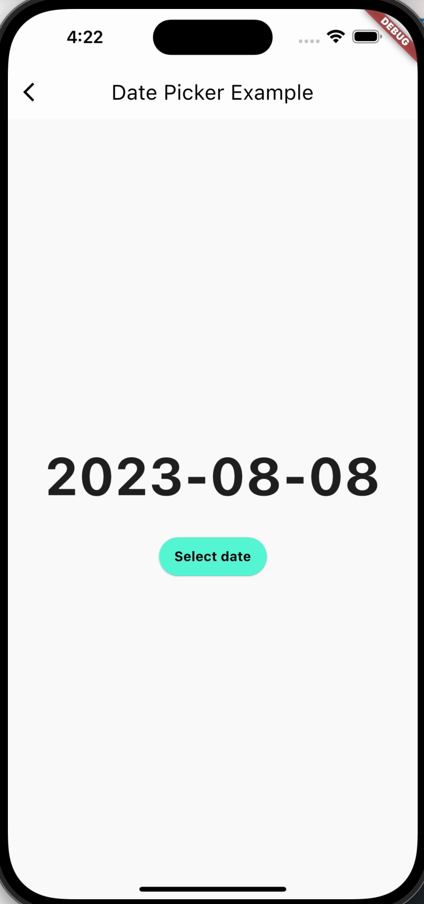

# DatePicker

在 Flutter 中，并没有名为 DatePicker 的特定部件。不过，Flutter 提供了一些支持日期选择功能的部件，其中最常用的是 showDatePicker 函数。让我为您解释一下如何使用它以及相关的属性和注意事项。

## 功能和属性

```dart
Future<DateTime?> showDatePicker({
  required BuildContext context,
  required DateTime initialDate,
  required DateTime firstDate,
  required DateTime lastDate,
  DateTime? currentDate,
  DatePickerEntryMode initialEntryMode = DatePickerEntryMode.calendar,
  SelectableDayPredicate? selectableDayPredicate,
  String? helpText,
  String? cancelText,
  String? confirmText,
  Locale? locale,
  bool useRootNavigator = true,
  RouteSettings? routeSettings,
  TextDirection? textDirection,
  TransitionBuilder? builder,
  DatePickerMode initialDatePickerMode = DatePickerMode.day,
  String? errorFormatText,
  String? errorInvalidText,
  String? fieldHintText,
  String? fieldLabelText,
  TextInputType? keyboardType,
  Offset? anchorPoint,
})
```

showDatePicker 函数允许您显示一个日期选择对话框，供用户选择日期。它的主要属性包括：

- `context` (required): 上下文对象，用于显示日期选择器。
- `initialDate` (required): 初始化日期选择器时显示的日期。
- `firstDate` (required): 允许选择的最早日期。
- `lastDate` (required): 允许选择的最晚日期。
- `currentDate`: 可选参数，指定日期选择器打开时的当前日期。如果不提供此参数，将使用 DateTime.now()。
- `initialEntryMode`: 可选参数，定义日期选择器的初始显示模式，可以是 DatePickerEntryMode.calendar（日历模式）或 DatePickerEntryMode.input（输入模式，默认）。
- `selectableDayPredicate`: 可选参数，用于指定哪些日期可以被选择的回调函数。
- `helpText`: 可选参数，日期选择器标题栏中的帮助文本。
- `cancelText`: 可选参数，日期选择器中的取消按钮文本。
- `confirmText`: 可选参数，日期选择器中的确认按钮文本。
- `locale`: 可选参数，用于指定日期选择器的本地化信息。
- `useRootNavigator`: 可选参数，指定是否使用根导航器来显示日期选择器。
- `routeSettings`: 可选参数，用于指定日期选择器的路由设置。
- `textDirection`: 可选参数，用于指定日期选择器的文本方向。
- `builder`: 可选参数，用于自定义日期选择器的过渡效果。
- `initialDatePickerMode`: 可选参数，定义日期选择器初始化时的显示模式，可以是 DatePickerMode.day（日期模式，默认）或 DatePickerMode.year（年份模式）。
- `errorFormatText`: 可选参数，格式错误时显示的文本。
- `errorInvalidText`: 可选参数，无效日期时显示的文本。
- `fieldHintText`: 可选参数，输入模式下输入框的提示文本。
- `fieldLabelText`: 可选参数，输入模式下输入框的标签文本。
- `keyboardType`: 可选参数，输入模式下输入框的键盘类型。
- `anchorPoint`: 可选参数，日期选择器对话框打开时的锚点，用于调整对话框的位置。

## 用法和使用场景

showDatePicker 用于在用户需要选择日期时显示日期选择对话框，典型的用例包括：

- 日期选择器：允许用户选择日期，并在应用中使用选定的日期。
- 预订和预约系统：用于选择预订或预约的日期。

## 举例

以下是一个使用 showDatePicker 函数的简单示例：

```dart
import 'package:flutter/material.dart';

class DatePickerExample extends StatefulWidget {
  const DatePickerExample({super.key});

  @override
  _DatePickerExampleState createState() => _DatePickerExampleState();
}

class _DatePickerExampleState extends State<DatePickerExample> {
  DateTime selectedDate = DateTime.now();

  Future<void> _selectDate(BuildContext context) async {
    final DateTime? pickedDate = await showDatePicker(
      context: context,
      initialDate: selectedDate,
      initialEntryMode: DatePickerEntryMode.calendar,
      firstDate: DateTime(2000),
      lastDate: DateTime(2101),
      builder: (BuildContext context, Widget? child) {
        return SizedBox(
          child: child,
        );
      },
    );

    if (pickedDate != null && pickedDate != selectedDate) {
      setState(() {
        selectedDate = pickedDate;
      });
    }
  }

  @override
  Widget build(BuildContext context) {
    return Scaffold(
      appBar: AppBar(
        title: Text('Date Picker Example'),
      ),
      body: Center(
        child: Column(
          mainAxisSize: MainAxisSize.min,
          children: <Widget>[
            Text(
              "${selectedDate.toLocal()}".split(' ')[0],
              style: const TextStyle(fontSize: 55, fontWeight: FontWeight.bold),
            ),
            const SizedBox(
              height: 20.0,
            ),
            ElevatedButton(
              onPressed: () => _selectDate(context),
              style:
                  ElevatedButton.styleFrom(backgroundColor: Colors.tealAccent),
              child: const Text(
                'Select date',
                style:
                    TextStyle(color: Colors.black, fontWeight: FontWeight.bold),
              ),
            ),
          ],
        ),
      ),
    );
  }
}

```



## 注意事项

- showDatePicker 返回一个 Future<DateTime?>，允许您在用户选择日期后进行后续操作。
- 在使用 showDatePicker 时，确保提供合适的上下文，并在需要时使用 await 来等待用户的选择。
- 为了提高用户体验，firstDate 和 lastDate 应该设置为合适的日期范围，以限制用户的选择。
- 考虑适当的帮助文本、按钮文本和标签文本，以确保用户明白如何使用日期选择器。
- 格式错误和无效日期时的提示文本可以提供更好的用户反馈。
- 请注意，虽然 showDatePicker 是一个方便的内置函数，但是您也可以使用其他日期选择库或自定义部件来满足特定的需求。
