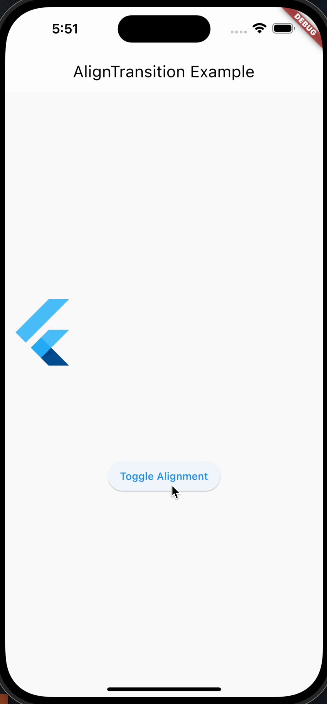

# AlignTransition(对齐过渡)

AlignTransition 是 Flutter 中用于在过渡期间根据动画值调整部件的对齐方式的小部件。它可以在子部件的不同对齐方式之间创建平滑的过渡效果。以下是关于 AlignTransition 的详细介绍，包括其属性、功能、用法、使用场景、示例和注意事项。

```dart
  const AlignTransition({
    super.key,
    required Animation<AlignmentGeometry> alignment,
    required this.child,
    this.widthFactor,
    this.heightFactor,
  })
```

## 属性及功能

以下是 AlignTransition 的主要属性及其功能：

- key：用于标识 AlignTransition 的键，通常用 GlobalKey 创建。
- alignment: 设置动画的开始和结束时的对齐方式。
- child: 要对其应用过渡效果的子部件。
- alignment: 对齐方式的动画，它决定了子部件如何在过渡中移动。

## 用法

```dart
AlignTransition(
  alignment: _animation,
  child: FlutterLogo(size: 100),
)
```

## 使用场景

AlignTransition 适用于以下场景：

- 当需要在两个不同的对齐方式之间创建平滑的过渡效果时，如旋转、缩放、移动等。

## 注意事项

- 确保 alignment 属性是通过动画值来控制的，以实现平滑的过渡效果。
- 在处理复杂动画时，可能需要结合其他动画组件一起使用，如 AnimationController、Tween 等。

## 示例

以下是一个简单示例，展示了如何使用 AlignTransition 来创建子部件在两种不同对齐方式之间的平滑过渡效果：

```dart
import 'package:flutter/material.dart';

class AlignTransitionWidget extends StatefulWidget {
  @override
  _AlignTransitionWidgetState createState() => _AlignTransitionWidgetState();
}

class _AlignTransitionWidgetState extends State<AlignTransitionWidget>
    with SingleTickerProviderStateMixin {
  late AnimationController _controller;
  late Animation<Alignment> _animation;
  final Alignment _startAlignment = Alignment.topLeft;
  final Alignment _endAlignment = Alignment.bottomRight;

  @override
  void initState() {
    super.initState();
    _controller = AnimationController(
      vsync: this,
      duration: const Duration(seconds: 1),
    );

    _animation = AlignmentTween(
      begin: _startAlignment,
      end: _endAlignment,
    ).animate(_controller);
  }

  void _toggleAlignment() {
    if (_controller.status == AnimationStatus.completed) {
      _controller.reverse();
    } else {
      _controller.forward();
    }
  }

  @override
  void dispose() {
    _controller.dispose();
    super.dispose();
  }

  @override
  Widget build(BuildContext context) {
    return Scaffold(
      appBar: AppBar(title: const Text('AlignTransition Example')),
      body: Center(
        child: Column(
          mainAxisAlignment: MainAxisAlignment.center,
          children: <Widget>[
            SizedBox(
              height: 200,
              child: AlignTransition(
                alignment: _animation,
                child: const FlutterLogo(size: 100),
              ),
            ),
            const SizedBox(height: 20),
            ElevatedButton(
              onPressed: _toggleAlignment,
              child: const Text('Toggle Alignment'),
            ),
          ],
        ),
      ),
    );
  }
}

```

如图所示



在这个示例中，我们使用 AlignTransition 将 FlutterLogo 在 Alignment.topLeft 和 Alignment.bottomRight 之间进行平滑过渡。使用 AnimationController 和 Tween 来控制过渡效果。
