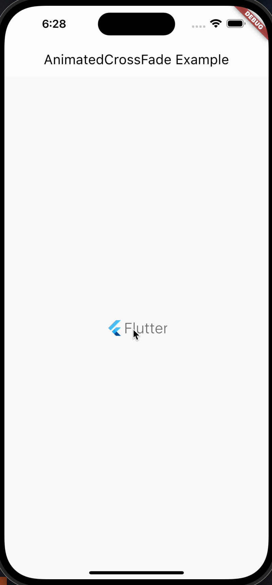

# AnimatedCrossFade(淡入淡出过渡)

AnimatedCrossFade 是 Flutter 中的一个小部件，用于在两个不同的状态之间进行平滑的过渡。它允许您在两个子部件之间进行淡入淡出的过渡效果，根据布尔值的变化来控制显示哪个子部件。以下是关于 AnimatedCrossFade 的详细介绍，包括其属性、功能、用法、使用场景、示例和注意事项。

```dart
  const AnimatedCrossFade({
    super.key,
    required this.firstChild,
    required this.secondChild,
    this.firstCurve = Curves.linear,
    this.secondCurve = Curves.linear,
    this.sizeCurve = Curves.linear,
    this.alignment = Alignment.topCenter,
    required this.crossFadeState,
    required this.duration,
    this.reverseDuration,
    this.layoutBuilder = defaultLayoutBuilder,
    this.excludeBottomFocus = true,
  })
```

## 属性及功能

以下是 AnimatedCrossFade 的主要属性及其功能：

- key：用于标识 AnimatedCrossFade 的键，通常使用 GlobalKey 创建。
- firstChild：第一个子部件，会在布尔值为 false 时显示。
- secondChild：第二个子部件，会在布尔值为 true 时显示。
- firstCurve：第一个子部件的淡入曲线。
- secondCurve：第二个子部件的淡入曲线。
- sizeCurve：控制部件大小变化的曲线。
- crossFadeState：定义哪个子部件应该显示，有 CrossFadeState.showFirst 和 CrossFadeState.showSecond 两种状态。
- duration：过渡动画的持续时间。

## 用法

```dart
AnimatedCrossFade(
  crossFadeState: _isFirst ? CrossFadeState.showFirst : CrossFadeState.showSecond,
  duration: Duration(seconds: 1),
  firstChild: FlutterLogo(size: 100, colors: Colors.red),
  secondChild: FlutterLogo(size: 100, colors: Colors.blue),
)
```

## 使用场景

AnimatedCrossFade 适用于以下场景：

- 当需要在两个不同的状态之间进行平滑的淡入淡出过渡时，如显示/隐藏部件。

## 注意事项

- 确保 firstChild 和 secondChild 有明确的状态切换，以实现预期的过渡效果。
- 使用合适的曲线来控制淡入和淡出的动画效果。

## 示例

以下是一个示例，展示了如何使用 AnimatedCrossFade 来创建两个不同子部件之间的淡入淡出过渡：

```dart
import 'package:flutter/material.dart';

class AnimatedCrossFadeWidget extends StatefulWidget {
  const AnimatedCrossFadeWidget({super.key});

  @override
  State<AnimatedCrossFadeWidget> createState() =>
      _AnimatedCrossFadeWidgetState();
}

class _AnimatedCrossFadeWidgetState extends State<AnimatedCrossFadeWidget> {
  var bool_isFirst = true;

  void _toggleChild() {
    setState(() {
      bool_isFirst = !bool_isFirst;
    });
  }

  @override
  Widget build(BuildContext context) {
    return Scaffold(
      appBar: AppBar(title: Text('AnimatedCrossFade Example')),
      body: Center(
        child: GestureDetector(
          onTap: _toggleChild,
          child: AnimatedCrossFade(
            crossFadeState: bool_isFirst
                ? CrossFadeState.showFirst
                : CrossFadeState.showSecond,
            duration: const Duration(seconds: 1),
            firstChild: const FlutterLogo(
                size: 100,
                style: FlutterLogoStyle.horizontal,
                curve: Curves.bounceInOut),
            secondChild: const FlutterLogo(
                size: 100,
                style: FlutterLogoStyle.markOnly,
                curve: Curves.easeIn),
          ),
        ),
      ),
    );
  }
}

```

如图所示



在这个示例中，我们使用 AnimatedCrossFade 来创建两个不同子部件之间的淡入淡出过渡。通过点击来切换显示的子部件。
