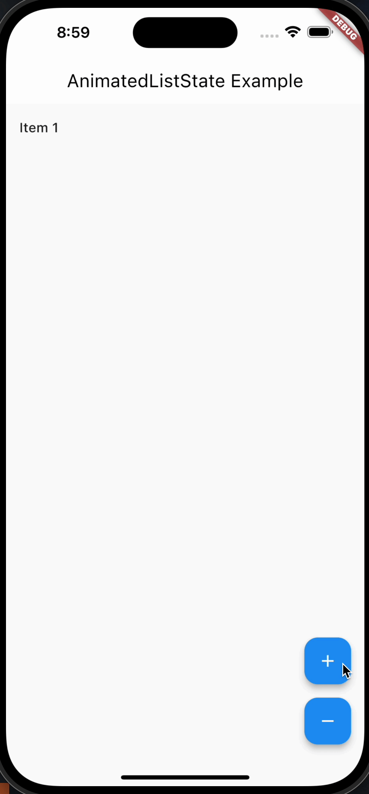

# AnimatedListState(动画列表状态)

AnimatedListState 并不是一个小部件，而是一个状态对象，它管理了 AnimatedList 小部件中的数据和操作。通过 AnimatedListState，您可以对列表项进行添加、删除、移动等操作，并且在这些操作时产生平滑的过渡动画效果。

## 属性和功能

- insertItem(int index, {Duration? duration}): 在指定位置插入一个新的列表项，并在 duration 指定的时间内展示过渡动画。
- removeItem(int index, T removedItemBuilder(BuildContext context, `Animation<double>` animation)): 在指定位置移除一个列表项，并在 removedItemBuilder 中使用动画构建已移除的项的界面。
- removeItemAt(int index, T removedItemBuilder(BuildContext context, `Animation<double>` animation)): 在指定位置移除一个列表项，并在 removedItemBuilder 中使用动画构建已移除的项的界面。
- moveItem(int fromIndex, int toIndex): 将位于 fromIndex 位置的列表项移动到 toIndex 位置，并展示平滑的过渡动画。

## 用法

```dart
import 'package:flutter/material.dart';

class AnimatedListStateWidget extends StatefulWidget {
  const AnimatedListStateWidget({super.key});

  @override
  State<AnimatedListStateWidget> createState() =>
      _AnimatedListStateWidgetState();
}

class _AnimatedListStateWidgetState extends State<AnimatedListStateWidget> {
  List<int> _items = [1, 2, 3];
  GlobalKey<AnimatedListState> _listKey = GlobalKey<AnimatedListState>();

  void _addItem() {
    int newItem = _items.length + 1;
    _items.add(newItem);
    _listKey.currentState?.insertItem(_items.length - 1);
  }

  void _removeItem() {
    int removedItem = _items.length;
    _listKey.currentState?.removeItem(
      _items.length - 1,
      (context, animation) => buildRemovedItem(removedItem, animation),
    );
    _items.removeAt(_items.length - 1);
  }

  Widget buildRemovedItem(int item, Animation<double> animation) {
    return SizeTransition(
      sizeFactor: animation,
      child: ListTile(
        title: Text('Item $item'),
      ),
    );
  }

  @override
  Widget build(BuildContext context) {
    return Scaffold(
      appBar: AppBar(title: Text('AnimatedListState Example')),
      body: AnimatedList(
        key: _listKey,
        initialItemCount: _items.length,
        itemBuilder: (context, index, animation) {
          return buildListItem(_items[index], animation);
        },
      ),
      floatingActionButton: Column(
        mainAxisSize: MainAxisSize.min,
        children: <Widget>[
          FloatingActionButton(
            onPressed: _addItem,
            child: Icon(Icons.add),
          ),
          SizedBox(height: 16),
          FloatingActionButton(
            onPressed: _removeItem,
            child: Icon(Icons.remove),
          ),
        ],
      ),
    );
  }

  Widget buildListItem(int item, Animation<double> animation) {
    return SizeTransition(
      sizeFactor: animation,
      child: ListTile(
        title: Text('Item $item'),
      ),
    );
  }
}

```

如图所示



## 使用场景

- 当需要在列表中插入、移动或删除项时，并且希望在这些操作中使用平滑的过渡动画时，可以使用 AnimatedListState。
- 在实现列表删除操作时，将被删除项的界面添加到动画过渡中，以产生平滑的移除效果。

## 注意事项

- 要使用 AnimatedListState，必须在 AnimatedList 上设置一个全局键 `(GlobalKey<AnimatedListState>)`。
- 当在操作列表时，确保同步更新数据源以及 AnimatedList 中的项数，否则会导致异常或不一致的效果。

总之，AnimatedListState 提供了管理列表项动画的方法，可以创建具有平滑过渡效果的交互式列表。
