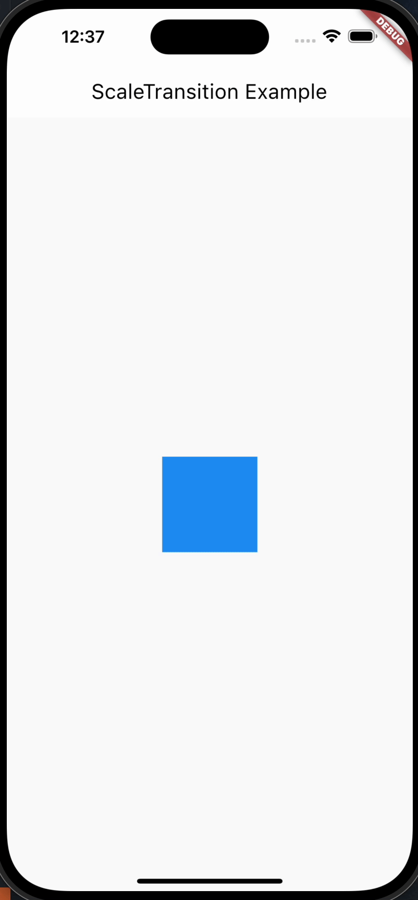

# ScaleTransition(transition)

ScaleTransition 是 Flutter 中用于实现缩放动画的一个组件。它可以在一个子部件上应用缩放动画，并根据提供的动画进行缩放。

```dart
  const ScaleTransition({
    super.key,
    required Animation<double> scale,
    this.alignment = Alignment.center,
    this.filterQuality,
    this.child,
  })
```

## 属性和功能

- scale: 一个 `Animation<double>` 类型的属性，表示缩放的比例。当 scale 的值为1时，子部件不会缩放；小于1时，子部件会缩小；大于1时，子部件会放大。
- alignment: 用于指定缩放的中心点，默认为 Alignment.center，表示中心对齐。
- child: 要应用缩放动画的子部件。

## 用法

ScaleTransition 可以用于为一个部件添加缩放动画效果。通常配合 AnimationController 和 Tween 使用，可以实现在一段时间内缩放部件。

## 使用场景

- 当你想要为一个部件添加缩放动画时，比如在用户交互、状态变化等情况下。
- 在设计动态和生动的用户界面时，可以使用缩放动画来增强交互体验。

## 示例

```dart
AnimationController _controller;
Animation<double>_animation;

@override
void initState() {
  super.initState();
  _controller = AnimationController(
    vsync: this,
    duration: Duration(seconds: 2),
  )..repeat(reverse: true);

  _animation =_controller.drive(
    Tween<double>(
      begin: 1,
      end: 2,
    ),
  );
}

@override
Widget build(BuildContext context) {
  return Scaffold(
    appBar: AppBar(title: Text('ScaleTransition Example')),
    body: Center(
      child: ScaleTransition(
        scale: _animation,
        child: Container(
          width: 100,
          height: 100,
          color: Colors.blue,
        ),
      ),
    ),
  );
}
```



## 注意事项

- ScaleTransition 中的 scale 属性的值是一个 `Animation<double>`，所以需要配合 AnimationController 和 Tween 使用。
- 当使用 ScaleTransition 时，要确保给定的动画范围在 1 到正无穷之间，否则可能导致部件缩放为负值，影响动画效果。
