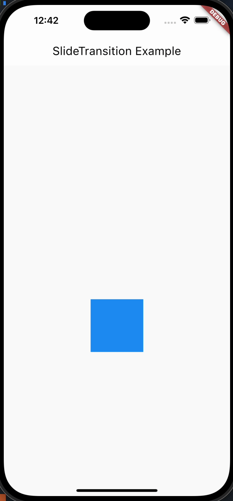

# SlideTransition(平移滑动动画)

SlideTransition 是 Flutter 中用于实现滑动动画的一个组件。它可以在一个子部件上应用滑动动画，并根据提供的动画进行平移滑动。

```dart
  const SlideTransition({
    super.key,
    required Animation<Offset> position,
    this.transformHitTests = true,
    this.textDirection,
    this.child,
  })
```

## 属性和功能

- position: 一个 `Animation<Offset>` 类型的属性，表示滑动的位置。Offset 是一个表示平面上的点的类，position 的动画会将子部件从一个 Offset 平移到另一个 Offset。
- child: 要应用滑动动画的子部件。
- 用法：
- SlideTransition 可以用于为一个部件添加滑动动画效果。通常配合 AnimationController 和 Tween 使用，可以实现在一段时间内平移滑动部件。

## 使用场景

- 当你想要为一个部件添加平移滑动动画时，比如在用户交互、状态变化等情况下。
- 在设计动态和生动的用户界面时，可以使用平移滑动动画来增强交互体验。

## 属性示例

```dart
AnimationController _controller;
Animation<Offset>_animation;

@override
void initState() {
  super.initState();
  _controller = AnimationController(
    vsync: this,
    duration: Duration(seconds: 2),
  )..repeat(reverse: true);

  _animation =_controller.drive(
    Tween<Offset>(
      begin: Offset(0, 0),
      end: Offset(0, 1),
    ),
  );
}

@override
Widget build(BuildContext context) {
  return Scaffold(
    appBar: AppBar(title: Text('SlideTransition Example')),
    body: Center(
      child: SlideTransition(
        position: _animation,
        child: Container(
          width: 100,
          height: 100,
          color: Colors.blue,
        ),
      ),
    ),
  );
}
```



## 注意事项

SlideTransition 中的 position 属性的值是一个 `Animation<Offset>`，所以需要配合 AnimationController 和 Tween 使用。
当使用 SlideTransition 时，要确保给定的动画范围在 Offset 的范围内，否则可能导致部件滑出屏幕范围，影响动画效果。
