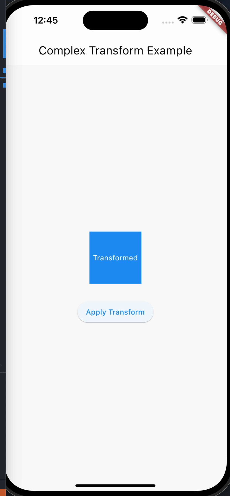

# Transform(变换)

Transform 是 Flutter 中用于对子部件进行矩阵变换的组件。通过 Transform 组件，你可以对子部件进行平移、旋转、缩放等变换操作，从而实现各种复杂的界面效果。

```dart
  const Transform({
    super.key,
    required this.transform,
    this.origin,
    this.alignment,
    this.transformHitTests = true,
    this.filterQuality,
    super.child,
  })
```

## 属性和功能

- transform: 一个 Matrix4 类型的属性，表示要应用的矩阵变换。你可以通过 Matrix4 类来构建不同类型的变换，如平移、旋转和缩放。
- origin: 一个 Offset 类型的属性，表示变换的原点，默认为部件中心。
- alignment: 一个 AlignmentGeometry 类型的属性，用于设置变换原点的对齐方式。
- transformHitTests: 一个布尔值，表示是否在进行变换时也应用点击测试，默认为 false。

## 用法

- Transform 组件可以用于对单个或多个子部件应用不同的矩阵变换，实现各种视觉效果，比如旋转、缩放等。

## 使用场景

- 当你想要对一个或多个子部件进行变换，如平移、旋转、缩放等时。
- 在实现自定义动画和过渡效果时，可以使用 Transform 来实现更加复杂的变换效果。

## 属性示例

```dart
import 'package:flutter/material.dart';

class TransformExample extends StatefulWidget {
  @override
  _TransformExampleState createState() => _TransformExampleState();
}

class _TransformExampleState extends State<TransformExample> {
  double _angle = 0.0;
  double _scale = 1.0;
  Offset _offset = Offset(0.0, 0.0);

  void _updateTransform() {
    setState(() {
      _angle += 45.0;
      _scale = _scale == 1.0 ? 1.5 : 1.0;
      _offset = Offset(_offset.dx + 50.0, _offset.dy + 50.0);
    });
  }

  @override
  Widget build(BuildContext context) {
    return Scaffold(
      appBar: AppBar(title: Text('Complex Transform Example')),
      body: Center(
        child: Column(
          mainAxisAlignment: MainAxisAlignment.center,
          children: [
            Transform(
              transform: Matrix4.identity()
                ..translate(_offset.dx, _offset.dy)
                ..rotateZ(_angle * (3.1415927 / 180))
                ..scale(_scale),
              child: Container(
                width: 100,
                height: 100,
                color: Colors.blue,
                child: Center(
                  child: Text(
                    'Transformed',
                    style: TextStyle(color: Colors.white),
                  ),
                ),
              ),
            ),
            SizedBox(height: 30),
            ElevatedButton(
              onPressed: _updateTransform,
              child: Text('Apply Transform'),
            ),
          ],
        ),
      ),
    );
  }
}

```



在这个示例中，我们使用Transform小部件来应用复杂的变换效果。每次按下“Apply Transform”按钮时，小部件将以45度的角度旋转，缩放为1.5倍，并向右下方移动50个单位。这个例子演示了如何在一个小部件上同时应用多个不同类型的变换。

## 注意事项

- 变换的原点可以通过 origin 属性来设置，默认为部件中心。
- 可以通过 alignment 属性来调整变换的原点对齐方式。
- 使用 transformHitTests 属性可以控制是否在变换时也应用点击测试，可以用于处理可点击区域的变化。
- 总之，Transform 组件是实现各种矩阵变换效果的重要工具，在设计复杂界面和动画效果时非常有用。
