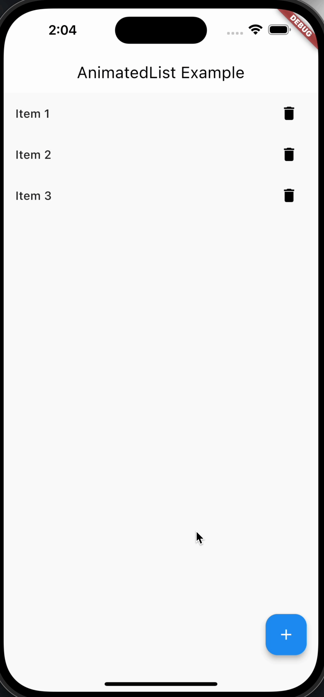

# AnimatedList

> AnimatedList 是 Flutter 中用于创建具有动画效果的列表的小部件。它允许您在列表中插入、删除或移动项目时产生平滑的动画过渡效果

## 属性及功能

```dart
  const AnimatedList({
    super.key,
    required this.itemBuilder,  //一个回调函数，用于构建每个列表项。这个函数接收三个参数：上下文、索引和插值动画。通过使用插值动画，可以为每个列表项创建平滑的动画效果。
    this.initialItemCount = 0,  // 初始列表项的数量，用于初始化列表的长度。
    this.scrollDirection = Axis.vertical, //确定列表的滚动方向，可以是 Axis.vertical 或 Axis.horizontal。
    this.reverse = false, //决定列表项是否按照反向顺序排列。
    this.controller,  //用于控制列表滚动的滚动控制器。 
    this.primary,    //确定是否将列表视图放置在主轴的开始处
    this.physics,   //用于控制列表的滚动行为的滚动物理效果。
    this.shrinkWrap = false, //确定列表是否根据子项的总长度来调整自身的大小。
    this.padding,   //列表的内边距。
    this.clipBehavior = Clip.hardEdge,  //用于确定列表是否应该将其子项剪裁到其边界。
  })
```

## 用法

```dart
AnimatedList(
  key: _listKey,
initialItemCount:_list.length,
  itemBuilder: (context, index, animation) {
    return _buildItem(_list[index], animation);
  },
)
```

## 使用场景

AnimatedList 在以下场景中特别有用：

- 当您需要在列表中进行插入、删除或移动项目时，希望有平滑的动画过渡效果。
- 在 UI 中需要动画效果的列表，比如购物车中商品的添加和删除，任务列表的状态更新等。

## 示例

以下是一个简单示例，展示了如何使用 AnimatedList 来创建带有动画效果的列表：

```dart
import 'package:flutter/material.dart';

void main() {
  runApp(MyApp());
}

class MyApp extends StatelessWidget {
  @override
  Widget build(BuildContext context) {
    return MaterialApp(
      home: AnimatedListExample(),
    );
  }
}

class AnimatedListExample extends StatefulWidget {
  @override
  _AnimatedListExampleState createState() =>_AnimatedListExampleState();
}

class _AnimatedListExampleState extends State<AnimatedListExample> {
final GlobalKey<AnimatedListState>_listKey = GlobalKey();
  List<String> _items = ['Item 1', 'Item 2', 'Item 3'];

  void _addItem() {
int newIndex =_items.length;
    _items.insert(newIndex, 'Item $newIndex');
    _listKey.currentState!.insertItem(newIndex);
  }

  void _removeItem(int index) {
String removedItem =_items.removeAt(index);
    _listKey.currentState!.removeItem(
      index,
(context, animation) =>_buildItem(removedItem, animation),
    );
  }

  @override
  Widget build(BuildContext context) {
    return Scaffold(
      appBar: AppBar(title: Text('AnimatedList Example')),
      body: AnimatedList(
        key: _listKey,
        initialItemCount:_items.length,
        itemBuilder: (context, index, animation) {
          return _buildItem(_items[index], animation);
        },
      ),
      floatingActionButton: FloatingActionButton(
        onPressed: _addItem,
        child: Icon(Icons.add),
      ),
    );
  }

  Widget _buildItem(String item, Animation<double> animation) {
    return SizeTransition(
      sizeFactor: animation,
      child: ListTile(
        title: Text(item),
        trailing: IconButton(
          icon: Icon(Icons.delete),
          onPressed: () =>_removeItem(_items.indexOf(item)),
        ),
      ),
    );
  }
}
```

如图所示



## 注意事项

- 使用 AnimatedList 时，要理解 ListView 和动画的基本原理，以便更好地控制列表的动画效果。
- 在列表项的构建函数中，使用 SizeTransition、FadeTransition 等过渡动画来实现项目插入、删除和移动时的平滑动画。
- 当涉及到大量数据时，要谨慎使用动画，以避免性能问题。
- 通过适当使用 AnimatedList，您可以为您的应用程序创建出色的动态列表，并在插入、删除或移动项目时提供平滑的过渡效果。
