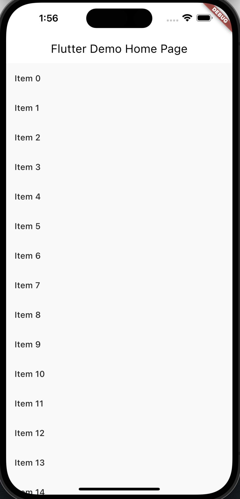

# ScrollConfiguration

> ScrollConfiguration 是 Flutter 中用于配置滚动视图的小部件，它可以自定义滚动视图的滑动行为、滚动效果等。通过包裹滚动视图，可以为特定范围内的滚动视图应用不同的配置。

## 用法

```dart
ScrollConfiguration(
  behavior: MyScrollBehavior(), // 自定义的滚动行为
  child: <Widget>[
    // 子部件，通常是一个滚动视图，如 ListView、GridView 等
  ],
)
```

## 属性及功能

1.behavior：滚动行为。
功能：设置一个自定义的滚动行为，用于配置滚动视图的滑动效果。

2.child（Widget）：子部件。
功能：设置需要应用滚动配置的子部件，通常是一个滚动视图，如 ListView、GridView 等。

## 使用场景

- 自定义滚动行为，例如修改滚动速度、滚动阻尼等效果。
- 在不同范围内应用不同的滚动效果，例如某个页面需要更流畅的滚动，而另一个页面需要更快的滚动。

## 注意事项

- ScrollConfiguration 通常用于嵌套在需要自定义滚动行为的滚动视图内部，以实现特定范围内的滚动配置。

## 示例

以下是一个示例，展示如何使用 ScrollConfiguration 自定义一个滚动行为：

```dart
import 'package:flutter/material.dart';

void main() {
  runApp(MyApp());
}

class MyApp extends StatelessWidget {
  @override
  Widget build(BuildContext context) {
    return MaterialApp(
      home: MyScrollPage(),
    );
  }
}

class MyScrollPage extends StatelessWidget {
  @override
  Widget build(BuildContext context) {
    return Scaffold(
      appBar: AppBar(
        title: Text('ScrollConfiguration Example'),
      ),
      body: ScrollConfiguration(
        behavior: MyScrollBehavior(),
        child: ListView.builder(
          itemCount: 20,
          itemBuilder: (context, index) {
            return ListTile(
              title: Text('Item $index'),
            );
          },
        ),
      ),
    );
  }
}

class MyScrollBehavior extends ScrollBehavior {
  @override
  Widget buildViewportChrome(BuildContext context, Widget child, AxisDirection axisDirection) {
    return child;
  }

  @override
  ScrollPhysics getScrollPhysics(BuildContext context) {
    return BouncingScrollPhysics();
  }
}
```

如图所示



在这个示例中，我们使用 ScrollConfiguration 自定义了一个滚动行为 MyScrollBehavior。在 MyScrollBehavior 中，我们重写了 getScrollPhysics 方法，将滚动物理效果设置为 BouncingScrollPhysics。通过这种方式，我们为 ScrollConfiguration 内的滚动视图应用了自定义的滚动行为。
