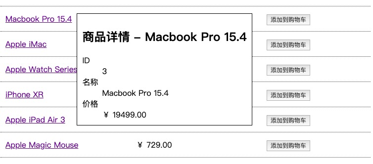

# 路由组件传参

[TOC]

## 路由组件传参

我们通常把路由直接映射（绑定）的组件称为 <u>路由组件</u>，也只有路由组件才能直接调用路由有关对象：`$router`、`$route`

当我们一个组件即希望作为路由组件使用，又可能作为功能组件（某个页面中的一部分）去使用，这个时候路由组件传参的方式来做到这点

### 案例

我们对 <u>item.vue</u> 组件进行改造，当我们在 <u>home.vue</u> 的商品列表上移入移出，出现商品信息提示层



```vue
// Home.vue
<template>
	...
  <li v-for="item of items" :key="item.id">
    <span>
      <router-link @mouseover.native="mouseover(item.id, $event)" @mouseout.native="mouseout(item.id, $event)" :to='{name: "item", params:{itemId: item.id}}'>{{item.name}}</router-link>
    </span>
    <span>{{item.price|RMB}}</span>
    <span>
      <button>添加到购物车</button>
    </span>
  </li>
	...
	<div class="tip" :style="{left: tip.left, top: tip.top}" v-show="tip.isShow">
    <Item :itemId="tip.itemId"></Item>
  </div>
	...
</template>
<script>
...
export default {
  ...,
  data() {
    return {
      items: [],
      tip: {
        itemId: 0,
        isShow: false,
        left: 0,
        top: 0
      }
    }
  },
  ...
  methods: {
    ...,
    mouseover(itemId, e) {
      let pos = e.target.getBoundingClientRect();
      this.tip.itemId = itemId;
      this.tip.left = pos.left + pos.width + 10 + 'px';
      this.tip.top = pos.top + 'px';
      this.tip.isShow = true;
    },
    mouseout(itemId, e) {
      this.tip.isShow = false;
    }
  }
}
</script>
<style>
...
.tip {
  position: fixed;
  left: 0;
  top: 0;
  border: 1px solid #000;
  background: #fff;
  padding: 10px;
}
</style>
```

因为原来的 <u>Item.vue</u> 组件时通过 `this.$route.params.itemId` 来接收 `itemId` 的，但是作为功能组件 `itemId` 需要通过 <u>prop</u>  来传入了，这个时候，我们需要对 <u>Item.vue</u> 组件进行改造

```vue
<template>
    <div>
        <template v-if="item">
            <h2>商品详情 - {{item.name}}</h2>
            <dt>ID</dt>
            <dd>{{item.id}}</dd>
            <dt>名称</dt>
            <dd>{{item.name}}</dd>
            <dt>价格</dt>
            <dd>{{item.price|RMB}}</dd>
        </template>
        <template v-else>
            <h2>没有该商品信息</h2>
        </template>
    </div>
</template>
<script>
import axios from 'axios';
import {RMB} from '@/filters/RMB';
export default {
    name: 'item',
    props: ['itemId'],
    data() {
        return {
            item: null
        }
    },
    filters: {
        RMB
    },
    watch: {
        itemId() {
            this.getItem();
        }
    },
    created() {
        // let itemId = Number(this.$route.params.itemId);
        this.getItem();
    },
    methods: {
        getItem() {
            if (this.itemId) {
                axios({
                    url: `/api/item/${this.itemId}`
                }).then(res => {
                    this.item = res.data;
                }).catch(err=>{});
            }
        }
    }
}
</script>
```

但是这个时候，我们的 <u>Item.vue</u>  可以接收来自 <u>props</u> 的参数，却不可以处理来自路由的 <u>params</u> 参数了。为了能给让 <u>Item.vue</u> 组件既能接收 <u>props</u> 传递的参数，也能接收 <u>route.params</u> 传递的参数，需要对 路由 也进行一些改造

```javascript
{
  path: '/item/:itemId',
  name: 'item',
  component: Item,
  props: true
}
```

#### 默认处理

当 `props` 设置 为 `true`，那么 `route.params` 中的数据自动就会被设置为组件属性与组件原有 <u>props</u> 进行合并

#### 对象模式的 

我们也可以有选择的返回 <u>props</u>

```javascript
{
  path: '/item/:itemId',
  name: 'item',
  component: Item,
  props: {a: 1, b: 2}
}
```

#### 回调函数模式

也可以使用回调函数模式

```javascript
{
  path: '/item/:itemId',
  name: 'item',
  component: Item,
  props: r => ({ itemId: Number(r.params.itemId) })
}
```

