# let 和 const 命令

## let 命令

### 更清洁的声明变量

ES6新增了`let`命令，用来声明变量。
它的用法类似于`var` , 但比`var`更“清洁”，因为其声明的变量，只在`let`命令所在的代码块内有效。

看下例：

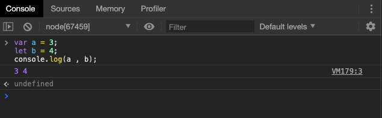

显示上来看，两者的声明变量的效果是一致的。

再看一例：

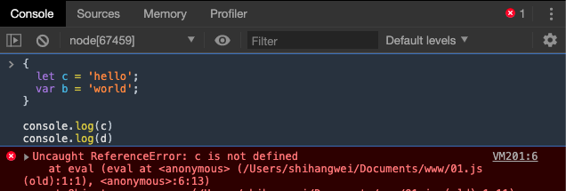

可以看出: `let`命令在定义的`{}`内生效，某些语言也有类似特点，称为 "块级作用域"。

这样,`let`定义的变量,只在块内生效,不影响其他区域,所以我们说Ta更"清洁".

在某些场合下,用`let`特别适合,比如`for()`循环：

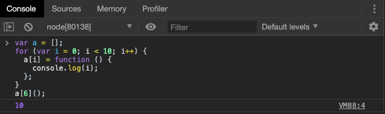

上面代码中，变量`i`是`var`命令声明的，在全局范围内都有效，所以全局只有一个变量`i`。每一次循环，变量`i`的值都会发生改变，而循环内被赋给数组`a`的函数内部的`console.log(i)`，里面的`i`指向的就是全局的`i`。也就是说，所有数组`a`的成员里面的`i`，指向的都是同一个`i`，导致运行时输出的是最后一轮的`i`的值，也就是 10。

> 在 let 出现之前，我们想让上述代码输出预期的结果，一般使用闭包将 i 打包在相应的作用域中，尝试回想一下，如何使用闭包让代码输出预期的结果？


如果使用`let`，声明的变量仅在块级作用域内有效，最后输出的是 6。

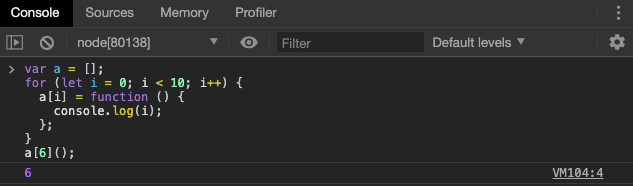

上面代码中，变量`i`是`let`声明的，当前的`i`只在本轮循环有效，所以每一次循环的`i`其实都是一个新的变量，所以最后输出的是`6`。你可能会问，如果每一轮循环的变量`i`都是重新声明的，那它怎么知道上一轮循环的值，从而计算出本轮循环的值？这是因为 JavaScript 引擎内部会记住上一轮循环的值，初始化本轮的变量`i`时，就在上一轮循环的基础上进行计算。

> 所以请注意，此时我们输出和预期相同的原因不是生成了新的闭包。而是在每次循环时都在新的块级作用域中重新声明了一次变量 i


另外，`for`循环还有一个特别之处，就是设置循环变量的那部分是一个父作用域，而循环体内部是一个单独的子作用域。

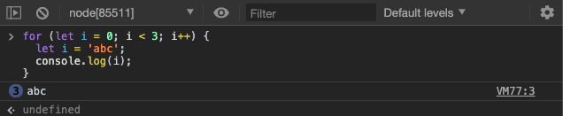

上面代码正确运行，输出了 3 次`abc`。这表明函数内部的变量`i`与循环变量`i`不在同一个作用域，有各自单独的作用域。


### 不存在变量提升

`var`命令会发生“变量提升”现象，即变量可以在声明之前使用，值为`undefined`。这种现象多多少少是有些奇怪的，按照一般的逻辑，变量应该在声明语句之后才可以使用。

为了纠正这种现象，`let`命令改变了语法行为，它所声明的变量一定要在声明后使用，否则报错。

```javascript
// var 的情况
console.log(foo); // 输出undefined
var foo = 2;

// let 的情况
console.log(bar); // 报错ReferenceError
let bar = 2;
```

上面代码中，变量`foo`用`var`命令声明，会发生变量提升，即脚本开始运行时，变量`foo`已经存在了，但是没有值，所以会输出`undefined`。变量`bar`用`let`命令声明，不会发生变量提升。这表示在声明它之前，变量`bar`是不存在的，这时如果用到它，就会抛出一个错误。

> 变量提升其实只是一种现象，这种现象的实质是词法分析过程先于代码执行，在代码执行前，变量和函数的声明已经被分析过了。


### 暂时性死区

只要块级作用域内存在`let`命令，它所声明的变量就“绑定”（binding）这个区域，不再受外部的影响。

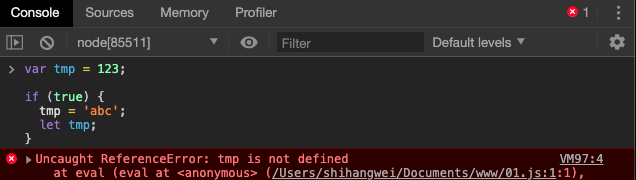

上面代码中，存在全局变量`tmp`，但是块级作用域内`let`又声明了一个局部变量`tmp`，导致后者绑定这个块级作用域，所以在`let`声明变量前，对`tmp`赋值会报错。

ES6 明确规定，如果区块中存在`let`和`const`命令，这个区块对这些命令声明的变量，从一开始就形成了封闭作用域。凡是在声明之前就使用这些变量，就会报错。

总之，在代码块内，使用`let`命令声明变量之前，该变量都是不可用的。这在语法上，称为“暂时性死区”（temporal dead zone，简称 TDZ）。

“暂时性死区”也意味着`typeof`不再是一个百分之百安全的操作。

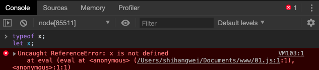

上面代码中，变量`x`使用`let`命令声明，所以在声明之前，都属于`x`的“死区”，只要用到该变量就会报错。因此，`typeof`运行时就会抛出一个`ReferenceError`。

作为比较，如果一个变量根本没有被声明，使用`typeof`反而不会报错。

```javascript
typeof undeclared_variable // "undefined"
```

上面代码中，`undeclared_variable`是一个不存在的变量名，结果返回“undefined”。所以，在没有`let`之前，`typeof`运算符是百分之百安全的，永远不会报错。现在这一点不成立了。这样的设计是为了让大家养成良好的编程习惯，变量一定要在声明之后使用，否则就报错。

有些“死区”比较隐蔽，不太容易发现。

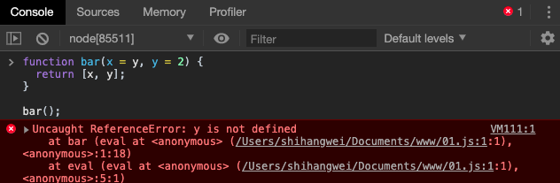

上面代码中，调用`bar`函数之所以报错（某些实现可能不报错），是因为参数`x`默认值等于另一个参数`y`，而此时`y`还没有声明，属于“死区”。如果`y`的默认值是`x`，就不会报错，因为此时`x`已经声明了。

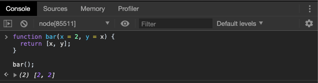

另外，下面的代码也会报错，与`var`的行为不同。

```javascript
// 不报错
var x = x;

// 报错
let x = x;
// ReferenceError: x is not defined
```

上面代码报错，也是因为暂时性死区。使用`let`声明变量时，只要变量在还没有声明完成前使用，就会报错。上面这行就属于这个情况，在变量`x`的声明语句还没有执行完成前，就去取`x`的值，导致报错”x 未定义“。

ES6 规定暂时性死区和`let`、`const`语句不出现变量提升，主要是为了减少运行时错误，防止在变量声明前就使用这个变量，从而导致意料之外的行为。这样的错误在 ES5 是很常见的，现在有了这种规定，避免此类错误就很容易了。

总之，暂时性死区的本质就是，在作用域内，只有等到声明变量的那一行代码出现，才可以获取和使用该变量。

> 此处我们需要和作用域相关知识对比学习，详情请参考《函数新特性》一章。ES6 由于有了新的变量声明方式，AO分析变得更为严谨了。


### 不允许重复声明

`let`不允许在相同作用域内，重复声明同一个变量。

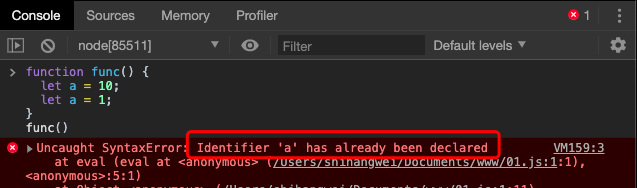

因此，不能在函数内部重新声明参数

```javascript
function func(arg) {
  let arg;
}
func() // 报错

function func(arg) {
  {
    let arg;
  }
}
func() // 不报错
```

## 块级作用域

### 为什么需要块级作用域？

ES5 只有全局作用域和函数作用域，没有块级作用域，这带来很多不合理的场景。

第一种场景，内层变量可能会覆盖外层变量。

```javascript
var tmp = new Date();

function f() {
  console.log(tmp);
  if (false) {
    var tmp = 'hello world';
  }
}

f(); // undefined
```

上面代码的原意是，`if`代码块的外部使用外层的`tmp`变量，内部使用内层的`tmp`变量。但是，函数`f`执行后，输出结果为`undefined`，如果我们使用 ActiveObject 分析，就会很清楚的知道，在代码执行前，函数`f`内部由于有变量声明，没有参数传递和函数声明，`tmp`在该作用域的AO对象上的默认值是`undefined`，因此控制台打印的代码执行时，`tmp`由于并为被赋值，会以默认值`undefined`输出。

第二种场景，用来计数的循环变量泄露为全局变量。

```javascript
var s = 'hello';

for (var i = 0; i < s.length; i++) {
  console.log(s[i]);
}

console.log(i); // 5
```

上面代码中，变量`i`只用来控制循环，但是循环结束后，它并没有消失，泄露成了全局变量。


### ES6 的块级作用域

`let`实际上为 JavaScript 新增了块级作用域。

同样的例子我们进行测试：

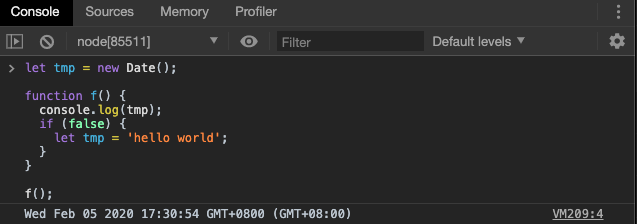

可以发现在函数体内的变量声明并未影响到`console.log`的输出结果，`tmp`正常跳出函数作用域在全局作用域中找到了值

我们使用更为直观的例子进行测试：

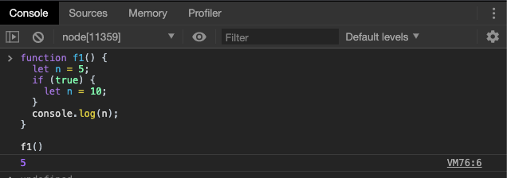

上面的函数有两个代码块，都声明了变量`n`，运行后输出 5。这表示外层代码块不受内层代码块的影响。如果两次都使用`var`定义变量`n`，最后输出的值才是 10。

ES6 允许块级作用域的任意嵌套。

```javascript
{{{{
  {let insane = 'Hello World'}
  console.log(insane); // 报错
}}}};
```

上面代码使用了一个五层的块级作用域，每一层都是一个单独的作用域。第四层作用域无法读取第五层作用域的内部变量。

> 根据作用域规则 是可以向上读取的

内层作用域可以定义外层作用域的同名变量。

```javascript
{{{{
  let insane = 'Hello World';
  {let insane = 'Hello World'}
}}}};
```

块级作用域的出现，实际上使得获得广泛应用的匿名立即执行函数表达式（匿名 IIFE）不再必要了。

```javascript
// IIFE 写法
(function () {
  var tmp = ...;
  ...
}());

// 块级作用域写法
{
  let tmp = ...;
  ...
}
```


### 块级作用域和函数声明

ES5 规定，函数只能在顶层作用域和函数作用域之中声明，不能在块级作用域声明。

```javascript
// 情况一
if (true) {
  function f() {}
}

// 情况二
try {
  function f() {}
} catch(e) {
  // ...
}
```

上面两种函数声明，根据 ES5 的规定都是非法的。

但是，浏览器没有遵守这个规定，为了兼容以前的旧代码，还是支持在块级作用域之中声明函数，因此上面两种情况实际都能运行，不会报错。

ES6 引入了块级作用域，明确允许在块级作用域之中声明函数。ES6 规定，块级作用域之中，函数声明语句的行为类似于`let`，在块级作用域之外不可引用。

```javascript
function f() { console.log('I am outside!'); }

(function () {
  if (false) {
    // 重复声明一次函数f
    function f() { console.log('I am inside!'); }
  }

  f();
}());
```

上面代码在 ES5 中运行，会得到“I am inside!”，匿名函数执行前，首先进行词法分析，在匿名函数作用域的AO中存在键为`f`，值为函数体的属性，匿名函数运行时，作用域中有该函数，就会执行该函数。

ES6 就完全不一样了，理论上会得到“I am outside!”。因为块级作用域内声明的函数类似于`let`，对作用域之外没有影响。但是，如果你真的在 ES6 浏览器中运行一下上面的代码，是会报错的，这是为什么呢？

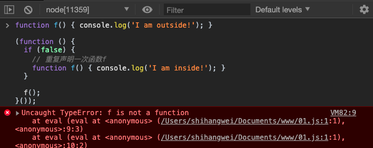

原来，如果改变了块级作用域内声明的函数的处理规则，显然会对老代码产生很大影响。为了减轻因此产生的不兼容问题，ES6 在[附录 B](http://www.ecma-international.org/ecma-262/6.0/index.html#sec-block-level-function-declarations-web-legacy-compatibility-semantics)里面规定，浏览器的实现可以不遵守上面的规定，有自己的[行为方式](http://stackoverflow.com/questions/31419897/what-are-the-precise-semantics-of-block-level-functions-in-es6)。

- 允许在块级作用域内声明函数。
- 函数声明类似于`var`

注意，上面三条规则只对 ES6 的浏览器实现有效，其他环境的实现不用遵守，还是将块级作用域的函数声明当作`let`处理。

根据这一规则，浏览器的 ES6 环境中，块级作用域内声明的函数，行为类似于`var`声明的变量。因此我们不能够按照正常的AO分析去分析块级作用域中的函数声明。

> ES6 标准并未全部在JavaScript的各种运行时中实现，这也是我们在学习过程中需要认真区分的

上述例子的实际AO分析就变为了：

1. 匿名函数没有参数传递
2. 不考虑匿名函数作用域内的函数声明，函数声明被视作变量声明
3. `f`是一个函数声明，视作变量声明，因此在代码执行前匿名函数的AO上有一个属性`f`，值为`undefined`

所以在嘴中执行时，由于`if`代码块并未运行，那匿名函数作用域中的`f`的值为默认值`undefined`，不能作为函数执行，报错。

> 此处要认真复习回顾 JavaScript 的词法分析部分内容。

考虑到环境导致的行为差异太大，应该避免在块级作用域内声明函数。如果确实需要，也应该写成函数表达式，而不是函数声明语句。

```javascript
// 块级作用域内部的函数声明语句，建议不要使用
{
  let a = 'secret';
  function f() {
    return a;
  }
}

// 块级作用域内部，优先使用函数表达式
{
  let a = 'secret';
  let f = function () {
    return a;
  };
}

```

另外，还有一个需要注意的地方。ES6 的块级作用域必须有大括号，如果没有大括号，JavaScript 引擎就认为不存在块级作用域。

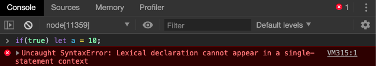

报错信息为：词法声明不能出现在单个语句的上下文中。简单来说，就是在单行的条件语句中，不允许使用let表达式。同理，函数声明也是如此

## const 命令

### 基本用法

`const`声明一个只读的常量。一旦声明，常量的值就不能改变。

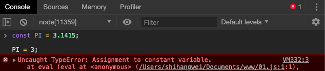


`const`声明的变量不得改变值，这意味着，`const`一旦声明变量，就必须立即初始化，不能留到以后赋值。

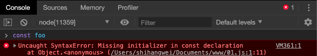

上面代码表示，对于`const`来说，只声明不赋值，就会报错。


`const`的作用域与`let`命令相同：只在声明所在的块级作用域内有效。

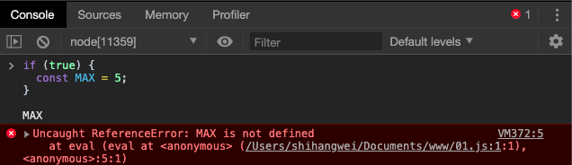


`const`命令声明的常量也是不提升，同样存在暂时性死区，只能在声明的位置后面使用。

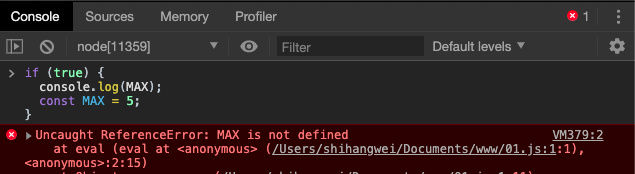

上面代码在常量`MAX`声明之前就调用，结果报错。


`const`声明的常量，也与`let`一样不可重复声明。

```javascript
var message = "Hello!";
let age = 25;

// 以下两行都会报错
const message = "Goodbye!";
const age = 30;
```


### 本质

`const`实际上保证的，并不是变量的值不得改动，而是变量指向的那个内存地址所保存的数据不得改动。对于简单类型的数据（数值、字符串、布尔值），值就保存在变量指向的那个内存地址，因此等同于常量。但对于复合类型的数据（主要是对象和数组），变量指向的内存地址，保存的只是一个指向实际数据的指针，`const`只能保证这个指针是固定的（即总是指向另一个固定的地址），至于它指向的数据结构是不是可变的，就完全不能控制了。因此，将一个对象声明为常量必须非常小心。

> 此处学过 C/C++ 的同学们可以做类比

```javascript
const foo = {};

// 为 foo 添加一个属性，可以成功
foo.prop = 123;
foo.prop // 123

// 将 foo 指向另一个对象，就会报错
foo = {}; // TypeError: "foo" is read-only
```

上面代码中，常量`foo`储存的是一个地址，这个地址指向一个对象。不可变的只是这个地址，即不能把`foo`指向另一个地址，但对象本身是可变的，所以依然可以为其添加新属性。

### ES6 声明变量的六种方法

ES5 只有两种声明变量的方法：`var`命令和`function`命令。ES6 除了添加`let`和`const`命令，还有另外两种声明变量的方法：`import`命令和`class`命令。所以，ES6 一共有 6 种声明变量的方法。

> 我们会在后面的课程中提及另外两种声明方式

## 顶层对象的属性

顶层对象，在浏览器环境指的是`window`对象，在 Node 指的是`global`对象。ES5 之中，顶层对象的属性与全局变量是等价的。

```javascript
window.a = 1;
a // 1
```
```javascript
a = 2;
window.a // 2
```

上面代码中，顶层对象的属性赋值与全局变量的赋值，是同一件事。

顶层对象的属性与全局变量挂钩，被认为是 JavaScript 语言最大的设计败笔之一。这样的设计带来了几个很大的问题，首先是没法在编译时就报出变量未声明的错误，只有运行时才能知道（因为全局变量可能是顶层对象的属性创造的，而属性的创造是动态的）；其次，程序员很容易不知不觉地就创建了全局变量（比如打字出错）；最后，顶层对象的属性是到处可以读写的，这非常不利于模块化编程。另一方面，`window`对象有实体含义，指的是浏览器的窗口对象，顶层对象是一个有实体含义的对象，也是不合适的。

ES6 为了改变这一点，一方面规定，为了保持兼容性，`var`命令和`function`命令声明的全局变量，依旧是顶层对象的属性；另一方面规定，`let`命令、`const`命令、`class`命令声明的全局变量，不属于顶层对象的属性。也就是说，从 ES6 开始，全局变量将逐步与顶层对象的属性脱钩。

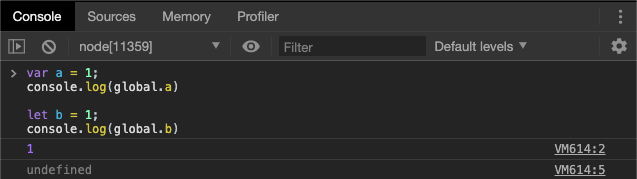

> 脚本运行环境为 node 环境，顶层对象为 global ，如果在浏览器环境下，顶层对象是 window 

上面代码中，全局变量`a`由`var`命令声明，所以它是顶层对象的属性；全局变量`b`由`let`命令声明，所以它不是顶层对象的属性，返回`undefined`。

## 小结

本章节我们主要学习了 ES6 中的最基本的变化-声明的变化，在学习时需要注意：

+ 复习作用域相关知识，回顾词法分析过程
+ 转变思维，认识 let / const 与我们曾经用过的 var 和 function 声明的不同之处

**预告**：下一节，我们将讲解 ES6 的第一个好吃的语法糖 结构赋值。