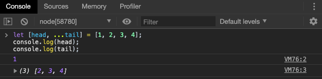
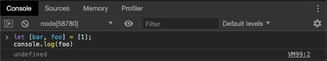
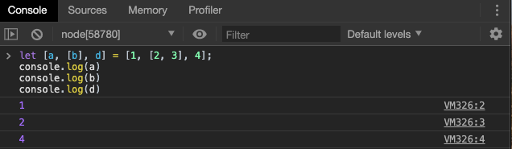
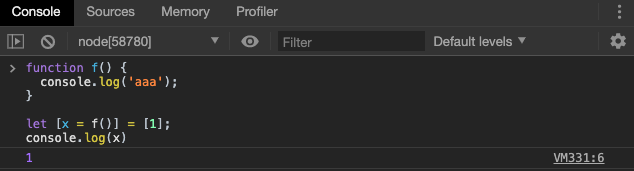
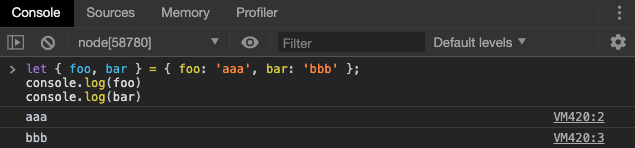
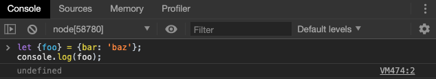
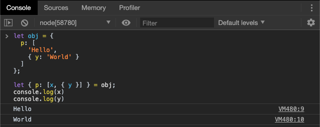
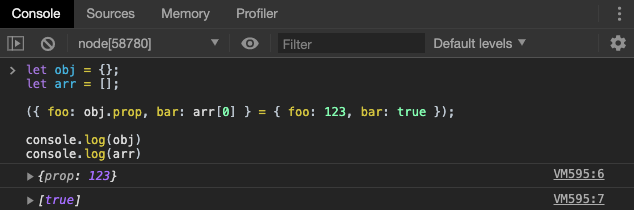
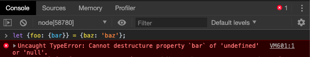
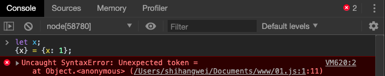

# 解构赋值

## 数组的解构赋值

### 基本用法

ES6 允许按照一定模式，从数组和对象中提取值，对变量进行赋值，这被称为解构（Destructuring）。

以前，为变量赋值，只能直接指定值。

```javascript
let a = 1;
let b = 2;
let c = 3;
```

ES6 提供以下的赋值方式

```javascript
let [a,b,c] = [1,2,3]
```

上面代码表示，可以从数组中提取**对应位置的值**，对变量进行赋值操作。

> 如果同学们在之前学过 Python ，会发现两种语言有很大的相似性

本质上，这种写法属于"匹配模式"，只要等号两侧的模式相同，左边的变量就会赋与对应的值，对于嵌套数组而言，也是一样，我们可以看以下几个例子：

```javascript
let [foo, [[bar], baz]] = [1, [[2], 3]];
foo // 1
bar // 2
baz // 3
```


``` javascript
let [ , , third] = ["foo", "bar", "baz"];
third // "baz"

let [x, , y] = [1, 2, 3];
x // 1
y // 3
```
> 此处出现了只占用位置却没有值的数组单元，在 ES6 中我们称之为“数组空位”，在后面的章节里，我们会详细讲解。数组空位的默认值为 undefined。




> 此处出现了 rest 参数，我们通常将不同位置的`...`符号称为展开运算符/rest运算符。后面的章节中，我们会详细的讲解。此处我们可以将 `...tail` 参数理解为“我也不知道你还有多少参数传递，就一并将你们打包成数组了”


如果解构不成功，变量的值就等于`undefined`。



另一种情况是不完全解构，即等号左边的模式，只匹配一部分的等号右边的数组。这种情况下，解构依然可以成功。




如果等号的右边不是数组（或者严格地说，不是可遍历的结构，后面在将生成器和迭代器时会讲到），那么将会报错。

```javascript
// 报错
let [foo] = 1;
let [foo] = false;
let [foo] = NaN;
let [foo] = undefined;
let [foo] = null;
let [foo] = {};
```

上面的语句都会报错，因为等号右边的值，要么转为对象以后不具备 Iterator 接口（前五个表达式），要么本身就不具备 Iterator 接口（最后一个表达式）。

事实上，只要某种数据结构具有 Iterator 接口，都可以采用数组形式的解构赋值。

```javascript
function* fibs() {
  let a = 0;
  let b = 1;
  while (true) {
    yield a;
    [a, b] = [b, a + b];
  }
}

let [first, second, third, fourth, fifth, sixth] = fibs();
sixth // 5
```

上面代码中，`fibs`是一个 Generator 函数（生成器），原生具有 Iterator 接口。解构赋值会依次从这个接口获取值。


### 默认值

解构赋值允许指定默认值。

```javascript
let [foo = true] = [];
foo // true

let [x, y = 'b'] = ['a']; // x='a', y='b'
let [x, y = 'b'] = ['a', 1] // x='a' y = 1
let [x, y = 'b'] = ['a', undefined]; // x='a', y='b'
```

同学们可能有疑问，既然默认值会被赋值操作所覆盖，那么为什么最后一个例子中的 `y`的值是`b`而不是`undefined`呢？

**注意**，ES6 内部使用严格相等运算符（`===`），判断一个位置是否有值。所以，只有当一个数组成员严格等于`undefined`，默认值才会生效。

```javascript
let [x = 1] = [undefined];
x // 1

let [x = 1] = [null];
x // null
```

上面代码中，如果一个数组成员是`null`，默认值就不会生效，因为`null`不严格等于`undefined`。


如果默认值是一个表达式，那么这个表达式是惰性求值的，即只有在用到的时候，才会求值。



上面代码中，因为`x`能取到值，所以函数`f`根本不会执行。上面的代码其实等价于下面的代码。

```javascript
let x;
if ([1][0] === undefined) {
  x = f();
} else {
  x = [1][0];
}
```

默认值可以引用解构赋值的其他变量，但该变量必须已经声明。

```javascript
let [x = 1, y = x] = [];     // x=1; y=1
let [x = 1, y = x] = [2];    // x=2; y=2
let [x = 1, y = x] = [1, 2]; // x=1; y=2
let [x = y, y = 1] = [];     // ReferenceError: y is not defined
```

上面最后一个表达式之所以会报错，是因为`x`用`y`做默认值时，`y`还没有声明。

## 对象的解构赋值

###  基本用法

解构不仅可以用于数组，还可以用于对象。



对象的解构与数组有一个重要的不同。数组的元素是按次序排列的，变量的取值由它的位置决定；而对象的属性没有次序，变量必须与属性同名，才能取到正确的值。

```javascript
let { bar, foo } = { foo: 'aaa', bar: 'bbb' };
foo // "aaa"
bar // "bbb"
```

上面代码中，等号左边的两个变量的次序，与等号右边两个同名属性的次序不一致，但是对取值完全没有影响。


但是如果变量没有相对应的属性名称，则会解构失败，变量的值为`undefined`



上面代码中，等号右边的对象没有`foo`属性，所以变量`foo`取不到值，所以等于`undefined`。


如果变量名与属性名不一致，必须写成下面这样。

```javascript
let { foo: baz } = { foo: 'aaa', bar: 'bbb' };
baz // "aaa"

let obj = { first: 'hello', last: 'world' };
let { first: f, last: l } = obj;
f // 'hello'
l // 'world'
```

这实际上说明，对象的解构赋值是下面形式的简写（ES6 新增的对象的缩写方法）。

```javascript
let { foo: foo, bar: bar } = { foo: 'aaa', bar: 'bbb' };
```

也就是说，对象的解构赋值的内部机制，是先找到同名属性，然后再赋给对应的变量。真正被赋值的是后者，而不是前者。

```javascript
let { foo: baz } = { foo: 'aaa', bar: 'bbb' };
baz // "aaa"
foo // error: foo is not defined
```

上面代码中，`foo`是匹配的模式，`baz`才是变量。真正被赋值的是变量`baz`，而不是模式`foo`。


与数组一样，解构也可以用于嵌套结构的对象。



注意，这时`p`是模式，不是变量，因此不会被赋值。

如果`p`也要作为变量赋值，可以写成下面这样。

```javascript
let obj = {
  p: [
    'Hello',
    { y: 'World' }
  ]
};

let { p, p: [x, { y }] } = obj;
x // "Hello"
y // "World"
p // ["Hello", {y: "World"}]
```

此处，第一个p是`{p:p}`的缩写，所以`p`既是模式又是变量，能够被赋值。


下面是另外一个例子，我们可以灵活的运用嵌套进行赋值




如果解构模式是嵌套的对象，而且子对象所在的父属性不存在，那么将会报错。



上面代码中，等号左边对象的`foo`属性，对应一个子对象。该子对象的`bar`属性，解构时会报错。原因很简单，因为`foo`这时等于`undefined`，再取子属性就会报错。

需要注意的是，对象的解构赋值可以取到继承的属性。


上面代码中，对象`obj1`的原型对象是`obj2`。`foo`属性不是`obj1`自身的属性，而是继承自`obj2`的属性，解构赋值可以取到这个属性。

### 默认值

和数组的解构赋值一样，对象的解构赋值也存在默认值。

```javascript
var {x = 3} = {};
x // 3

var {x, y = 5} = {x: 1};
x // 1
y // 5

var {x: y = 3} = {};
y // 3

var {x: y = 3} = {x: 5};
y // 5

var { message: msg = 'Something went wrong' } = {};
msg // "Something went wrong"
```

默认值生效的条件同样也是，对象的属性值严格等于`undefined`。

```javascript
var {x = 3} = {x: undefined};
x // 3

var {x = 3} = {x: null};
x // null
```

上面代码中，属性`x`等于`null`，因为`null`与`undefined`不严格相等，所以是个有效的赋值，导致默认值`3`不会生效。


### 注意点

#### 1. 已声明变量用于解构赋值

如果要将一个已经声明的变量用于解构赋值，必须非常小心。



上面代码的写法会报错，因为 JavaScript 引擎会将`{x}`理解成一个代码块，从而发生语法错误。只有不将大括号写在行首，避免 JavaScript 将其解释为代码块，才能解决这个问题。

```javascript
// 正确的写法
let x;
({x} = {x: 1});
```

上面代码将整个解构赋值语句，放在一个圆括号里面，就可以正确执行。


#### 2. 数组进行对象解构

由于数组本质是特殊的对象，因此可以对数组进行对象属性的解构。

```javascript
let arr = [1, 2, 3];
let {0 : first} = arr;
first // 1
```

## 字符串的解构赋值

字符串也可以解构赋值。这是因为此时，字符串被转换成了一个类似数组的对象。

```javascript
const [a, b, c, d, e] = 'hello';
a // "h"
b // "e"
c // "l"
d // "l"
e // "o"
```

类似数组的对象都有一个`length`属性，因此还可以对这个属性解构赋值。

```javascript
let {length : len} = 'hello';
len // 5
```

## 数值和布尔值的解构赋值

解构赋值时，如果等号右边是数值和布尔值，则会先转为对象。

```javascript
let {toString: s} = 123;
s === Number.prototype.toString // true

let {toString: s} = true;
s === Boolean.prototype.toString // true
```

上面代码中，数值和布尔值的包装对象都有`toString`属性，因此变量`s`都能取到值。

**解构赋值的规则是**，只要等号右边的值不是对象或数组，就先将其转为对象。由于`undefined`和`null`无法转为对象，所以对它们进行解构赋值，都会报错。

```javascript
let { prop: x } = undefined; // TypeError
let { prop: y } = null; // TypeError
```

## 函数参数的解构赋值

函数的参数也可以使用解构赋值。

```javascript
function add([x, y]){
  return x + y;
}

add([1, 2]); // 3
```

上面代码中，函数`add`的参数表面上是一个数组，但在传入参数的那一刻，数组参数就被解构成变量`x`和`y`。对于函数内部的代码来说，它们能感受到的参数就是`x`和`y`。

函数参数的解构也可以使用默认值。

```javascript
function move({x = 0, y = 0} = {}) {
  return [x, y];
}

move({x: 3, y: 8}); // [3, 8]
move({x: 3}); // [3, 0]
move({}); // [0, 0]
move(); // [0, 0]
```

上面代码中，函数`move`的参数是一个对象，通过对这个对象进行解构，得到变量`x`和`y`的值。如果解构失败，由于默认解构值为`undefined`，因此`x`和`y`等于默认值。

## 用途

变量的解构赋值用途很多。

### 交换变量的值

```javascript
let x = 1;
let y = 2;

[x, y] = [y, x];
```

上面代码交换变量`x`和`y`的值，这样的写法不仅简洁，而且易读，语义非常清晰。

### 从函数返回多个值

我们知道，函数的返回值有且只有一个，如果要返回多个值，只能将他们放在数组或对象里返回，有了解构赋值，取出这些值就非常方便。

```javascript
function example() {
  return [1, 2, 3];
}
let [a, b, c] = example();

// 返回一个对象

function example() {
  return {
    foo: 1,
    bar: 2
  };
}
let { foo, bar } = example();
```

### 函数参数的定义

解构赋值可以方便地将一组参数与变量名对应起来。

```javascript
// 参数是一组有次序的值
function f([x, y, z]) { ... }
f([1, 2, 3]);

// 参数是一组无次序的值
function f({x, y, z}) { ... }
f({z: 3, y: 2, x: 1});
```

###  函数参数的默认值

```javascript
jQuery.ajax = function (url, {
  async = true,
  beforeSend = function () {},
  cache = true,
  complete = function () {},
  crossDomain = false,
  global = true,
  // ... more config
} = {}) {
  // ... do stuff
};
```

指定参数的默认值，就避免了在函数体内部再写`var foo = config.foo || 'default foo';`这样的语句。解构赋值会根据参数默认值自动判断是否赋值为`undefined`

### 提取现有的对象方法

对象的解构赋值，可以很方便地将现有对象的方法，赋值到某个变量。

```javascript
// 例一
let { log, sin, cos } = Math;

// 例二
const { log } = console;
log('hello') // hello
```

上面代码的例一将`Math`对象的对数、正弦、余弦三个方法，赋值到对应的变量上，使用起来就会方便很多。例二将`console.log`赋值到`log`变量。

## 小结

本章我们主要学习了变量赋值的另外一种方法：解构赋值。需要注意：

+ 重点掌握数组和对象的解构赋值。
+ 明确解构赋值的实质是模式匹配，如果等号两侧的数据类型不同，等号右侧还会进行数据类型转化。
+ 理解并能编码过程中使用解构赋值。

**预告**：下一章，我们将深入 ES6 的学习，讲解基本数据类型-字符串的变化


