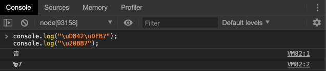
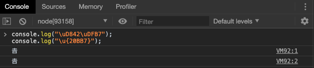
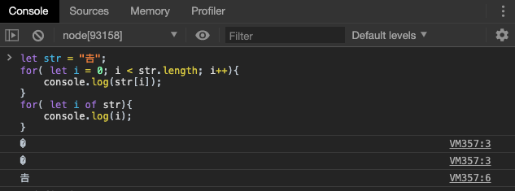
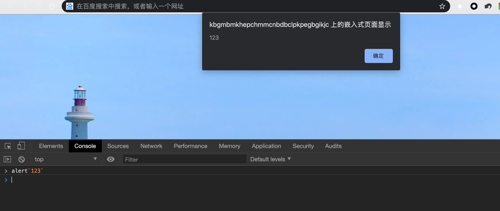
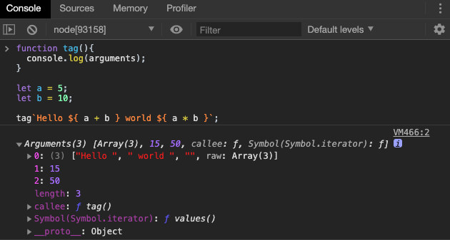
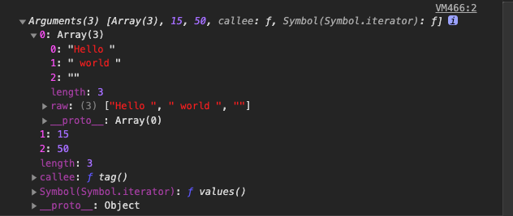

# 字符串新特性

## 字符的 Unicode 表示方法

ES6 加强了对 Unicode 的支持，允许采用`\uxxxx`形式表示一个字符，其中`xxxx`表示字符的 Unicode 码点。

```javascript
"\u0061"
// "a"
```

但是，这种表示法只限于码点在`\u0000`~`\uFFFF`之间的字符。超出这个范围的字符，必须用两个双字节的形式表示。

> 该范围为0～65535，是一个双字节字符的表示范围，汉字在这个范围内集中在 4E00～9FA5 ，基本涵盖了常用汉字，但是在原有的表示方法中，非常用汉字的表示有可能出现错误



上面代码表示，如果直接在`\u`后面跟上超过`0xFFFF`的数值（比如`\u20BB7`），JavaScript 会理解成`\u20BB+7`。打印出来的东西就比较奇怪。

ES6 对这一点做出了改进，只要将码点放入大括号，就能正确解读该字符。



上面代码中表明，大括号表示法与四字节的 UTF-16 编码是等价的。


##  字符串的迭代接口

ES6 为字符串添加了遍历器接口，使得字符串能够被`for ... of`	循环遍历。

为什么用`for ... of ` 遍历字符串呢？因为传统的`for`循环无法识别大于`0xFFFF`的码点。



上面代码中，字符串`str`只有一个字符，但是`for`循环会认为它包含两个字符（都不可打印），而`for...of`循环会正确识别出这一个字符。


## 模版字符串

传统的 JavaScript 语言，输出模板通常是这样写的（下面使用了 jQuery 的方法）。

```javascript
$('#result').append(
  'There are <b>' + basket.count + '</b> ' +
  'items in your basket, ' +
  '<em>' + basket.onSale +
  '</em> are on sale!'
);
```

上面这种写法相当繁琐不方便，我们要考虑字符串的拼接和换行等问题，ES6 引入了模板字符串解决这个问题。

```javascript
$('#result').append(`
  There are <b>${basket.count}</b> items
   in your basket, <em>${basket.onSale}</em>
  are on sale!
`);
```

模板字符串（template string）是增强版的字符串，用反引号（`）标识。它可以当作普通字符串使用，也可以用来定义多行字符串，或者在字符串中嵌入变量。

```javascript
// 普通字符串
`In JavaScript '\n' is a line-feed.`

// 多行字符串
`In JavaScript this is
 not legal.`

console.log(`string text line 1
string text line 2`);

// 字符串中嵌入变量
let name = "Bob", time = "today";
`Hello ${name}, how are you ${time}?`
```

上面代码中的模板字符串，都是用反引号表示。如果在模板字符串中需要使用反引号，则前面要用反斜杠转义。

```javascript
let greeting = `\`Yo\` World!`;
```

如果使用模板字符串表示多行字符串，所有的空格和缩进都会被保留在输出之中。

```javascript
$('#list').html(`
<ul>
  <li>first</li>
  <li>second</li>
</ul>
`);
```

上面代码中，所有模板字符串的空格和换行，都是被保留的。

模板字符串中嵌入变量，需要将变量名写在`${}`之中。

```javascript
function authorize(user, action) {
  if (!user.hasPrivilege(action)) {
    throw new Error(
      // 传统写法为
      // 'User '
      // + user.name
      // + ' is not authorized to do '
      // + action
      // + '.'
      `User ${user.name} is not authorized to do ${action}.`);
  }
}
```

大括号内部可以放入任意的 JavaScript 表达式，可以进行运算，以及引用对象属性。

```javascript
let x = 1;
let y = 2;

`${x} + ${y} = ${x + y}`
// "1 + 2 = 3"

`${x} + ${y * 2} = ${x + y * 2}`
// "1 + 4 = 5"

let obj = {x: 1, y: 2};
`${obj.x + obj.y}`
// "3"
```

模板字符串之中还能调用函数。

```javascript
function fn() {
  return "Hello World";
}

`foo ${fn()} bar`
// foo Hello World bar
```

如果大括号中的值不是字符串，将按照一般的规则转为字符串。比如，大括号中是一个对象，将默认调用对象的`toString`方法。

如果模板字符串中的变量没有声明，将报错。

```javascript
// 变量place没有声明
let msg = `Hello, ${place}`;
// 报错
```

由于模板字符串的大括号内部，就是执行 JavaScript 代码，因此如果大括号内部是一个字符串，将会原样输出。

```javascript
`Hello ${'World'}`
// "Hello World"
```

模板字符串甚至还能嵌套。

```javascript
const tmpl = addrs => `
  <table>
  ${addrs.map(addr => `
    <tr><td>${addr.first}</td></tr>
    <tr><td>${addr.last}</td></tr>
  `).join('')}
  </table>
`;
```

上面代码中，模板字符串的变量之中，又嵌入了另一个模板字符串，使用方法如下。

```javascript
const data = [
    { first: '<Jane>', last: 'Bond' },
    { first: 'Lars', last: '<Croft>' },
];

console.log(tmpl(data));
// <table>
//
//   <tr><td><Jane></td></tr>
//   <tr><td>Bond</td></tr>
//
//   <tr><td>Lars</td></tr>
//   <tr><td><Croft></td></tr>
//
// </table>
```

如果需要引用模板字符串本身，在需要时执行，可以写成函数。

```javascript
let func = (name) => `Hello ${name}!`;
func('Jack') // "Hello Jack!"
```

上面代码中，模板字符串写成了一个函数的返回值。执行这个函数，就相当于执行这个模板字符串了。

##  标签模版

模板字符串的功能，不仅仅是上面这些。它可以紧跟在一个函数名后面，该函数将被调用来处理这个模板字符串。这被称为“标签模板”功能（tagged template）。



上述代码其实等价于

`alert(['123'])`

标签模板其实不是模板，而是函数调用的一种特殊形式。“标签”指的就是函数，紧跟在后面的模板字符串就是它的参数。

但是，如果模板字符里面有变量，就不是简单的调用了，而是会将模板字符串先处理成多个参数，再调用函数。

我们自定义一个函数看看效果



上面代码中，模板字符串前面有一个标识名`tag`，它是一个函数。整个表达式的返回值，就是`tag`函数处理模板字符串后的返回值。

因此上面的标签模版近似等价于以下函数调用

```javascript
tag(['Hello ', ' world ', ''], 15, 50);
```

`tag`函数的第一个参数是一个数组，该数组的成员是模板字符串中那些没有变量替换的部分，也就是说，变量替换只发生在数组的第一个成员与第二个成员之间、第二个成员与第三个成员之间，以此类推。

`tag`函数的其他参数，都是模板字符串各个变量被替换后的值。

值得一提的是，虽然看上去第一个参数是`['Hello ', ' world ', '']`，但实际上该参数还有一个 `raw` 属性，也指向一个数组，数组成员就是模版字符串中没有被变量替换的部分。




“标签模板”的一个重要应用，就是过滤 HTML 字符串，防止用户输入恶意内容。

```javascript
let message = SaferHTML`<p>${sender} has sent you a message.</p>`;

function SaferHTML(templateData) {
  let s = templateData[0];
  for (let i = 1; i < arguments.length; i++) {
    let arg = String(arguments[i]);

    // Escape special characters in the substitution.
    s += arg.replace(/&/g, "&amp;")
            .replace(/</g, "&lt;")
            .replace(/>/g, "&gt;");

    // Don't escape special characters in the template.
    s += templateData[i];
  }
  return s;
}
```

上面代码中，`sender`变量往往是用户提供的，经过`SaferHTML`函数处理，里面的特殊字符都会被转义。

```javascript
let sender = '<script>alert("abc")</script>'; // 恶意代码
let message = SaferHTML`<p>${sender} has sent you a message.</p>`;

message
// <p>&lt;script&gt;alert("abc")&lt;/script&gt; has sent you a message.
```


## 小结

本章讲解了字符串的新增特性，是 ES6 在语法层面上为字符串这个数据类型添加了一些好用的特性，让 JS 这门语言更加易用和严谨，我们应重点掌握：

+ 字符串新增的遍历方式
+ 字符串模版的使用
+ 标签模版的使用

**预告**：下一章，我们将继续讲解 ES6 中的字符串，聊一聊 字符串的新增方法。