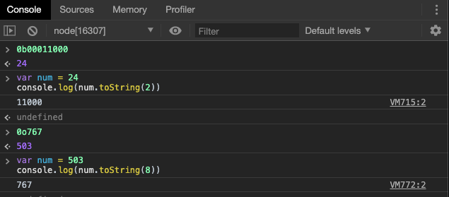
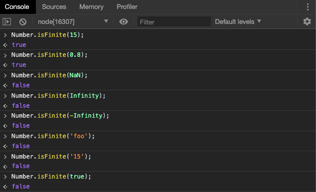
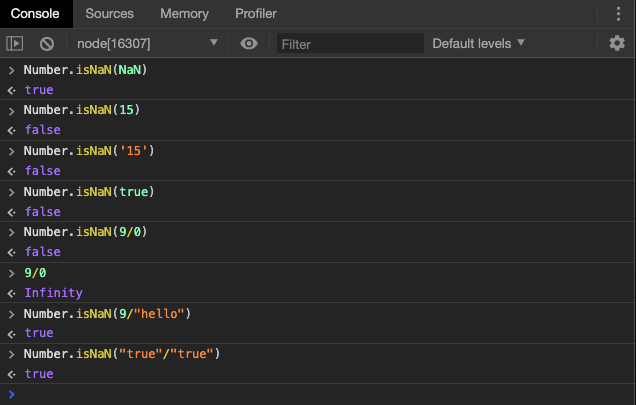
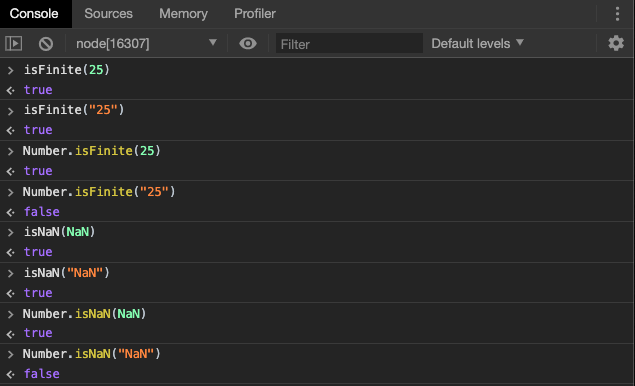
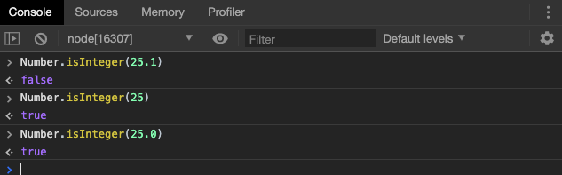
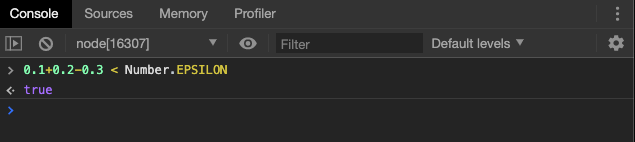
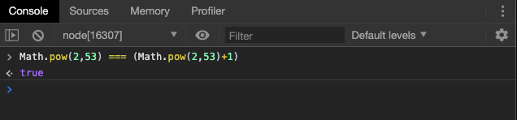
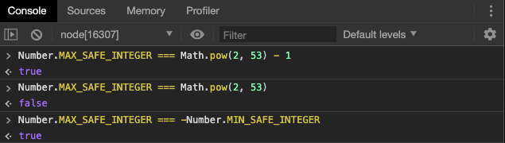
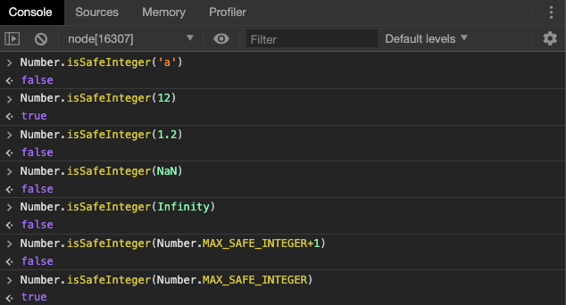

# 数值的新特性

## 二进制和八进制表示法

ES6 提供了二进制和八进制数值的新的写法，分别用前缀`0b`（或`0B`）和`0o`（或`0O`）表示。



我们此处使用的是`toString`方法进行的进制转换，当然，也可以使用`Number`方法

```javascript
Number('0b111')  // 7
Number('0o10')  // 8
```

## Number.isFinite() 和 Number.isNaN()

ES6把一些关于数值的全局函数移植到了`Number`对象上，为了逐步减少全局性的方法，使得语言逐步模块化，但是它们仍然向下兼容。

```javascript
isFinite() 
isNaN()
parseInt()
parseFloat()
```

以上四个方法均被移植。我们接下来讲解他们的变化。

ES6 在`Number`对象上，新提供了`Number.isFinite()`和`Number.isNaN()`两个方法。

`Number.isFinite()`用来检查一个数值是否为有限的（finite），即不是`Infinity`。



注意，如果参数类型不是数值，`Number.isFinite`一律返回`false`。

`Number.isNaN()`用来检查一个值是否为`NaN`。



如果参数类型不是`NaN`，`Number.isNaN`一律返回`false`。

> 还记得吗，我们无法直接判断一个值是否是`NaN`，因为`NaN`和自身都不相等。

它们与传统的全局方法`isFinite()`和`isNaN()`的区别在于，传统方法先调用`Number()`将非数值的值转为数值，再进行判断，而这两个新方法只对数值有效，`Number.isFinite()`对于非数值一律返回`false`, `Number.isNaN()`只有对于`NaN`才返回`true`，非`NaN`一律返回`false`。




## Number.parseInt() 和 Number.parseFloat()

ES6 将全局方法`parseInt()`和`parseFloat()`，移植到`Number`对象上面，行为完全保持不变。

```javascript
// ES5的写法
parseInt('12.34') // 12
parseFloat('123.45#') // 123.45

// ES6的写法
Number.parseInt('12.34') // 12
Number.parseFloat('123.45#') // 123.45
```

## Number.isInteger()

`Number.isInteger()`用来判断一个数值是否为整数。

JavaScript 内部，整数和浮点数采用的是同样的储存方法，所以 25 和 25.0 被视为同一个值。



如果参数不是数值，`Number.isInteger`返回`false`。

```javascript
Number.isInteger() // false
Number.isInteger(null) // false
Number.isInteger('15') // false
Number.isInteger(true) // false
```

注意，由于 JavaScript 采用 IEEE 754 标准，数值存储为64位双精度格式，数值精度最多可以达到 53 个二进制位（1 个隐藏位与 52 个有效位）。如果数值的精度超过这个限度，第54位及后面的位就会被丢弃，这种情况下，`Number.isInteger`可能会误判。

```javascript
Number.isInteger(3.0000000000000002) // true
```

上面代码中，`Number.isInteger`的参数明明不是整数，但是会返回`true`。原因就是这个小数的精度达到了小数点后16个十进制位，转成二进制位超过了53个二进制位，导致最后的那个`2`被丢弃了。

类似的情况还有，如果一个数值的绝对值小于`Number.MIN_VALUE`（5E-324），即小于 JavaScript 能够分辨的最小值，会被自动转为 0。这时，`Number.isInteger`也会误判。

```javascript
Number.isInteger(5E-324) // false
Number.isInteger(5E-325) // true
```

上面代码中，`5E-325`由于值太小，会被自动转为0，因此返回`true`。

**总之**，如果对数据精度的要求较高，不建议使用`Number.isInteger()`判断一个数值是否为整数。

## Number.EPSILON

ES6在Number对象上面，新增了一个极小的常量`Number.EPSILON`

```javascript
console.log(Number.EPSILON.toFixed(20));
//0.00000000000000022204
```

引入这个小的量的目的，是为了为浮点计算设置一个误差范围。由于浮点的存储机制，我们在进行浮点运算的时候，计算结果往往是不精确的。

```javascript
console.log(0.1+0.2);
//0.30000000000000004
```

如果误差能够小小于这个小的常量，那么我们认为得到了正确结果。



因此，`Number.EPSLIN`实际上就是一个可以接受的范围。

> 这也是我们不用浮点数的加减法做比较和判断的原因。

## 安全整数和 Number.isSafeInteger()

JavaScript 能够准确表示的整数范围在`-2^53`到`2^53`之间（不含两个端点），超过这个范围，无法精确表示这个值。



ES6 引入了`Number.MAX_SAFE_INTEGER`和`Number.MIN_SAFE_INTEGER`这两个常量，用来表示这个范围的上下限。




与之对应的`Number.isSafeInteger()`则是用来判断一个整数是否落在这个范围之内。



> 实际使用这个函数时，需要注意。验证运算结果是否落在安全整数的范围内，不要只验证运算结果，而要同时验证参与运算的每个值。因为运算过程中超出精度范围的整数会存储为精度上/下限的那个数值。

## Math 对象的扩展

ES6在Math对象上新增了17个与数学相关的方法。所有这些方法和原来的都一样，是静态的，可以直接在Math对象上进行调用。
我们不必要全都记住，找几个可能用到的讲解。

### Math.trunc()

去除一个数的小数部分，返回整数部分。

```javascript
Math.trunc(4.1); //4
Math.trunc(4.9); //4
Math.trunc(-4.1); // -4
Math.trunc(); //对于空值和无法取整的值返回NaN
Math.trunc('abc'); // NaN
Math.trunc('12.34'); //对于非数值 内部先将其转换为数值. 12
Math.trunc(NaN); // NaN
```

请注意，`Math.trunc()`是真正意义上的**去掉**小数部分，而我们曾经学过的`Math.floor()`和`Math.ceil()`是取整操作，有向下/向上取整的动作。

### Math.sign()

`Math.sign`方法可以用来判断一个数到底是正数，负数，还是零。

+ 如果参数是正数，返回+1
+ 如果参数为负数，返回-1
+ 如果参数为0，返回0
+ 如果参数是-0，返回-0
+ 如果参数为其它，返回NaN

> 请注意，由于二进制的计算方式，+0 和 -0 有着不同的含义

### Math.cbrt()

`Math.cbrt()`方法用来计算一个数的立方根。对于非数值，也是在内部先将其转换为数值型。

## 指数运算符

ES2016 新增了一个指数运算符（`**`）。

```javascript
2 ** 2 // 4
2 ** 3 // 8
```

这个运算符的一个特点是右结合，而不是常见的左结合。多个指数运算符连用时，是从最右边开始计算的。

```javascript
// 相当于 2 ** (3 ** 2)
2 ** 3 ** 2
// 512
```

上面代码中，首先计算的是第二个指数运算符，而不是第一个。

指数运算符可以与等号结合，形成一个新的赋值运算符（`**=`）。

```javascript
let a = 1.5;
a **= 2;
// 等同于 a = a * a;

let b = 4;
b **= 3;
// 等同于 b = b * b * b;
```


## 小结

在本章中，我们学习了数值的新特性，重点在于掌握：

+ 回顾并学习 `isFinite`,`isNaN`,`parseInt`和`parseFloat`几个函数。
+ 了解小数运算的不精确和解决方法。
+ 掌握整数的精确表示范围和判断方法。
+ 学习Math对象新增方法，掌握指数运算符。

**预告**：在下一章中，我们将学习 ES6 中另一种数据类型的新变化 - 数组的新特性。