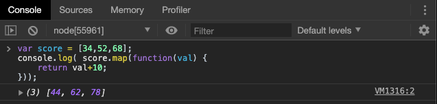

# ES5 数组变化

在学习 ES6 数组新特性之前，我们首先回顾一下 ES5 数组的变化。

## Array.isArray()

`Array.isArray()`方法是用来判断某个值是否是数组，如果是，则返回true，否则返回false，用于判断一些类似数组的对象很有用。

例如以下的数组和对象我们凭借打印和`typeof` 操作都无法直观的作出区分：


上面的例子中，`arr2`就是一个"长得像数组的对象"。

无论是数组还是对象，对于`typeof`的操作返回值都为`object`，所以就有了区分数组类型和对象类型的需要。我们之前区分是通过如下方法：


>`instanceof`用来判断内存中实际对象A是不是B类型


ES5 提供了 `Array.isArray`方法来方便我们进行判断


>需要注意的是 `isArray`方法是对象方法而不是实例方法

## indexOf() 和 lastIndexOf()

`indexOf()`方法返回给定元素能找在数组中找到的第一个索引值，否则则返回-1。
而`lastIndexOf()`方法是返回指定元素在数组中的最后一个索引值，如果不存在则返回-1。
**注意**，`lastIndexOf()`是从数组的后面向前查找。


> 思考一下，数组中的`indexOf`方法是否和字符串中的表现一致？学过C语言的同学们应该有所领悟，字符串其实是一种特殊的数组。

## filter() 和 map()

ES5 提供了几个新的数组遍历函数。

`filter()`方法使用制定的函数过滤所有元素，并创建一个包含所有通过过滤的元素的新数组，通常我们称之为过滤器。
我们可以指定函数为`filter()`的回调函数。


那么在遍历时，`filter`的回调函数中具体接收了哪些参数呢？


实质上，`filter`接收到了三个实参，分别是

+ 迭代到该步的数组元素
+ 数组元素对应的索引
+ 原数组

我们的判断可以基于上述三个参数进行。


上例我们就基于索引进行了过滤。

> 过滤器的返回值一定是一个布尔值，用以判断该步元素是否被过滤掉。

`map()`方法返回一个由原数组中的每个元素调用一个指定方法后的返回值组成的新数组。
`map()`方法会给原数组按照顺序调用一次回调函数进行处理。处理之后的返回值会组合起来形成一个新数组。



它和`filter`函数的执行类似，只是返回值并不是布尔值，而是**经过运算后的数组该位置上的新值**，因此，下面的函数执行也是可以的：


**注意**，我们不仅可以用自定义回调函数，也可以用系统回调函数处理数组元素：


同`filter`一样，我们一起来探究`map`函数在遍历时接收到的实参：


实质上，`map`接收到了三个实参，分别是

+ 迭代到该步的数组元素
+ 数组元素对应的索引
+ 原数组

我们的判断可以基于上述三个参数进行。


上例中我们就使用其它两个参数实现了数组的反转。

## reduce() 和 reduceRight()

同样是遍历数组，`reduce()`方法接受一个回调函数作为**累加器**，数组中的每个值（从左到右）开始合并，最终合成一个值。


相比`filter`和`map`，`reduce`不太容易理解，我们首先看一下它接收的实参：


为了便于观察，我们将每一步遍历的返回值设置为0，实际上，`reduce`的实参有如下几个部分组成：

+ `previsousValue` :上一次调用的回调值，或者是给定的初始值
+ `currentValue`: 数组中当前被处理的元素
+ `index`: 当前元素在数组中的索引值
+ `array`: 调用reduce的数组

如果想要实现累加，需要的返回值显而易见`previousValue + currentValue`

```
array.reduce(function(previsousValue,currentValue,index,array)　
	return previousValue + currentValue;
})
```

而`reduceRight()`和`reduce()`方法类似，只是执行顺序是从右到左的。

## forEach()

同上述四个方法一样， `forEach()`也是用来遍历数组并，且对数组的每个元素执行一次回调函数。


它接收的参数如下：


+ 当前元素元素的值
+ 当前元素的索引
+ 当前数组

相比而言，`forEach`更为灵活，我们可以自定义返回规则，是筛选，是更改，还是累加:

筛选：


更改：


累加：


## 小结

本章我们主要讲解了 ES5 中新增的几个数组方法，它们能够帮助我们更为灵活的判断，使用，和遍历数组，也为我们的 ES6 数组变化作出了铺垫。

**预告**： 下一章，我们将正式介绍 ES6 中的数组变化。


