# 数组新特性

## 扩展运算符

扩展运算符（spread）是三个点（`...`）, 可以将一个数组转换为逗号分隔的参数序列。

我们在《解构赋值》一章曾经使用过类似的符号：

```javascript
let [a,...b] = [1,2,3]
```

请注意此处的`...`并不是扩展运算符，而是`rest 参数`，或被称为**不定形参**，区分扩展运算符和`rest参数`，需要看谁是`左值`，即被赋值的一方为 `rest参数`，展开赋予值，即被取值的一方为扩展运算符。当然，有些资料把它们统称为扩展运算符，也是可以的，同学们理解用法即可，不必深究。

> 关于`rest参数`我们会在函数新特性一章中详细讲解。

扩展运算符使用很简单：

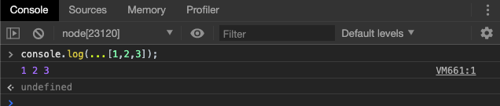

取值的一方被自动展开了。

该运算符主要用于函数的调用：

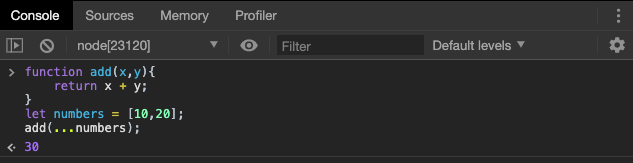

函数在调用时，扩展运算符将一个数组，变为一个参数序列，我们有时也会称这种赋值方式为**不定实参**。

扩展运算符的使用非常灵活，它可以和正常的函数实参结合使用：

```javascript
function f(v, w, x, y, z) { }
const args = [0, 1];
f(-1, ...args, 2, ...[3]);
```

也可以放置表达式：

```javascript
const arr = [
  ...(x > 0 ? ['a'] : []),
  'b',
];
```

### 代替apply方法

由于扩展运算符可以展开数组，所以不再需要`apply`方法，将数组转为函数的参数了。

> 当然，`apply`方法的实质是扭转`this`的指向，有时我们也仅使用`apply`解决参数传递问题。

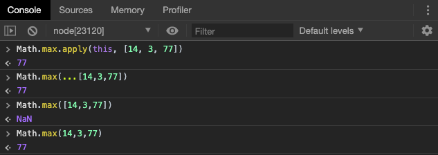

很明显，当我们有数组格式的参数需要拆解传递时，扩展运算符较`apply`更好理解和使用。

下面是另外一个例子：

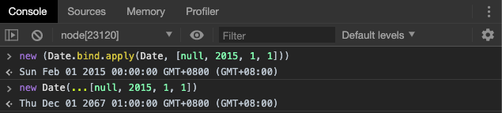


### 扩展运算符的应用

#### 复制数组

数组是复合的数据类型，直接复制的话，只是复制了指向底层数据结构的指针，而不是克隆一个全新的数组。

```javascript
const a1 = [1, 2];
const a2 = a1;

a2[0] = 2;
a1 // [2, 2]
```

上面代码中，`a2`并不是`a1`的克隆，而是指向同一份数据的另一个指针。修改`a2`，会直接导致`a1`的变化。

ES5 只能用变通方法来复制数组。

```javascript
const a1 = [1, 2];
const a2 = a1.concat();

a2[0] = 2;
a1 // [1, 2]
```

上面代码中，`a1`会返回原数组的克隆，再修改`a2`就不会对`a1`产生影响。

扩展运算符提供了复制数组的简便写法。

```javascript
const a1 = [1, 2];
// 写法一
const a2 = [...a1];
// 写法二
const [...a2] = a1;
```

上面的两种写法，`a2`都是`a1`的克隆。


#### 合并数组

扩展运算符提供了数组合并的新写法。

```javascript
const arr1 = ['a', 'b'];
const arr2 = ['c'];
const arr3 = ['d', 'e'];

// ES5 的合并数组
arr1.concat(arr2, arr3);
// [ 'a', 'b', 'c', 'd', 'e' ]

// ES6 的合并数组
[...arr1, ...arr2, ...arr3]
// [ 'a', 'b', 'c', 'd', 'e' ]
```

不过，这两种方法都是浅拷贝，使用的时候需要注意。

```javascript
const a1 = [{ foo: 1 }];
const a2 = [{ bar: 2 }];

const a3 = a1.concat(a2);
const a4 = [...a1, ...a2];

a3[0] === a1[0] // true
a4[0] === a1[0] // true
```

上面代码中，`a3`和`a4`是用两种不同方法合并而成的新数组，但是它们的成员都是对原数组成员的引用，这就是浅拷贝。如果修改了引用指向的值，会同步反映到新数组。

#### 字符串

扩展运算符还可以将字符串转为真正的数组。

```javascript
[...'hello']
// [ "h", "e", "l", "l", "o" ]
```

扩展运算符可以正确识别四个字节的 Unicode 字符，识别为2个字符。我们对字符串的操作如果出现错误，可以改写成为扩展运算符的写法。

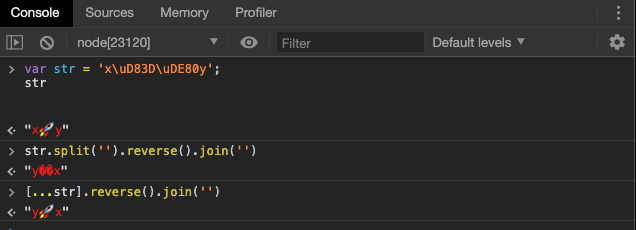

> 如果在进行字符串操作时需要保证严谨性，建议都使用扩展运算符进行改写。


#### 实现 Iterator 接口对象/操作 Generator 函数

我们将在`Iterator`和`Generator`部分进行详细讲解。

## Array.from()

`Array.from`方法用于将两类对象转为真正的数组：类似数组的对象（array-like object）和可遍历（iterable）的对象（包括 ES6 新增的数据结构 Set 和 Map）。

```javascript
let arrayLike = {
	'0':'a',
	'1':'b',
	'2':'c',
	length:3
}
```

`arrayLike`对象是一个长得像数组的对象，我们如果想要将其转换为数组，在 ES5 中的做法就很麻烦。

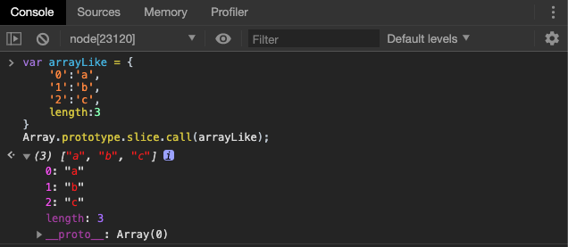

如果使用 `Array.from()`，事情就会变的很简单直观。

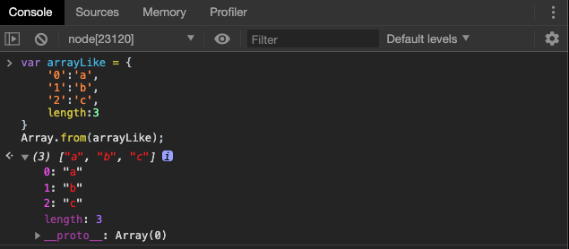

> 区别于扩展运算符，`Array.from()`无需在意转换的对象是否是可迭代对象，任何有`length`属性的对象，都可以进行转换，同学们在此处仅作了解，具体内容我们还是将在`Iterator`和`Generator`部分进行详细讲解。

`Array.from`还可以接受第二个参数，作用类似于数组的`map`方法，用来对每个元素进行处理，将处理后的值放入返回的数组。

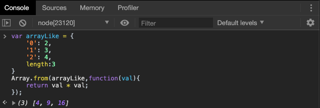

> 此处的回调函数和`map`**一致**。

如果回调函数中用到了`this`关键字，还可以传入`Array.from`的第三个参数，用来绑定`this`。

总之，`Array.from()`可以将各种值转为真正的数组，并且还提供`map`功能。这实际上意味着，只要有一个原始的数据结构，你就可以先对它的值进行处理，然后转成规范的数组结构，进而就可以使用数量众多的数组方法。


`Array.from()`的另一个应用是，将字符串转为数组，然后返回字符串的长度。

```javascript
Array.from(string).length;
```

> 其实作用和扩展运算符一致，都是为了能够正确的处理各种 Unicode 字符，以避免处理大于`\uFFFF`字符时出现错误。

## Array.of()

`Array.of`方法用于将一组值，转换为数组。

```javascript
Array.of(3, 11, 8) // [3,11,8]
Array.of(3) // [3]
Array.of(3).length // 1
```

这个方法的主要目的，是弥补数组构造函数`Array()`的不足。因为参数个数的不同，会导致`Array()`的行为有差异。

```javascript
Array() // []
Array(3) // [, , ,]
Array(3, 11, 8) // [3, 11, 8]
```

上面代码中，`Array`方法没有参数、一个参数、三个参数时，返回结果都不一样。只有当参数个数不少于 2 个时，`Array()`才会返回由参数组成的新数组。参数个数只有一个时，实际上是指定数组的长度。

`Array.of`基本上可以用来替代`Array()`或`new Array()`，并且不存在由于参数不同而导致的重载。它的行为非常统一。

```javascript
Array.of() // []
Array.of(undefined) // [undefined]
Array.of(1) // [1]
Array.of(1, 2) // [1, 2]
```

`Array.of`总是返回参数值组成的数组。如果没有参数，就返回一个空数组。

## 数组实例方法 copyWithin()

数组通过`copyWithin`方法，在当前数组内部，将指定位置的成员复制到其它位置（会覆盖原有的成员），然后返回当前数组。

```javascript
Array.prototype.copyWithin(target,start = 0,end = this.length);
```

它接受三个参数：

+ target(必须)：从该位置开始替换数据。
+ start(可选)：从该位置开始读取数据，默认为0，如果为负值，则表示从末尾开始计数。
+ end（可选）：从该位置**前**停止读取数据，默认等于数组长度。如果为负值，表示从末尾开始计数。


```javascript
[1,2,3,4,5].copyWithin(0,3,4);
//[4,2,3,4,5]
```

## 数组实例方法 find()和findIndex()

数组实例的`find()`方法，用于找到第一个符合条件的数组成员。它的参数是一个回调函数。所有数组的成员依次执行该回调函数，直到找出第一个返回值为true的成员，然后返回该成员。如果没有符合条件的成员，则返回`undefined`
回调函数可以接受三个参数

+ value 当前的键值
+ index 当前的索引值
+ array 原数组

```javascript
[1,5,10,15].find(function(value,index,array){
	return value > 9;
});
//10
```

数组的`findIndex()`方法和`find()`方法类似，只是返回值是第一个符合条件的数组成员的位置，如果找不到，则返回-1；

```Javascript
[1,5,10,15].findIndex(function(value,index,array){
	return value > 9;
})
//2
```

这两个方法都可以接受第二个参数，用来绑定回调函数的`this`指向。

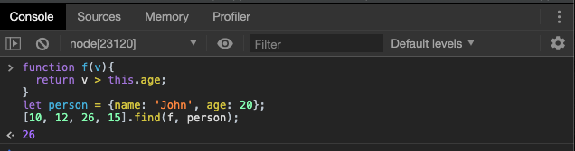

上面的代码中，`find`函数接收了第二个参数`person`对象，回调函数中的`this`对象指向`person`对象。

另外，这两个方法都可以发现`NaN`，弥补了数组的`indexOf`方法的不足。

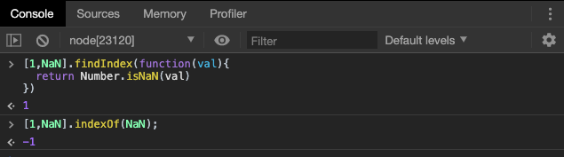

上面代码中，`indexOf`方法无法识别数组的`NaN`成员，但是`findIndex`可以找到。

> `indexOf`做的是全等于判断，而`NaN`和自身是不相等的。

## 数组实例方法 fill()

`fill()`方法使用给定值，填充一个数组。

```javascript
['a','b','c'].fill(7)
//7,7,7
```

上面的代码表明，`fill()`方法用于空数组的初始化非常方便。数组中已有的元素，会被全部抹去。
`fill()`方法还可以接受第二个和第三个参数，用于指定填充的起始位置和结束位置。

```javascript
['a','b','c'].fill(7,1,2)
//['a','7','c']
```

## 数组实例方法 entries() keys() 和 values()

ES6提供三个新的方法，`entries()`，`keys()`和`values()`,这三个方法可以用于遍历数组。

`keys()`是针对键名的遍历，`values()`是对键值的遍历，`entries()`是对键值对的遍历，它们三者的调用都会返回一个可遍历对象，可以供`for...of`循环遍历。

> `for...of`我们在《字符串新特性》一章已经接触过，今后我们仍会继续对它进行学习。

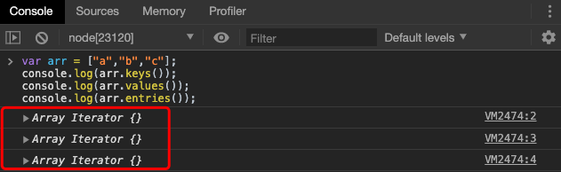

> 注意此处的返回值。

我们对三者进行遍历：

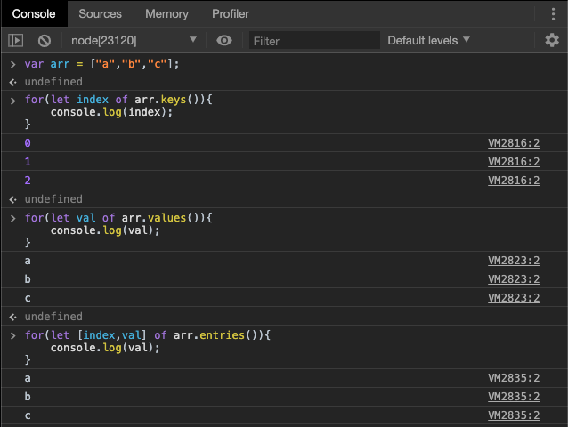


如果不使用原来的`for···of`循环，那么可以手动调用指针，使用`next`方法，进行遍历。

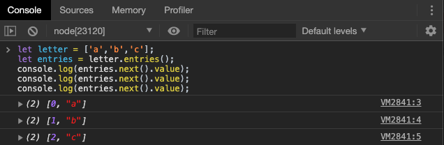

## 数组实例方法 includes()

`Array.prototype.includes()`方法返回一个布尔值，表示某个数组是否包含给定的值。

```javascript
[1,2,3].includes(2)//true
[1,2,3].includes(4)//false
```

同样该方法可以设置搜索的起始位置，默认为0。
如果第二个参数为负数，则表示倒数的位置。

```javascript
[1,2,3].includes(3,3) //false
[1,2,3].includes(3,-1)//true
```

同样，`includes()`方法也可以帮助我们判断数组中是否存在`NaN`，这一表现与`find/findIndex`相同。

```javascript
[1,2,3,NaN].includes(NaN) //true 
```

## 数组扁平化

数组的成员有时还是数组，`Array.prototype.flat()`用于将嵌套的数组“拉平”，变成一维的数组。该方法返回一个新数组，对原数据没有影响。

> 请注意，在Node 12 环境下，还未支持数组扁平化函数，下面的例子均在Chrome 79 上进行测试。

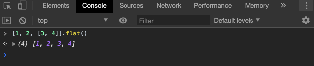

上面代码中，原数组的成员里面有一个数组，`flat()`方法将子数组的成员取出来，添加在原来的位置。

`flat()`默认只会“拉平”一层，如果想要“拉平”多层的嵌套数组，可以将`flat()`方法的参数写成一个整数，表示想要拉平的层数，默认为1。

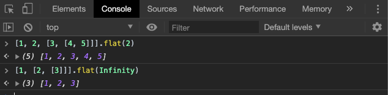

上面代码中，`flat()`的参数为2，表示要“拉平”两层的嵌套数组，如果不管有多少层嵌套，都要转成一维数组，可以用`Infinity`关键字作为参数。

如果原数组有空位，`flat()`方法会跳过空位。

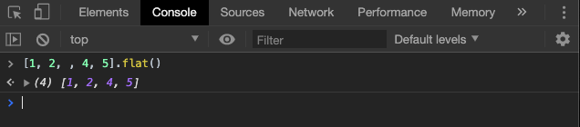

`flatMap()`方法对原数组的每个成员执行一个函数（相当于执行`Array.prototype.map()`），**然后**对返回值组成的数组执行`flat()`方法。该方法返回一个新数组，不改变原数组。

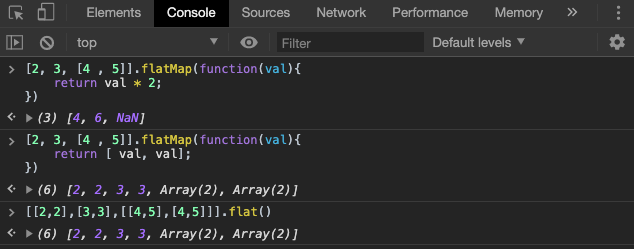

请注意`flatMap`的执行顺序，是先进行`map`操作，然后再进行`flat`操作。因此上例中的最后两个表达式是等价的。

> 注意：`flatMap()`只能展开一层数组。

`flatMap()`方法的参数是一个遍历函数，该函数可以接受三个参数，分别是当前数组成员、当前数组成员的位置（从零开始）、原数组。

```javascript
arr.flatMap(function callback(currentValue[, index[, array]]) {
  // ...
}[, thisArg])
```

`flatMap()`方法还可以有第二个参数，用来绑定遍历函数里面的`this`。

## 数组空位

数组的空位，指的是数组的某一个位置没有任何值。比如，`Array`构造函数返回的数组都是空位

```javascript
Array(3)//[,,,]
```

注意，空位不是`undefined`，一个位置等于`undefined`，依然是有值的。空位没有任何值。

ES5 对空位的处理，已经很不一致了，大多数情况下会忽略空位。

ES6 则是明确将空位转为`undefined`。

`Array.from`方法会将数组的空位，转为`undefined`，也就是说，这个方法不会忽略空位。

```javascript
Array.from(['a',,'b'])
// [ "a", undefined, "b" ]
```

扩展运算符（`...`）也会将空位转为`undefined`。

```javascript
[...['a',,'b']]
// [ "a", undefined, "b" ]
```

`copyWithin()`会连空位一起拷贝。

```javascript
[,'a','b',,].copyWithin(2,0) // [,"a",,"a"]
```

`fill()`会将空位视为正常的数组位置。

```javascript
new Array(3).fill('a') // ["a","a","a"]
```

`for...of`循环也会遍历空位。

```javascript
let arr = [, ,];
for (let i of arr) {
  console.log(1);
}
// 1
// 1
```

上面代码中，数组`arr`有两个空位，`for...of`并没有忽略它们。如果改成`map`方法遍历，空位是会跳过的

`entries()`、`keys()`、`values()`、`find()`和`findIndex()`会将空位处理成`undefined`。

> 此处需要注意区分 ES5 和 ES6 的数组方法和实例方法在处理数组空位上的不同。相信 ECMAScript 最终会走向标准一致。


##  小结

在本章中，我们详细介绍了 ES6 中的数组新增特性，包括新增的运算符和新增的对象方法和实例方法，这些都需要我们在实战中逐渐掌握。

在下一章中，我们将继续讲解 ES6 的新特性 - 对象新特性。