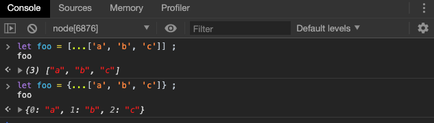

# 对象新特性

对象是 JavaScript 最重要的数据结构，ES6 对它进行了重大升级。 

## 属性的简洁表示法

ES6 允许在大括号里面，直接写入变量和函数，作为对象的属性和方法。这样的书写更加简洁。


同样的，方法也可以简写。


因此，当变量名等于属性名/方法名时,可以对其进行简洁表示。

这种写法，用于函数返回值时，会非常方便。

```javascript
function getPoint() {
  const x = 1;
  const y = 10;
  return {x, y};
}
```

需要注意的是，简写的对象方法不能作为构造函数，会报错。


上面代码中，`f`是一个简写的对象方法，所以`obj.f`不能当作构造函数使用。

## 属性名表达式

ES6 允许字面量定义对象时，用表达式作为对象的属性名，即把表达式放在方括号内。


表达式还可以用于定义方法名。


注意，属性名表达式与简洁表示法，不能同时使用，会报错。


注意，属性名表达式如果是一个对象，默认情况下会自动将对象转为字符串`[object Object]`，这一点要特别小心。

```javascript
const keyA = {a: 1};
const keyB = {b: 2};

const myObject = {
  [keyA]: 'valueA',
  [keyB]: 'valueB'
};

myObject // Object {[object Object]: "valueB"}
```

上面代码中，`[keyA]`和`[keyB]`得到的都是`[object Object]`，所以`[keyB]`会把`[keyA]`覆盖掉，而`myObject`最后只有一个`[object Object]`属性。

## 方法的 name 属性

函数的`name`属性，返回函数名。对象方法也是函数，因此也有`name`属性。


有两种特殊情况：`bind`方法创造的函数，`name`属性返回`bound`加上原函数的名字；`Function`构造函数创造的函数，`name`属性返回`anonymous`。


## 属性的可枚举性和遍历

### 可枚举性

对象的每个属性都有一个描述对象（Descriptor），用来控制该属性的行为。`Object.getOwnPropertyDescriptor`方法可以获取该属性的描述对象。


描述对象的`enumerable`属性，称为“可枚举性”，如果该属性为`false`，就表示某些操作会忽略当前属性。

目前，有四个操作会忽略`enumerable`为`false`的属性。

- `for...in`循环：只遍历对象自身的**和继承的**可枚举的属性。
- `Object.keys()`：返回对象自身的所有可枚举的属性的键名。
- `JSON.stringify()`：只串行化对象自身的可枚举的属性。
- `Object.assign()`： 忽略`enumerable`为`false`的属性，只拷贝对象自身的可枚举的属性。

这四个操作之中，前三个是 ES5 就有的，最后一个`Object.assign()`是 ES6 新增的。其中，只有`for...in`会返回继承的属性，其他三个方法都会忽略继承的属性，只处理对象自身的属性。

实际上，引入“可枚举”（`enumerable`）这个概念的最初目的，就是让某些属性可以规避掉`for...in`操作，不然所有内部属性和方法都会被遍历到。比如，对象原型的`toString`方法，以及数组的`length`属性，就通过“可枚举性”，从而避免被`for...in`遍历到。


上面代码中，`toString`和`length`属性的`enumerable`都是`false`，因此`for...in`不会遍历到这两个继承自原型的属性。

### 属性的遍历

ES6 一共有 5 种方法可以遍历对象的属性。

**（1）for...in**

`for...in`循环遍历对象自身的**和继承的**可枚举属性（不含 Symbol 属性）。

**（2）Object.keys(obj)**

`Object.keys`返回一个数组，包括对象自身的（不含继承的）所有可枚举属性（不含 Symbol 属性）的键名。

**（3）Object.getOwnPropertyNames(obj)**

`Object.getOwnPropertyNames`返回一个数组，包含对象自身的所有属性（不含 Symbol 属性，但是包括不可枚举属性）的键名。

**（4）Object.getOwnPropertySymbols(obj)**

`Object.getOwnPropertySymbols`返回一个数组，包含对象自身的所有 Symbol 属性的键名。

**（5）Reflect.ownKeys(obj)**

`Reflect.ownKeys`返回一个数组，包含对象自身的所有键名，不管键名是 Symbol 或字符串，也不管是否可枚举。

> 一般情况下，我们使用前两种方式遍历属性。其余方法暂时只做了解。

## super 关键字

我们知道，`this`关键字总是指向函数所在的当前对象，ES6 又新增了另一个类似的关键字`super`，指向当前对象的原型对象。


上面代码中，对象`obj.find()`方法之中，通过`super.foo`引用了原型对象`proto`的`foo`属性。

> 实际上，`setPrototypeOf(obj,proto)`在含以上等价于`obj.__proto__  =  proto`

注意，`super`关键字表示原型对象时，只能用在对象的方法之中，用在其他地方都会报错。


上述写法看起来没有错误，但实质上是在为属性赋值，并不是对象的方法。

JavaScript 引擎内部，`super.foo`等同于`Object.getPrototypeOf(this).foo`（属性）或`Object.getPrototypeOf(this).foo.call(this)`（方法），注意，这里的`this`是调用者的`this`，因此会出现以下现象：

```javascript
const proto = {
  x: 'hello',
  foo() {
    console.log(this.x);
  },
};

const obj = {
  x: 'world',
  foo() {
    super.foo();
  }
}

Object.setPrototypeOf(obj, proto);

obj.foo() // "world"
```

上面代码中，`super.foo`指向原型对象`proto`的`foo`方法，但是绑定的`this`却还是当前对象`obj`，因此输出的就是`world`。

## 对象的扩展运算符

数组新特性中的扩展运算符也被引入到了对象当中

### 解构赋值

对象的解构赋值用于从一个对象取值，相当于将目标对象自身的所有可遍历的（enumerable）、但尚未被读取的属性，分配到指定的对象上面。所有的键和它们的值，都会拷贝到新对象上面。


详细的对象的解构赋值的使用方式，我们可以参照《解构赋值》一章。

这里需要注意的是，在做解构赋值时，必须作为最后一个参数，否则会报错。


> 实际上此处的称谓不是扩展运算符，而是`rest 参数`，或称为**不定形参**

注意，解构赋值的拷贝是浅拷贝，即如果一个键的值是复合类型的值（数组、对象、函数）、那么解构赋值拷贝的是这个值的引用，而不是这个值的副本。

```javascript
let obj = { a: { b: 1 } };
let { ...x } = obj;
obj.a.b = 2;
x.a.b // 2
```

另外，扩展运算符的解构赋值，不能复制继承自原型对象的属性。

```javascript
let o1 = { a: 1 };
let o2 = { b: 2 };
o2.__proto__ = o1;
let { ...o3 } = o2;
o3 // { b: 2 }
o3.a // undefined
```

但是普通的解构赋值，是可以复制即成自原型对象的属性的，引用《解构赋值》一章的例子如下：


### 扩展运算符

对象的扩展运算符和数组的扩展运算符类似。

对象的扩展运算符（`...`）用于取出参数对象的所有可遍历属性，拷贝到**当前对象**之中。


由于数组是特殊的对象，所以对象的扩展运算符，也可以用于数组。



如果扩展运算符后面是字符串，它会自动转成一个类似数组的对象。


扩展运算符可用于合并对象，它的用法类似`Object.assign()`方法。

```javascript
let aClone = { ...a };
// 等同于
let aClone = Object.assign({}, a);

let ab = { ...a, ...b };
// 等同于
let ab = Object.assign({}, a, b);
```

> 上述拷贝仍然只是拷贝了对象实例的属性。

## 链判断运算符（了解）

编程实务中，如果读取对象内部的某个属性，往往需要判断一下该对象是否存在。比如，要读取`message.body.user.firstName`，安全的写法是写成下面这样。

```javascript
const firstName = (message
  && message.body
  && message.body.user
  && message.body.user.firstName) || 'default';
```

或者使用三元运算符`?:`，判断一个对象是否存在。

```javascript
const fooInput = myForm.querySelector('input[name=foo]')
const fooValue = fooInput ? fooInput.value : undefined
```

这样的层层判断非常麻烦，因此 [ES2020](https://github.com/tc39/proposal-optional-chaining) 引入了“链判断运算符”（optional chaining operator）`?.`，简化上面的写法。

```javascript
const firstName = message?.body?.user?.firstName || 'default';
const fooValue = myForm.querySelector('input[name=foo]')?.value
```

上面代码使用了`?.`运算符，直接在链式调用的时候判断，左侧的对象是否为`null`或`undefined`。如果是的，就不再往下运算，而是返回`undefined`。

> 本特性在 Node 12 版本中并未实现，测试环境为 Chrome 79时可以执行。

链判断运算符有三种用法。

- `obj?.prop` // 对象属性
- `obj?.[expr]` // 同上
- `func?.(...args)` // 函数或对象方法的调用

下面是判断对象方法是否存在，如果存在就立即执行的例子。

```javascript
iterator.return?.()
```

上面代码中，`iterator.return`如果有定义，就会调用该方法，否则直接返回`undefined`。

下面是这个运算符常见的使用形式，以及不使用该运算符时的等价形式。

```javascript
a?.b
// 等同于
a == null ? undefined : a.b

a?.[x]
// 等同于
a == null ? undefined : a[x]

a?.b()
// 等同于
a == null ? undefined : a.b()

a?.()
// 等同于
a == null ? undefined : a()
```

## Null 判断运算符（了解）

读取对象属性的时候，如果某个属性的值是`null`或`undefined`，有时候需要为它们指定默认值。常见做法是通过`||`运算符指定默认值。

```javascript
const headerText = response.settings.headerText || 'Hello, world!';
const animationDuration = response.settings.animationDuration || 300;
const showSplashScreen = response.settings.showSplashScreen || true;
```

上面的三行代码都通过`||`运算符指定默认值，但是这样写是错的。开发者的原意是，只要属性的值为`null`或`undefined`，默认值就会生效，但是属性的值如果为空字符串或`false`或`0`，默认值也会生效。

为了避免这种情况，[ES2020](https://github.com/tc39/proposal-nullish-coalescing) 引入了一个新的 Null 判断运算符`??`。它的行为类似`||`，但是只有运算符左侧的值为`null`或`undefined`时，才会返回右侧的值。

> 本特性在 Node 12 版本中并未实现，测试环境为 Chrome 79时可以执行。

```javascript
const headerText = response.settings.headerText ?? 'Hello, world!';
const animationDuration = response.settings.animationDuration ?? 300;
const showSplashScreen = response.settings.showSplashScreen ?? true;
```

上面代码中，默认值只有在属性值为`null`或`undefined`时，才会生效。

这个运算符的一个目的，就是跟链判断运算符`?.`配合使用，为`null`或`undefined`的值设置默认值。

```javascript
const animationDuration = response.settings?.animationDuration ?? 300;
```

上面代码中，`response.settings`如果是`null`或`undefined`，就会返回默认值300。

## 小结

本章我们主要讲解了 ES6 中对象的新特性，我们重点掌握如下知识点：

+ 属性的简洁表达式和属性名表达式
+ `super`关键字的使用
+ 对象的扩展运算符使用

**预告**：我们将在下一章继续讲解 ES6 中对象的变化，对象的新增方法。