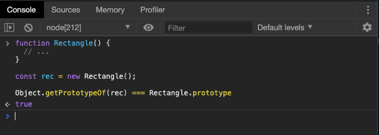

# 对象新方法

本章节涉及到面向对象部分知识，希望同学们认真回顾面向对象章节的**原型链**部分。

## Object.is()

ES5 比较两个值是否相等，只有两个运算符：相等运算符（`==`）和严格相等运算符（`===`）。它们都有缺点，前者会自动转换数据类型，后者的`NaN`不等于自身，以及`+0`等于`-0`。JavaScript 缺乏一种运算，在所有环境中，只要两个值是一样的，它们就应该相等。

ES6 提出“Same-value equality”（同值相等）算法，用来解决这个问题。`Object.is`就是部署这个算法的新方法。它用来比较两个值是否严格相等，与严格比较运算符（===）的行为基本一致。


不同之处只有两个：一是+0不等于-0，二是`NaN`等于自身。


## Object.assign()

### 基本用法

`Object.assign`方法用于对象的合并，将源对象（source）的所有可枚举属性，复制到目标对象（target）。

`Object.assign`方法的第一个参数是目标对象，后面的参数都是源对象，如果目标对象与源对象有同名属性，或多个源对象有同名属性，则后面的属性会覆盖前面的属性。


如果参数不是对象，则会被转换为对象，并拷贝可枚举属性，如果**第一个参数是null/undefined**，无法转换成为对象，就会报错。


> 在进行类型转换时，只有字符串的包装类型会产生可枚举属性。

`Object.assign`拷贝的属性是有限制的，只拷贝源对象的自身属性（不拷贝继承属性），也不拷贝不可枚举的属性（`enumerable: false`）。


上面代码中，`Object.assign`要拷贝的对象只有一个不可枚举属性`invisible`，这个属性并没有被拷贝进去。


### 注意点

#### 浅拷贝

`Object.assign`方法实行的是浅拷贝，而不是深拷贝。也就是说，如果源对象某个属性的值是对象，那么目标对象拷贝得到的是这个对象的引用。


#### 数组的处理 

`Object.assign`可以用来处理数组，但是会把数组视为对象。


上面代码中，`Object.assign`把数组视为属性名为 0、1、2 的对象，因此源数组的 0 号属性`4`覆盖了目标数组的 0 号属性`1`。


### 常见用途


#### 为对象添加属性

```javascript
class Point {
  constructor(x, y) {
    Object.assign(this, {x, y});
  }
}
```

上面方法通过`Object.assign`方法，将`x`属性和`y`属性添加到`Point`类的对象实例。


#### 为对象添加方法

```javascript
Object.assign(SomeClass.prototype, {
  someMethod(arg1, arg2) {
    ···
  },
  anotherMethod() {
    ···
  }
});
```

上面代码使用了对象属性的简洁表示法，直接将两个函数放在大括号中，再使用`assign`方法添加到`SomeClass.prototype`之中。


#### 克隆对象

```javascript
function clone(origin) {
  return Object.assign({}, origin);
}
```

上面代码将原始对象拷贝到一个空对象，就得到了原始对象的克隆。

不过，采用这种方法克隆，只能克隆原始对象自身的值，不能克隆它继承的值。如果想要保持继承链，可以采用下面的代码。

```javascript
function clone(origin) {
  let originProto = origin.__proto__;
  return Object.assign(Object.create(originProto), origin);
}
```

> **`Object.create()`**方法创建一个新对象，使用现有的对象来提供新创建的对象的__proto__。


#### 为属性提供默认值

```javascript
const DEFAULTS = {
  logLevel: 0,
  outputFormat: 'html'
};

function processContent(options) {
  options = Object.assign({}, DEFAULTS, options);
  console.log(options);
  // ...
}
```

上面代码中，`DEFAULTS`对象是默认值，`options`对象是用户提供的参数。`Object.assign`方法将`DEFAULTS`和`options`合并成一个新对象，如果两者有同名属性，则`options`的属性值会覆盖`DEFAULTS`的属性值。

## Object.getOwnPropertyDescriptors()

ES5 的`Object.getOwnPropertyDescriptor()`方法会返回某个对象属性的描述对象（descriptor）。ES2017 引入了`Object.getOwnPropertyDescriptors()`方法，返回指定对象所有自身属性（非继承属性）的描述对象。

> 上一章我们使用过`Object.getOwnPropertyDescriptor()`，为了查看可枚举属性和属性描述，同学们可以回顾查看。


### 补充内容

#### `Object.defineProperties()`

**`Object.defineProperties()`** 方法直接在一个对象上定义新的属性或修改现有属性，并返回该对象。

**语法**

```
Object.defineProperties(obj, props)
```

**参数**


- `obj`

  在其上定义或修改属性的对象。

- `props`

  要定义其可枚举属性或修改的属性描述符的对象。对象中存在的属性描述符主要有两种：数据描述符和访问器描述符描述符具有以下键：

  + `configurable`

    `true` 当且仅当该属性描述符的类型可以被改变并且该属性可以从对应对象中删除。 **默认为 `false`**

  + `enumerable`

    `true` 当且仅当在枚举相应对象上的属性时该属性显现。 **默认为 `false`**

  + `value`与属性关联的值。可以是任何有效的JavaScript值（数字，对象，函数等）。 **默认为`undefined`**

  + `writable`

    `true`当且仅当与该属性相关联的值可以用assignment operator改变时。 **默认为 `false`**

  + `get`作为该属性的 getter 函数，如果没有 getter 则为`undefined`。函数返回值将被用作属性的值。 **默认为 `undefined`**

  + `set`作为属性的 setter 函数，如果没有 setter 则为`undefined`。函数将仅接受参数赋值给该属性的新值。 **默认为 `undefined`**


#### `Object.create()`

 **`Object.create()`**方法创建一个新对象，使用现有的对象来提供新创建的对象的__proto__。

**语法**

```
Object.create(proto[, propertiesObject])
```

**参数**

- `proto`

  新创建对象的原型对象。

- `propertiesObject`

  可选。如果没有指定为 `undefined`，则是要添加到新创建对象的不可枚举（默认）属性（即其自身定义的属性，而不是其原型链上的枚举属性）对象的属性描述符以及相应的属性名称。这些属性对应`Object.defineProperties()`的第二个参数。

> 以上两种方法，我们在接下来的课件中会经常使用，请同学们结合面向对象部分内容进行学习。

### 用途

#### 正确拷贝取值方法和赋值方法


该方法的引入目的，主要是为了解决`Object.assign()`无法正确拷贝`get`属性和`set`属性的问题。


上面代码中，`source`对象的`foo`属性的值是一个赋值函数，`Object.assign`方法将这个属性拷贝给`target1`对象，结果该属性的值变成了`undefined`。这是因为`Object.assign`方法总是拷贝一个属性的值，而不会拷贝它背后的赋值方法或取值方法。

这时，`Object.getOwnPropertyDescriptors()`方法配合`Object.defineProperties()`方法，就可以实现正确拷贝。


#### 实现复制继承

`Object.getOwnPropertyDescriptors()`方法可以实现一个对象继承另一个对象。以前，继承另一个对象，常常写成下面这样。

```javascript
const obj = {
  __proto__: prot,
  foo: 123,
};
```

ES6 规定`__proto__`只有浏览器要部署，其他环境不用部署。如果去除`__proto__`，上面代码就要改成下面这样。

```javascript
const obj = Object.create(prot);
obj.foo = 123;

// 或者

const obj = Object.assign(
  Object.create(prot),
  {
    foo: 123,
  }
);
```

有了`Object.getOwnPropertyDescriptors()`，我们就有了另一种写法。

```javascript
const obj = Object.create(
  prot,
  Object.getOwnPropertyDescriptors({
    foo: 123,
  })
);
```


## \__proto__ 属性，Object.setPrototypeOf() 和 Object.getPrototypeOf()

JavaScript 语言的对象继承是通过原型链实现的。ES6 提供了更多原型对象的操作方法。

### \__proto__属性

`__proto__`属性，用来读取或设置当前对象的`prototype`对象。目前，所有浏览器（包括 IE11）都部署了这个属性。

```javascript
// es5 的写法
const obj = {
  method: function() { ... }
};
obj.__proto__ = someOtherObj;

// es6 的写法
var obj = Object.create(someOtherObj);
obj.method = function() { ... };
```

该属性没有写入 ES6 的正文，而是写入了附录，原因是`__proto__`前后的双下划线，说明它本质上是一个内部属性，而不是一个正式的对外的 API，只是由于浏览器广泛支持，才被加入了 ES6。

标准明确规定，只有浏览器必须部署这个属性，其他运行环境不一定需要部署，而且新的代码最好认为这个属性是不存在的。因此，无论从语义的角度，还是从兼容性的角度，都不要使用这个属性，而是使用`Object.setPrototypeOf()`（写操作）、`Object.getPrototypeOf()`（读操作）、`Object.create()`（生成操作）代替。

我们可以回顾一下`__proto__`，`prototype`和`constructor`的联系：

+ 每个对象都具有一个名为`__proto__`的属性 指向他的构造函数的`prototype`。

+ 每个构造函数都有个`prototype`的方法。（注意：既然是方法，那么就是一个对象（JS中函数同样是对象），所以`prototype`同样带有`__proto__`属性）；

+ 每个对象的`__proto__`属性指向自身构造函数的`prototype`；


### Object.setPrototypeOf()

`Object.setPrototypeOf`方法的作用与`__proto__`相同，用来设置一个对象的`prototype`对象，返回参数对象本身。它是 ES6 正式推荐的设置原型对象的方法。


上面代码将`proto`对象设为`obj`对象的原型，所以从`obj`对象可以读取`proto`对象的属性。

由于`undefined`和`null`无法转为对象，所以如果第一个参数是`undefined`或`null`，就会报错，但是我们可以设置一个对象的原型为`null`。


### Object.getPrototypeOf()

该方法与`Object.setPrototypeOf`方法配套，用于读取一个对象的原型对象。

```javascript
Object.getPrototypeOf(obj);
```

下面是一个例子。




## Object.keys() Object.values() 和 Object.entries()

以上三个方法看起来非常眼熟，是的，我们在《数组新特性》一章中，数组的实例方法有这三个同名函数。

在对象方法中，它们同样也是为了遍历对象，结合`for...of`使用的。


> 需要注意的是，`Object.values`方法返回一个数组，成员是参数对象自身的（不含继承的）所有可遍历（enumerable）属性的键值。
>
> 总之，在 ES6 中，只要是遍历对象的属性值，首先需要判断是否是可枚举属性。

## Object.fromEntries()

 `Object.fromEntries()`方法是`Object.entries()`的逆操作，用于将一个键值对数组转为对象。

```javascript
Object.fromEntries([
  ['foo', 'bar'],
  ['baz', 42]
])
// { foo: "bar", baz: 42 }
```

该方法的主要目的，是将键值对的数据结构还原为对象，因此特别适合将 Map 结构转为对象。

> 关于`Map`，我们会在后面的章节中详细解释。


## 小结

本章我们主要学习了对象的新增方法，重点还是在于对对象原型的一系列操作上。希望同学们在回顾面向对象知识之后再进行细致的学习。

**预告**：下一章，我们将继续学习 ES6 中的新变化 函数新特性