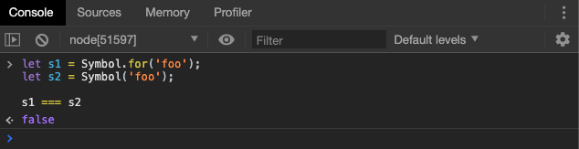
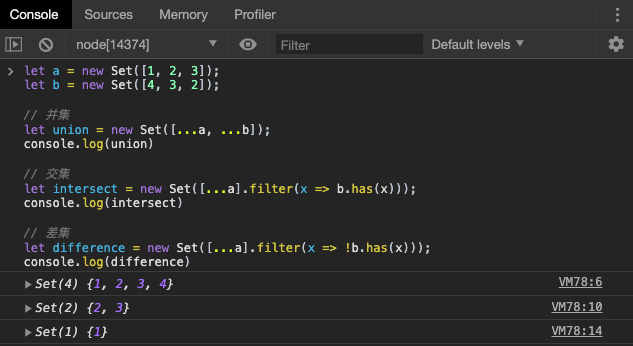
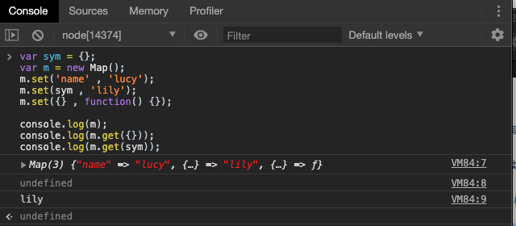

# 新增数据类型和数据结构

## Symbol 数据类型

### 概述

ES5 的对象属性名都是字符串，这容易造成属性名的冲突。比如，你使用了一个他人提供的对象，但又想为这个对象添加新的方法，新方法的名字就有可能与现有方法产生冲突。如果有一种机制，保证每个属性的名字都是独一无二的就好了，这样就从根本上防止属性名的冲突。这就是 ES6 引入`Symbol`的原因。

ES6 引入了一种新的原始数据类型`Symbol`，表示独一无二的值。它是 JavaScript 语言的第七种数据类型，前六种是：`undefined`、`null`、布尔值（Boolean）、字符串（String）、数值（Number）、对象（Object）。

Symbol 值通过`Symbol`函数生成。这就是说，对象的属性名现在可以有两种类型，一种是原来就有的字符串，另一种就是新增的 Symbol 类型。凡是属性名属于 Symbol 类型，就都是独一无二的，可以保证不会与其他属性名产生冲突。


> 这里不能用 `new`，因为`Symbol()`生成的不是一个对象，而是一种新的数据类型。

`Symbol`函数可以接受一个字符串作为参数，表示对 Symbol 实例的描述，主要是为了在控制台显示，或者转为字符串时，比较容易区分。


上面代码中，`s1`和`s2`是两个 Symbol 值。如果不加参数，它们在控制台的输出都是`Symbol()`，不利于区分。有了参数以后，就等于为它们加上了描述，输出的时候就能够分清，到底是哪一个值。

如果 Symbol 的参数是一个对象，就会调用该对象的`toString`方法，将其转为字符串，然后才生成一个 Symbol 值。

```javascript
const obj = {
  toString() {
    return 'abc';
  }
};
const sym = Symbol(obj);
sym // Symbol(abc)
```


需要注意，`Symbol`函数的参数只是表示对当前 Symbol 值的描述，因此相同参数的`Symbol`函数的返回值是不相等的。


上面代码中，`s1`和`s2`都是`Symbol`函数的返回值，而且参数相同，但是它们是不相等的。

> Symbol 值不能与其他类型的值进行运算，会报错。但是它可以显示的转换为字符串或者布尔值。

### 作为属性名的 Symbol 

由于每一个 Symbol 值都是不相等的，这意味着 Symbol 值可以作为标识符，用于对象的属性名，就能保证不会出现同名的属性。这对于一个对象由多个模块构成的情况非常有用，能防止某一个键被不小心改写或覆盖。

```javascript
let mySymbol = Symbol();

// 第一种写法
let a = {};
a[mySymbol] = 'Hello!';

// 第二种写法
let a = {
  [mySymbol]: 'Hello!'
};

// 第三种写法
let a = {};
Object.defineProperty(a, mySymbol, { value: 'Hello!' });

// 以上写法都得到同样结果
a[mySymbol] // "Hello!"
```

上面代码通过方括号结构和`Object.defineProperty`，将对象的属性名指定为一个 Symbol 值。

**注意**，Symbol 值作为对象属性名时，不能用点运算符。

```javascript
const mySymbol = Symbol();
const a = {};

a.mySymbol = 'Hello!';
a[mySymbol] // undefined
a['mySymbol'] // "Hello!"
```

上面代码中，因为点运算符后面总是字符串，所以不会读取`mySymbol`作为标识名所指代的那个值，导致`a`的属性名实际上是一个字符串，而不是一个 Symbol 值。

同理，在对象的内部，使用 Symbol 值定义属性时，Symbol 值必须放在方括号之中。

```javascript
let s = Symbol();

let obj = {
  [s]: function (arg) { ... }
};

obj[s](123);
```

上面代码中，如果`s`不放在方括号中，该属性的键名就是字符串`s`，而不是`s`所代表的那个 Symbol 值。

采用增强的对象写法，上面代码的`obj`对象可以写得更简洁一些。

```javascript
let obj = {
  [s](arg) { ... }
};
```

> 此处为 ES6 对象的写法。

Symbol 类型还可以用于定义一组常量，保证这组常量的值都是不相等的。

```javascript
const log = {};

log.levels = {
  DEBUG: Symbol('debug'),
  INFO: Symbol('info'),
  WARN: Symbol('warn')
};
console.log(log.levels.DEBUG, 'debug message');
console.log(log.levels.INFO, 'info message');
```

下面是另外一个例子。

```javascript
const COLOR_RED    = Symbol();
const COLOR_GREEN  = Symbol();

function getComplement(color) {
  switch (color) {
    case COLOR_RED:
      return COLOR_GREEN;
    case COLOR_GREEN:
      return COLOR_RED;
    default:
      throw new Error('Undefined color');
    }
}
```

常量使用 Symbol 值最大的好处，就是其他任何值都不可能有相同的值了，因此可以保证上面的`switch`语句会按设计的方式工作。

还有一点需要注意，Symbol 值作为属性名时，该属性还是公开属性，不是私有属性。


### 属性名的遍历

Symbol 作为属性名，遍历对象的时候，该属性不会出现在`for...in`、`for...of`循环中，也不会被`Object.keys()`、`Object.getOwnPropertyNames()`、`JSON.stringify()`返回。

但是，它也不是私有属性，有一个`Object.getOwnPropertySymbols()`方法，可以获取指定对象的所有 Symbol 属性名。该方法返回一个数组，成员是当前对象的所有用作属性名的 Symbol 值。


上面代码中，使用`for...in`循环和`Object.getOwnPropertyNames()`方法都得不到 Symbol 键名，需要使用`Object.getOwnPropertySymbols()`方法。

> 我们在讲遍历时候曾经提到过

另一个新的 API，`Reflect.ownKeys()`方法可以返回所有类型的键名，包括常规键名和 Symbol 键名。


> 顾名思义，`Reflect`使用了**反射**

由于以 Symbol 值作为键名，不会被常规方法遍历得到。我们可以利用这个特性，**为对象定义一些非私有的、但又希望只用于内部的方法。**

### Symbol.for() 和 Symbol.keyFor()

有时，我们希望重新使用同一个 Symbol 值，`Symbol.for()`方法可以做到这一点。它接受一个字符串作为参数，然后搜索有没有以该参数作为名称的 Symbol 值。如果有，就返回这个 Symbol 值，否则就新建一个以该字符串为名称的 Symbol 值，并将其注册到全局。

> 记为:“有则取之，无则创建”。


上面代码中，`s1`和`s2`都是 Symbol 值，但是它们都是同样参数的`Symbol.for`方法生成的，所以实际上是同一个值。

`Symbol.for()`与`Symbol()`这两种写法，都会生成新的 Symbol。它们的区别是，前者会被登记在全局环境中供搜索，后者不会。`Symbol.for()`不会每次调用就返回一个新的 Symbol 类型的值，而是会先检查给定的`key`是否已经存在，如果不存在才会新建一个值。比如，如果你调用`Symbol.for("cat")`30 次，每次都会返回同一个 Symbol 值，但是调用`Symbol("cat")`30 次，会返回 30 个不同的 Symbol 值。



上述代码也很好的证明了，同样是创建一个参数为`foo`的`Symbol`数据，两者创建的值不一致。

`Symbol.keyFor()`方法返回一个已登记的 Symbol 类型值的`key`。


上面代码中，变量`s3`属于未登记的 Symbol 值，所以返回`undefined`。

> `Symbol.for`为 Symbol 登记值的名字，是全局环境的，不管函数是否在全局中运行。

### 内置的 Symbol 值

除了自己可使用 Symbol 值以外，ES6 还提供了 11 个内置的 Symbol 值，指向语言内部的使用方法，我们在此处不做讨论。


## Set 和 Map 数据结构

### Set

`Set`是数据的集合，具有确定性，无序性，唯一性，在之前的 JavaScript 中，我们如果想要构建一个集合会很麻烦，ES6 提供了新的数据结构 Set。它类似于数组，但是成员的值都是唯一的，没有重复的值。

`Set`本身是一个构造函数，用来生成 Set 数据结构。

`Set`函数可以接受一个数组（或者具有 iterable 接口的其他数据结构）作为参数，用来初始化。


上面的例子中，我们都通过`Set`函数接受数组作为参数，我们也可以得知，由于`Set`可迭代，所以其可以被展开运算符展开，同理可以被`for...of`循环。

因为集合中的元素具有确定性和唯一性，而`Set`又是可以被可迭代对象创建同时又可以被展开的，我们经常会使用`Set`进行数组去重和字符串去重。


向 Set 加入值的时候，不会发生类型转换，所以`5`和`"5"`是两个不同的值，但是需要注意的是，**两个`NaN`被`Set`认为成相同的值**。

> 两个空对象当然是不同的值。

同时，`Array.from()` 方法也可以将`Set` 结构转换成为数组，我们又多了一种数组去重的方法：


> 此处再次回想一下，`Array.from` 和 扩展运算符的区别：不管对象是否可迭代，只要有`length`属性，`Array.from`都可将其转换成为数组。


#### Set 实例的属性和方法

Set 结构的实例有以下属性。

- `Set.prototype.constructor`：构造函数，默认就是`Set`函数。
- `Set.prototype.size`：返回`Set`实例的成员总数。

Set 实例的方法分为两大类：操作方法（用于操作数据）和遍历方法（用于遍历成员）。下面先介绍四个操作方法。

- `Set.prototype.add(value)`：添加某个值，返回 Set 结构本身。
- `Set.prototype.delete(value)`：删除某个值，返回一个布尔值，表示删除是否成功。
- `Set.prototype.has(value)`：返回一个布尔值，表示该值是否为`Set`的成员。
- `Set.prototype.clear()`：清除所有成员，没有返回值。


#### 遍历操作

Set 结构的实例有四个遍历方法，可以用于遍历成员。

- `Set.prototype.keys()`：返回键名的遍历器
- `Set.prototype.values()`：返回键值的遍历器
- `Set.prototype.entries()`：返回键值对的遍历器
- `Set.prototype.forEach()`：使用回调函数遍历每个成员

需要特别指出的是，`Set`的遍历顺序就是插入顺序。这个特性有时非常有用，比如使用 Set 保存一个回调函数列表，调用时就能保证按照添加顺序调用。

**（1）`keys()`，`values()`，`entries()`**

`keys`方法、`values`方法、`entries`方法返回的都是遍历器对象。由于 Set 结构没有键名，只有键值（**或者说键名和键值是同一个值**），所以`keys`方法和`values`方法的行为完全一致。

> 和数组/对象的遍历方法名称一致。


上面代码中，`entries`方法返回的遍历器，同时包括键名和键值，所以每次输出一个数组，它的两个成员完全相等。

我们也可以直接用`for...of`循环遍历 Set。


**（2）`forEach()`**

Set 结构的实例与数组一样，也拥有`forEach`方法，用于对每个成员执行某种操作，没有返回值。

```javascript
let set = new Set([1, 4, 9]);
set.forEach((value, key) => console.log(key + ' : ' + value))
// 1 : 1
// 4 : 4
// 9 : 9
```

上面代码说明，`forEach`方法的参数就是一个处理函数。该函数的参数与数组的`forEach`一致，依次为键值、键名、集合本身（上例省略了该参数）。这里需要注意，**Set 结构的键名就是键值**（两者是同一个值），因此第一个参数与第二个参数的值永远都是一样的。

另外，`forEach`方法还可以有第二个参数，表示绑定处理函数内部的`this`对象。

**（3）遍历的应用**

扩展运算符（`...`）内部使用`for...of`循环，所以也可以用于 Set 结构。

```javascript
let set = new Set(['red', 'green', 'blue']);
let arr = [...set];
// ['red', 'green', 'blue']
```

扩展运算符和 Set 结构相结合，就可以去除数组的重复成员。

```javascript
let arr = [3, 5, 2, 2, 5, 5];
let unique = [...new Set(arr)];
// [3, 5, 2]
```

而且，数组的`map`和`filter`方法也可以间接用于 Set 了。

```javascript
let set = new Set([1, 2, 3]);
set = new Set([...set].map(x => x * 2));
// 返回Set结构：{2, 4, 6}

let set = new Set([1, 2, 3, 4, 5]);
set = new Set([...set].filter(x => (x % 2) == 0));
// 返回Set结构：{2, 4}
```

**因此使用 Set 可以很容易地实现并集（Union）、交集（Intersect）和差集（Difference）。**



### Map

JavaScript的对象（Object），本质上是键值对的集合（Hash结构），但是传统上只能用字符串当作键。这给它的使用带来了很大的限制。
为了解决这个问题，ES6 提供了Map 数据结构。它类似于对象，也是键值对的集合，但是“键”的范围不限于字符串，各种类型的值（包括对象）都可以当作键。也就是说，Object 结构提供了“字符串—值”的对应，Map 结构提供了“值—值”的对应，是一种更完善的Hash结构实现。



上述代码中，我们使用了 Map 结构的`set`方法，在空的 Map 结构中添加了键和值，然后又用 `get`方法进行了取值操作。需要注意的是，**两个空对象并不相等**，但是就和 Set 一样，两个 `NaN`被视为同一个键。

作为构造函数，Map 也可以接受一个数组作为参数。该数组的成员是一个个表示键值对的数组。

```javascript
const map = new Map([
  ['name', '张三'],
  ['title', 'Author']
]);

map.size // 2
map.has('name') // true
map.get('name') // "张三"
map.has('title') // true
map.get('title') // "Author"
```

上面代码在新建 Map 实例时，就指定了两个键`name`和`title`。

事实上，不仅仅是数组，任何具有 Iterator 接口、且每个成员都是一个双元素的数组的数据结构，都可以当作`Map`构造函数的参数。这就是说，`Set`和`Map`都可以用来生成新的 Map。


有意思的是，Map 由 Map 生成时，它们长得是一样的。


如果对同一个键多次赋值，后面的值将覆盖前面的值。

```javascript
const map = new Map();

map
.set(1, 'aaa')
.set(1, 'bbb');

map.get(1) // "bbb"
```

上面代码对键`1`连续赋值两次，后一次的值覆盖前一次的值。

如果读取一个未知的键，则返回`undefined`。

```javascript
new Map().get('asfddfsasadf')
// undefined
```

#### Map 实例的属性和方法

Map 结构的实例有以下属性。

- `Map.prototype.constructor`：构造函数，默认就是`Map`函数。
- `Map.prototype.size`：返回`Map`实例的成员总数。

Map 实例的方法分为两大类：操作方法（用于操作数据）和遍历方法（用于遍历成员）。下面先介绍四个操作方法。

- `Map.prototype.set(key,value)`：添加某个值，返回 Map 结构本身，**如果`key`已经有值，则键值会被更新，否则就新生成该键。**
- `Map.prototype.delete(key)`：删除某个值，返回一个布尔值，表示删除是否成功。
- `Map.prototype.has(key)`：返回`key`所对应的`value`，如果找不到`key`则返回`undefined`。
- `Map.prototype.clear()`：清除所有成员，没有返回值。

具体的实例请看上文。

#### 遍历操作

Map 结构原生提供三个遍历器生成函数和一个遍历方法。

- `Map.prototype.keys()`：返回键名的遍历器。
- `Map.prototype.values()`：返回键值的遍历器。
- `Map.prototype.entries()`：返回所有成员的遍历器。
- `Map.prototype.forEach()`：遍历 Map 的所有成员。

需要特别注意的是，Map 的遍历顺序就是插入顺序。`keys`， `values` 和 `entries` 和数组的方法类似，具体的实例不做赘述。

我们同样可以将 Map 结构转化为数组，比较快捷的方法是使用扩展运算符。


此外，Map 还有一个`forEach`方法，与数组的`forEach`方法类似，也可以实现遍历。

```javascript
map.forEach(function(value, key, map) {
  console.log("Key: %s, Value: %s", key, value);
});
```

`forEach`方法还可以接受第二个参数，用来绑定`this`。

除和数组相互转化外，我们还可以很轻松的将 Map 与对象进行相互转化。

如果所有 Map 的键都是字符串，它可以无损地转为对象。

```javascript
function strMapToObj(strMap) {
  let obj = Object.create(null);
  for (let [k,v] of strMap) {
    obj[k] = v;
  }
  return obj;
}

const myMap = new Map()
  .set('yes', true)
  .set('no', false);
strMapToObj(myMap)
// { yes: true, no: false }
```

如果有非字符串的键名，那么这个键名会被转成字符串，再作为对象的键名。

而对象转为 Map 可以通过`Object.entries()`。

```javascript
let obj = {"a":1, "b":2};
let map = new Map(Object.entries(obj));
```

## 小结

本章我们学习了 ES6 新增的数据类型和数据结构，都比较重要，需要同学们结合之前学习过的扩展运算符，数组实例的方法，对象实例的方法进行学习。

**预告**：下一章，我们将学习 ES6 新增的 迭代器，看一看究竟什么是可被遍历的。