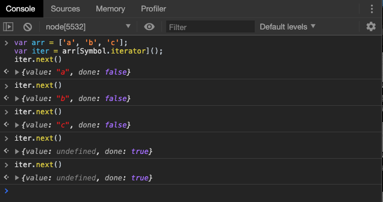
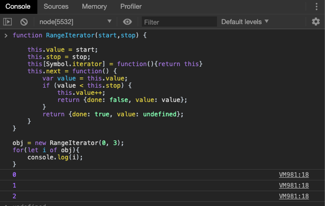
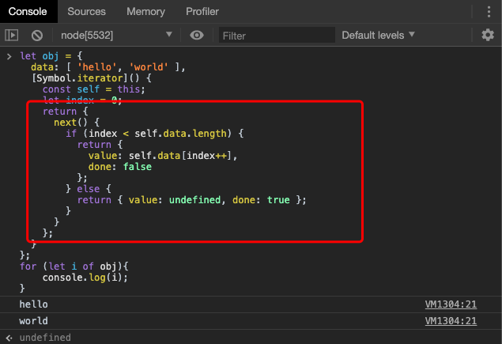
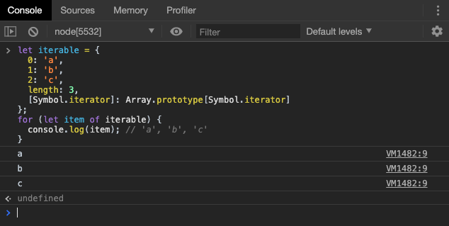
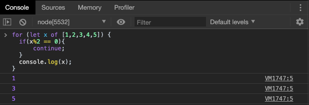
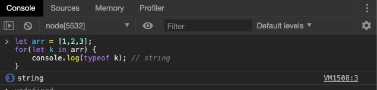
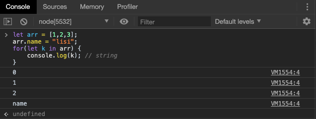
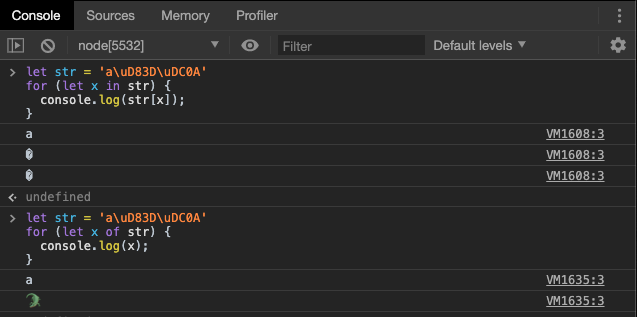

# Iterator 遍历器

## Iterator 概念

JavaScript 原有的表示“集合”的数据结构，主要是数组（`Array`）和对象（`Object`），ES6 又添加了`Map`和`Set`。这样就有了四种数据集合，用户还可以组合使用它们，定义自己的数据结构，比如数组的成员是`Map`，`Map`的成员是对象。这样就需要一种统一的接口机制，来处理所有不同的数据结构。

遍历器（Iterator）就是这样一种机制。它是一种接口，为各种不同的数据结构提供统一的访问机制。任何数据结构只要部署 Iterator 接口，就可以完成遍历操作（即依次处理该数据结构的所有成员）。

Iterator 的作用有三个：一是为各种数据结构，提供一个统一的、简便的访问接口；二是使得数据结构的成员能够按某种次序排列；三是 ES6 创造了一种新的遍历命令`for...of`循环，Iterator 接口主要供`for...of`消费。

Iterator 的遍历过程是这样的。

（1）创建一个指针对象，指向当前数据结构的起始位置。也就是说，遍历器对象本质上，就是一个指针对象。

（2）依次调用指针对象的`next`方法，返回一个包含`value`和`done`两个属性的对象。其中，`value`属性是当前成员的值，`done`属性是一个布尔值，表示遍历是否结束。

具体实例我们下一小节详细讲解。

## 默认 Iterator 接口

Iterator 接口的目的，就是为所有数据结构，提供了一种统一的访问机制，即`for...of`循环。当使用`for...of`循环遍历某种数据结构时，**该循环会自动去寻找 Iterator 接口。**

**一种数据结构只要部署了 Iterator 接口，我们就称这种数据结构是“可遍历的”或者“可迭代的”（iterable）。**

ES6 规定，默认的 Iterator 接口部署在数据结构的`Symbol.iterator`属性，或者说，一个数据结构只要具有`Symbol.iterator`属性，就可以认为是“可遍历的”（iterable）。`Symbol.iterator`属性本身是一个函数，就是当前数据结构默认的遍历器生成函数。执行这个函数，就会返回一个遍历器对象。

> `Symbol.iterator` 是JavaScript内置的。

ES6 的有些数据结构原生具备 Iterator 接口（比如数组），即不用任何处理，就可以被`for...of`循环遍历。原因在于，这些数据结构原生部署了`Symbol.iterator`属性，`for...of`在循环时首先调用了其接口。凡是部署了`Symbol.iterator`属性的数据结构，就称为部署了遍历器接口。**调用这个接口，就会返回一个遍历器对象。**

原生具备 Iterator 接口的数据结构如下。

- Array
- Map
- Set
- String
- TypedArray
- 函数的 arguments 对象
- NodeList 对象

下面的例子是数组的`Symbol.iterator`属性。



上面代码中，变量`arr`是一个数组，原生就具有遍历器接口，部署在`arr`的`Symbol.iterator`属性上面。所以，**调用这个属性，就得到遍历器对象。**而根据第一节的描述，我们自然就可以调用该遍历器对象的`next()`方法，返回值正如我们所述，是一个包含`value`和`done`两个属性的对象。

对于原生部署 Iterator 接口的数据结构，不用自己写遍历器生成函数，`for...of`循环会自动遍历它们。除此之外，其他数据结构（主要是对象）的 Iterator 接口，都需要自己在`Symbol.iterator`属性上面部署，这样才会被`for...of`循环遍历，一个对象如果要具备可被`for...of`循环调用的 Iterator 接口，就必须在`Symbol.iterator`的属性上部署遍历器生成方法（原型链上的对象具有该方法也可）。



上面代码是一个对象通过部署 Iterator 接口的写法。`Symbol.iterator`属性对应一个函数，执行后返回当前对象的遍历器对象。

下面是另一个为对象添加 Iterator 接口的例子。



需要注意的是，`Symbol.iterator`返回值是一个对象，对象中的`next()`函数使用了其作用域外的变量`self`和`index`，本质上形成了闭包，是我们能在调用`next()`时，引用`Symbol.iterator`定义时的内部变量，因此我们每次调用`next()`时，会正常执行迭代。

如果上面的例子能够看懂，我们再来看一例通过遍历器实现指针结构的例子。

```javascript
function Obj(value) {
  this.value = value;
  this.next = null;
}

Obj.prototype[Symbol.iterator] = function() {
  var iterator = { next: next };

  var current = this;

  function next() {
    if (current) {
      var value = current.value;
      current = current.next;
      return { done: false, value: value };
    } else {
      return { done: true };
    }
  }
  return iterator;
}

var one = new Obj(1);
var two = new Obj(2);
var three = new Obj(3);

one.next = two;
two.next = three;

for (var i of one){
  console.log(i); // 1, 2, 3
}
```

上面代码首先在构造函数的原型链上部署`Symbol.iterator`方法，调用该方法会返回遍历器对象`iterator`，调用该对象的`next`方法，在返回一个值的同时，自动将内部指针移到下一个实例。

对于类似数组的对象（存在数值键名和`length`属性），部署 Iterator 接口，有一个简便方法，就是`Symbol.iterator`方法直接引用数组的 Iterator 接口。



> 普通对象部署数组的`Symbol.iterator`方法，并无效果。

## 调用 Iterator 的场合

有一些场合会默认调用 Iterator 接口（即`Symbol.iterator`方法），除了下文会介绍的`for...of`循环，还有几个别的场合。

**（1）解构赋值**

对数组和 Set 结构进行解构赋值时，会默认调用`Symbol.iterator`方法。

```javascript
let set = new Set().add('a').add('b').add('c');

let [x,y] = set;
// x='a'; y='b'

let [first, ...rest] = set;
// first='a'; rest=['b','c'];
```

**（2）扩展运算符**

扩展运算符（...）也会调用默认的 Iterator 接口。

```javascript
// 例一
var str = 'hello';
[...str] //  ['h','e','l','l','o']

// 例二
let arr = ['b', 'c'];
['a', ...arr, 'd']
// ['a', 'b', 'c', 'd']
```

上面代码的扩展运算符内部就调用 Iterator 接口。

实际上，这提供了一种简便机制，可以将任何部署了 Iterator 接口的数据结构，转为数组。也就是说，只要某个数据结构部署了 Iterator 接口，就可以对它使用扩展运算符，将其转为数组。

```javascript
let arr = [...iterable];
```

**（3）yield\***

我们会在下一章详细解释。

## Iterator 接口和 Generator 函数

`Symbol.iterator`方法的最简单实现，还是使用下一章要介绍的 Generator 函数，我们会在下一章详细解释。

## `for ... of` 循环

ES6 借鉴 C++、Java、C# 和 Python 语言，引入了`for...of`循环，作为遍历所有数据结构的统一的方法。

一个数据结构只要部署了`Symbol.iterator`属性，就被视为具有 iterator 接口，就可以用`for...of`循环遍历它的成员。也就是说，`for...of`循环内部调用的是数据结构的`Symbol.iterator`方法。

`for...of`循环可以使用的范围包括数组、Set 和 Map 结构、某些类似数组的对象**（比如`arguments`对象、DOM NodeList 对象）**、后文的 Generator 对象，以及字符串。

```js
let arr = ['东' , '南' , '西'];
for(let a of arr) {
    console.log(a);
}
// 东 南 西
```

```js
let sts = new Set(['春' , '夏' , '秋']);
for(let s of sts) {
    console.log(s);
}
// 春 夏 秋
```

```js
let maps = new Map([['name','lucy'] , ['age' , 9]]);
for(let m of maps) {
    console.log(m);
}
// ['name','lucy'] ['age',9]
```
```js
function add(){
  for(let x of arguments){
    console.log(x)
  }
}
add(...["hello","world"]);
// hello world
```

```js
function *makeSn(){
    for(let i=0; i<5; i++) {
        yield i;
    }
}

for(let sn of makeSn()) {
    console.log(sn);
}
// 0 1 2 3 4 5 
```

```javascript
let str = 'hello';
for(let s of str) {
    console.log(s);
}
// h e l l o
```

有些数据结构是在现有数据结构的基础上，计算生成的。比如，ES6 的数组、Set、Map 都部署了以下三个方法，调用后都返回遍历器对象。

- `entries()` 返回一个遍历器对象，用来遍历`[键名, 键值]`组成的数组。对于数组，键名就是索引值；对于 Set，键名与键值相同。Map 结构的 Iterator 接口，默认就是调用`entries`方法。
- `keys()` 返回一个遍历器对象，用来遍历所有的键名。
- `values()` 返回一个遍历器对象，用来遍历所有的键值。

这三个方法调用后生成的遍历器对象，所遍历的都是计算生成的数据结构。

```javascript
let arr = ['a', 'b', 'c'];
for (let pair of arr.entries()) {
  console.log(pair);
}
// [0, 'a']
// [1, 'b']
// [2, 'c']
```

### 与其它遍历方式的比较

原始的`for`循环

```js
for (var index = 0; index < myArray.length; index++) {
  console.log(myArray[index]);
}
```

es5 新增的`forEach()`

```js
// 自动给你的回调函数传递3个参数(单元的值,单元的键,数组本身)

['a' , 'b' , 'c'].forEach(function(val , key , arr){
    
    // if(val == 'b') break; //forEach中不能break

    console.log(val);
});
```

实质上，`for`循环和`forEach`没有本质区别。这两种循环方式都有很明显的缺点：无法使用`break`跳出，但是对于 `for...of`却没有这个顾虑。



我们通常也会使用``for...in`循环。

`for...in`虽然是为遍历对象准备的，不过它既可以循环数组也可以循环对象，但是在循环时往往会出现一些问题，比如在对数组循环时：



自动的对数据类型进行了转化。



也会莫名其妙的遍历数组的其它属性。

在《字符串新特性》一章中，我们也提到过，`for...in`不能正确识别 32 位 UTF-16 字符。



对比几种遍历方式，我们可以总结一下：

`for...in`的缺点:

+ `for...in`循环主要是为遍历对象而设计的，不适用于遍历数组。
+ 数组的键名是数字，但是`for...in`循环是以字符串作为键名“0”、“1”、“2”等等。
+ `for...in`循环不仅遍历数字键名，还会遍历手动添加的其他键，甚至包括原型链上的键。
+ 不敢保证遍历的键的顺序。

`for...of`的优点：

+ 有着同`for...in`一样的简洁语法，但是没有for...in那些缺点。
+ 不同用于`forEach()`方法，它可以与`break`、`continue`和`return`配合使用。
+ 提供了遍历所有数据结构的统一操作接口。


## 小结

本章中我们主要学习了遍历器 Iterator ，可迭代对象的特性和新增的`for...of`循环。都比较重要，请同学们参照以前所学的数据结构进行学习。

**预告**:下一章，我们将学习 ES6 新增的生成器函数 Generator。

