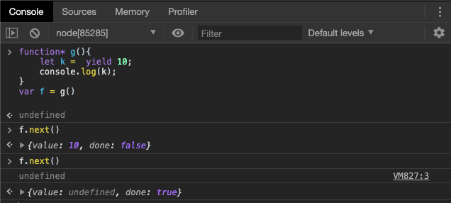
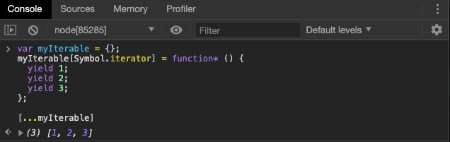
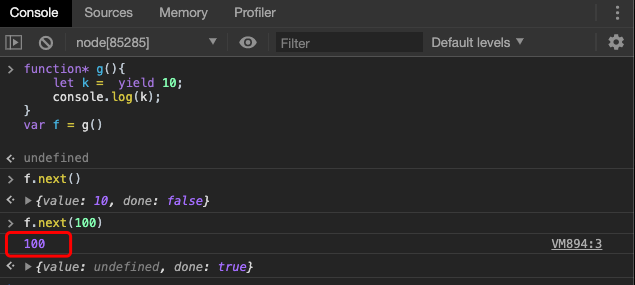
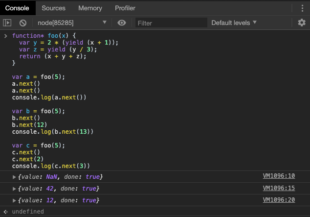
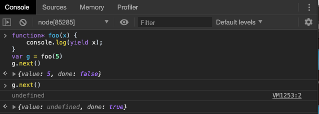
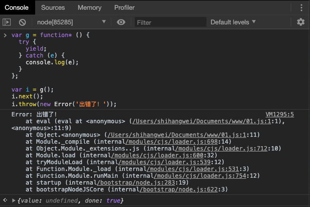
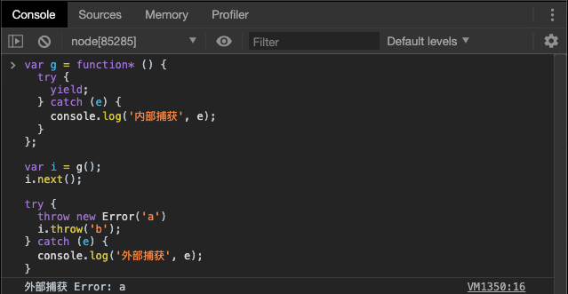
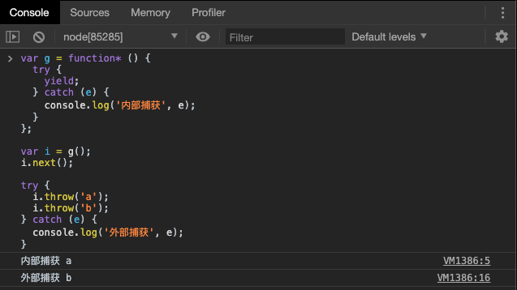
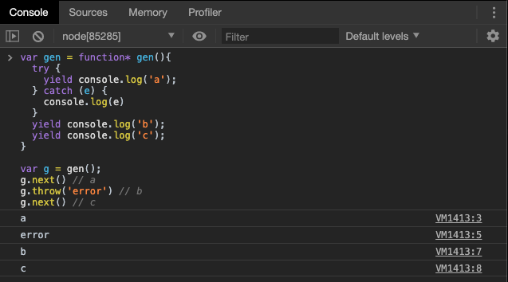
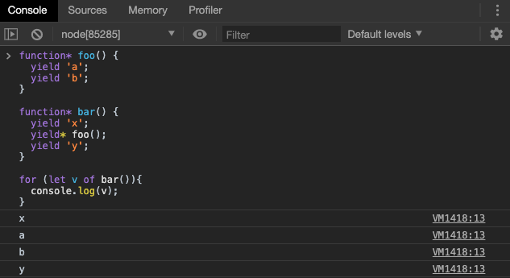

# 生成器 Generator

## 简介

### 基本概念

Generator 函数是 ES6 提供的一种异步编程解决方案，语法行为与传统函数完全不同。本章详细介绍 Generator 函数的语法和 API。

至于异步编程，我们将在学完本模块 Node.js 和后面的课程 《HTTP与网络编程》之后再进行学习。

Generator 函数有多种理解角度。语法上，首先可以把它理解成，Generator 函数是一个状态机，封装了多个内部状态。

我们可以把这个函数进行更为生动的理解：罐装啤酒和啤酒机


我们平日去吃大排档，通常会买几提啤酒，很有可能喝不完，还得很麻烦的退掉。不过如果我们让服务员搬过来一台啤酒机，我们想喝啤酒，就按下开关喝一杯，往往就不会浪费。

Generator 函数就类似啤酒机，不直接将啤酒一下子给客户，而是给客户一个能够产出啤酒“状态机”，内含啤酒。

这样做有什么好处呢？

我们以一个著名的斐波那契数列为例，它由`0`，`1`开头：

```
0 1 1 2 3 5 8 13 21 34 ...
```

要编写一个产生斐波那契数列的函数，可以这么写：

```javascript
function fib(max) {
    var
        t,
        a = 0,
        b = 1,
        arr = [0, 1];
    while (arr.length < max) {
        [a, b] = [b, a + b];
        arr.push(b);
    }
    return arr;
}

// 测试:
fib(5); // [0, 1, 1, 2, 3]
fib(10); // [0, 1, 1, 2, 3, 5, 8, 13, 21, 34]
```

函数只能返回一次，所以必须返回一个`Array`。但是，我们并不想一口气拿到所有的值，而是想每次都拿到数列的下一个值。当然，闭包是一个选项，不过 Generator 更轻松的能够实现。

```js
function* fib(max) {
    var
        t,
        a = 0,
        b = 1,
        n = 0;
    while (n < max) {
        yield a;
        [a, b] = [b, a + b];
        n ++;
    }
    return;
}
```

直接调用试试：

```javascript
fib(5); // fib {[[GeneratorStatus]]: "suspended", [[GeneratorReceiver]]: Window}
```

直接调用一个 Generator 和调用函数不一样，`fib(5)`仅仅是创建了一个Generator对象，还没有去执行它。

调用 Generator 对象有两个方法，一是不断地调用 Generator 对象的`next()`方法：

```
var f = fib(5);
f.next(); // {value: 0, done: false}
f.next(); // {value: 1, done: false}
f.next(); // {value: 1, done: false}
f.next(); // {value: 2, done: false}
f.next(); // {value: 3, done: false}
f.next(); // {value: undefined, done: true}
```

另外一种就是使用`for...of`循环。这两种方式我们会在下文详细解释。

先来仔细观察下 Generator 函数。

形式上，Generator 函数是一个普通函数，但是有两个特征。一是，`function`关键字与函数名之间有一个星号；二是，函数体内部使用`yield`表达式，定义不同的内部状态（`yield`在英语里的意思就是“产出”）

```javascript
function* helloWorldGenerator() {
  yield 'hello';
  yield 'world';
  return 'ending';
}

var hw = helloWorldGenerator();
```

上面代码定义了一个 Generator 函数`helloWorldGenerator`，它内部有两个`yield`表达式（`hello`和`world`），即该函数有三个状态：hello，world 和 return 语句（结束执行）。

然后，Generator 函数的调用方法与普通函数一样，也是在函数名后面加上一对圆括号。不同的是，调用 Generator 函数后，该函数并不执行，返回的也不是函数运行结果，而是一个指向内部状态的指针对象，也就是上一章介绍的遍历器对象（Iterator Object）。

下一步，必须调用遍历器对象的`next`方法，使得指针移向下一个状态。也就是说，每次调用`next`方法，内部指针就从函数头部或上一次停下来的地方开始执行，直到遇到下一个`yield`表达式（或`return`语句）为止。换言之，Generator 函数是分段执行的，`yield`表达式是暂停执行的标记，而`next`方法可以恢复执行。

```javascript
hw.next()
// { value: 'hello', done: false }

hw.next()
// { value: 'world', done: false }

hw.next()
// { value: 'ending', done: true }

hw.next()
// { value: undefined, done: true }
```

上面代码一共调用了四次`next`方法。

第一次调用，Generator 函数开始执行，直到遇到第一个`yield`表达式为止。`next`方法返回一个对象，它的`value`属性就是当前`yield`表达式的值`hello`，`done`属性的值`false`，表示遍历还没有结束。

第二次调用，Generator 函数从上次`yield`表达式停下的地方，一直执行到下一个`yield`表达式。`next`方法返回的对象的`value`属性就是当前`yield`表达式的值`world`，`done`属性的值`false`，表示遍历还没有结束。

第三次调用，Generator 函数从上次`yield`表达式停下的地方，一直执行到`return`语句（如果没有`return`语句，就执行到函数结束）。`next`方法返回的对象的`value`属性，就是紧跟在`return`语句后面的表达式的值（如果没有`return`语句，则`value`属性的值为`undefined`），`done`属性的值`true`，表示遍历已经结束。

第四次调用，此时 Generator 函数已经运行完毕，`next`方法返回对象的`value`属性为`undefined`，`done`属性为`true`。以后再调用`next`方法，返回的都是这个值。

总结一下，调用 Generator 函数，返回一个遍历器对象，代表 Generator 函数的内部指针。以后，每次调用遍历器对象的`next`方法，就会返回一个有着`value`和`done`两个属性的对象。`value`属性表示当前的内部状态的值，是`yield`表达式后面那个表达式的值；`done`属性是一个布尔值，表示是否遍历结束。

### yield 表达式

由于 Generator 函数返回的遍历器对象，只有调用`next`方法才会遍历下一个内部状态，所以其实提供了一种可以暂停执行的函数。`yield`表达式就是暂停标志。

遍历器对象的`next`方法的运行逻辑如下。

（1）遇到`yield`表达式，就暂停执行后面的操作，并将紧跟在`yield`后面的那个表达式的值，作为返回的对象的`value`属性值。

（2）下一次调用`next`方法时，再继续往下执行，直到遇到下一个`yield`表达式。

（3）如果没有再遇到新的`yield`表达式，就一直运行到函数结束，直到`return`语句为止，并将`return`语句后面的表达式的值，作为返回的对象的`value`属性值。

（4）如果该函数没有`return`语句，则返回的对象的`value`属性值为`undefined`。

需要注意的是`yield`的位置很重要，如果它位于赋值运算的右侧时更需要注意。



当我们执行第一个`next()`时，正常返回 `yield`后面的值 10。

但是第二次执行`next()`，时，`console.log(k)`的打印结果却是`undefined`，这就证明，并未进行赋值操作，或者说赋值操作的右值为`undefined`。

这是为什么呢？

当代码执行到`let k = yield 10`时，左值`k`需要取到右侧的值，而右侧是一个`yield`表达式，赋值操作被按下了暂停键，`yield`表达式执行，返回`value`值为 10。

当我们再次调用`next()`，赋值操作继续执行，那么取到的值是什么？`yield`表达式的返回值！该表达式没有返回值，或者说返回值为`undefined`，因此`k`的赋值操作其实为`k = undefined`

如何让函数做到看起来像它表述的那样执行呢？我们需要借助`next()`方法。在下一节中详细讲解。

### 与 Iterator 接口的关系

上一章说过，任意一个对象的`Symbol.iterator`方法，等于该对象的遍历器生成函数，调用该函数会返回该对象的一个遍历器对象。

由于 Generator 函数就是遍历器生成函数，因此可以把 Generator 赋值给对象的`Symbol.iterator`属性，从而使得该对象具有 Iterator 接口。



上面代码中，Generator 函数赋值给`Symbol.iterator`属性，从而使得`myIterable`对象具有了 Iterator 接口，可以被`...`运算符遍历了。 

Generator 函数执行后，返回一个遍历器对象。该对象本身也具有`Symbol.iterator`属性，执行后返回自身。

```javascript
function* gen(){
  // some code
}

var g = gen();

g[Symbol.iterator]() === g
```

## next 方法的参数

上一节中我们提到了`yield`需要注意的一个例子：

```js
function* g(){
    let k =  yield 10;
    console.log(k);
}
```

我们该如何对`k`进行正常赋值呢？

`yield`表达式本身没有返回值，或者说总是返回`undefined`。但是，`next`方法可以带一个参数，该参数就会被当作**上一个**`yield`表达式的返回值。

如果我们想要让`k`正常被赋值，那么需要在执行第二个`next()`方法时，传入参数，作为赋值操作继续执行取到的`yield`表达式的返回值！



上例中，`k`被赋值为 100 。

这个功能有很重要的语法意义。Generator 函数从暂停状态到恢复运行，它的上下文状态（context）是不变的。通过`next`方法的参数，就有办法在 Generator 函数开始运行之后，继续向函数体内部注入值。也就是说，可以在 Generator 函数运行的不同阶段，从外部向内部注入不同的值，从而调整函数行为。

```javascript
function* foo(x) {
  var y = 2 * (yield (x + 1));
  var z = yield (y / 3);
  return (x + y + z);
}
```

在这个生成器中，我们就可以通过注入不同的值，来返回不同的结果。



生成器 `a`由于没有在`next()`函数中传参，赋值运算右侧含有`yield`表达式的返回结果均为`undefined`，因此最后的运算结果肯定是`NaN`；

生成器 `b`,分别传入了12 和 13 两个值作为返回值，因此函数运算可视为为如下运算：

```
var x = 5
var y = 2 * 12
var z = 13
return (x + y + z) // 42
```

生成器 `c`，改变了传入参数，因此结果也不同。

注意，由于`next`方法的参数表示上一个`yield`表达式的返回值，所以在第一次使用`next`方法时，传递参数是无效的，**第一个`next()`被认为是启动 Generator**，只有从第二次使用`next`方法开始，参数才是有效的。**从语义上讲，第一个`next`方法用来启动遍历器对象，所以不用带有参数。**

这里需要注意，隐式的`RHS`操作，也会被`yield`暂停。



此处的`console.log()`就被按下了暂停键。

## <a id = "tag">`for...of` 循环</a>

`for...of`循环可以自动遍历 Generator 函数运行时生成的`Iterator`对象，且此时不再需要调用`next`方法。

```javascript
function* foo() {
  yield 1;
  yield 2;
  yield 3;
  yield 4;
  yield 5;
  return 6;
}

for (let v of foo()) {
  console.log(v);
}
// 1 2 3 4 5
```

上面代码使用`for...of`循环，依次显示 5 个`yield`表达式的值。这里需要注意，上面代码的`return`语句返回的`value`是`6`，但是`done`的值为`true`，不包括在`for...of`循环之中。

利用`for...of`循环，可以写出遍历任意对象（object）的方法。原生的 JavaScript 对象没有遍历接口，无法使用`for...of`循环，通过 Generator 函数为它加上这个接口，就可以用了。

```javascript
function* objectEntries(obj) {
  let propKeys = Reflect.ownKeys(obj);

  for (let propKey of propKeys) {
    yield [propKey, obj[propKey]];
  }
}

let jane = { first: 'Jane', last: 'Doe' };

for (let [key, value] of objectEntries(jane)) {
  console.log(`${key}: ${value}`);
}
// first: Jane
// last: Doe
```

上面代码中，对象`jane`原生不具备 Iterator 接口，无法用`for...of`遍历。这时，我们通过 Generator 函数`objectEntries`为它加上遍历器接口，就可以用`for...of`遍历了。加上遍历器接口的另一种写法是，将 Generator 函数加到对象的`Symbol.iterator`属性上面。

```javascript
function* objectEntries() {
  let propKeys = Object.keys(this);

  for (let propKey of propKeys) {
    yield [propKey, this[propKey]];
  }
}

let jane = { first: 'Jane', last: 'Doe' };

jane[Symbol.iterator] = objectEntries;

for (let [key, value] of jane) {
  console.log(`${key}: ${value}`);
}
// first: Jane
// last: Doe
```

除了`for...of`循环以外，扩展运算符（`...`）、解构赋值和`Array.from`方法内部调用的，都是遍历器接口。这意味着，它们都可以将 Generator 函数返回的 Iterator 对象，作为参数。

## Generator.prototype.throw() 

Generator 函数返回的遍历器对象，都有一个`throw`方法，可以在函数体外抛出错误，然后在 Generator 函数体内捕获。



注意，不要混淆遍历器对象的`throw`方法和全局的`throw`命令。上面代码的错误，是用遍历器对象的`throw`方法抛出的，而不是用`throw`命令抛出的。后者只能被函数体外的`catch`语句捕获。



如果 Generator 函数内部没有部署`try...catch`代码块，或者内部的`try...catch`已经执行完毕，那么`throw`方法抛出的错误，将被外部`try...catch`代码块捕获。



在上面的代码中，由于第一个错误已经被内部捕获，内部的`try...cathc`代码已经执行完毕，所以第二次抛出的错误只能被外部捕获。

> `throw`方法抛出的错误要被内部捕获，前提是必须至少执行过一次`next`方法，因为第一次执行`next`方法，等同于启动执行 Generator 函数的内部代码。

`throw`方法被捕获以后，会附带执行下一条`yield`表达式。也就是说，会附带执行一次`next`方法。



上面代码中，`g.throw`方法被捕获以后，自动执行了一次`next`方法，所以会打印`b`。另外，也可以看到，只要 Generator 函数内部部署了`try...catch`代码块，那么遍历器的`throw`方法抛出的错误，不影响下一次遍历。

## Generator.prototype.return() 

Generator 函数返回的遍历器对象，还有一个`return`方法，可以返回给定的值，并且终结遍历 Generator 函数。

```javascript
function* gen() {
  yield 1;
  yield 2;
  yield 3;
}

var g = gen();

g.next()        // { value: 1, done: false }
g.return('foo') // { value: "foo", done: true }
g.next()        // { value: undefined, done: true }
```

上面代码中，遍历器对象`g`调用`return`方法后，返回值的`value`属性就是`return`方法的参数`foo`。并且，Generator 函数的遍历就终止了，返回值的`done`属性为`true`，以后再调用`next`方法，`done`属性总是返回`true`。

> 如果`return`方法调用时，不提供参数，则返回值的`value`属性为`undefined`。

## next()、throw()、return() 的共同点

`next()`、`throw()`、`return()`这三个方法本质上是同一件事，可以放在一起理解。它们的作用都是让 Generator 函数恢复执行，并且使用不同的语句替换`yield`表达式。

> 此处需要注意，替换的是上一个`yield`的返回值。

`next()`是将`yield`表达式替换成一个值。

```javascript
const g = function* (x, y) {
  let result = yield x + y;
  return result;
};

const gen = g(1, 2);
gen.next(); // Object {value: 3, done: false}

gen.next(1); // Object {value: 1, done: true}
// 相当于将 let result = yield x + y
// 替换成 let result = 1;
```

上面代码中，第二个`next(1)`方法就相当于将`yield`表达式替换成一个值`1`。如果`next`方法没有参数，就相当于替换成`undefined`。

`throw()`是将`yield`表达式替换成一个`throw`语句。

```javascript
gen.throw(new Error('出错了')); // Uncaught Error: 出错了
// 相当于将 let result = yield x + y
// 替换成 let result = throw(new Error('出错了'));
```

`return()`是将`yield`表达式替换成一个`return`语句。

```javascript
gen.return(2); // Object {value: 2, done: true}
// 相当于将 let result = yield x + y
// 替换成 let result = return 2;
```

## yield* 表达式

如果在 Generator 函数内部，调用另一个 Generator 函数。需要在前者的函数体内部，自己手动完成遍历。

```javascript
function* foo() {
  yield 'a';
  yield 'b';
}

function* bar() {
  yield 'x';
  // 手动遍历 foo()
  for (let i of foo()) {
    console.log(i);
  }
  yield 'y';
}

for (let v of bar()){
  console.log(v);
}
// x
// a
// b
// y
```

上面代码中，`foo`和`bar`都是 Generator 函数，在`bar`里面调用`foo`，就需要手动遍历`foo`。如果有多个 Generator 函数嵌套，写起来就非常麻烦。

ES6 提供了`yield*`表达式，作为解决办法，用来在一个 Generator 函数里面执行另一个 Generator 函数。



从语法角度看，如果`yield`表达式后面跟的是一个遍历器对象，需要在`yield`表达式后面加上星号，表明它返回的是一个遍历器对象。这被称为`yield*`表达式。

实际上，任何数据结构只要有 Iterator 接口，就可以被`yield*`遍历。

```javascript
let read = (function* () {
  yield 'hello';
  yield* 'hello';
})();

read.next().value // "hello"
read.next().value // "h"
```

上面代码中，`yield`表达式返回整个字符串，`yield*`语句返回单个字符。因为字符串具有 Iterator 接口，所以被`yield*`遍历。

如果被代理的 Generator 函数有`return`语句，那么就可以向代理它的 Generator 函数返回数据。

```javascript
function* foo() {
  yield 2;
  yield 3;
  return "foo";
}

function* bar() {
  yield 1;
  var v = yield* foo();
  console.log("v: " + v);
  yield 4;
}

var it = bar();

it.next()
// {value: 1, done: false}
it.next()
// {value: 2, done: false}
it.next()
// {value: 3, done: false}
it.next();
// "v: foo"
// {value: 4, done: false}
it.next()
// {value: undefined, done: true}
```

上面代码在第四次调用`next`方法的时候，屏幕上会有输出，这是因为函数`foo`的`return`语句，向函数`bar`提供了返回值。

## 作为对象属性的 Generator 函数

如果一个对象的属性是 Generator 函数，可以简写成下面的形式。

```javascript
let obj = {
  * myGeneratorMethod() {
    ···
  }
};
```

上面代码中，`myGeneratorMethod`属性前面有一个星号，表示这个属性是一个 Generator 函数。

它的完整形式如下，与上面的写法是等价的。

```javascript
let obj = {
  myGeneratorMethod: function* () {
    // ···
  }
};
```

## 应用

Generator 可以暂停函数执行，返回任意表达式的值。这种特点使得 Generator 有多种应用场景。

### 异步操作的同步化表达

在学完 Node.js 和 Ajax 之后再作学习。

### 解决回调地狱

在学完 Node.js，Ajax 和 Promise 之后再做学习。

### 部署 Iterator 接口

利用 Generator 函数，可以在任意对象上部署 Iterator 接口。

见[上文](#tag)，我们在`for...of`一节中已经讲解过了。

### 作为数据结构

Generator 可以看作是数据结构，更确切地说，可以看作是一个数组结构，因为 Generator 函数可以返回一系列的值，这意味着它可以对任意表达式，提供类似数组的接口。

```javascript
function* doStuff() {
  yield fs.readFile.bind(null, 'hello.txt');
  yield fs.readFile.bind(null, 'world.txt');
  yield fs.readFile.bind(null, 'and-such.txt');
}
```

上面代码就是依次返回三个函数，但是由于使用了 Generator 函数，导致可以像处理数组那样，处理这三个返回的函数。

```javascript
for (task of doStuff()) {
  // task是一个函数，可以像回调函数那样使用它
}
```

实际上，如果用 ES5 表达，完全可以用数组模拟 Generator 的这种用法。

```javascript
function doStuff() {
  return [
    fs.readFile.bind(null, 'hello.txt'),
    fs.readFile.bind(null, 'world.txt'),
    fs.readFile.bind(null, 'and-such.txt')
  ];
}
```

上面的函数，可以用一模一样的`for...of`循环处理！两相一比较，就不难看出 Generator 使得数据或者操作，具备了类似数组的接口。

## 小结

本章中我们学习了 ES6 新增的生成器 Generator，重点掌握生成器的定义和操作，能够为我们后期所学的知识有很大帮助。

**预告**：下一章，我们将学习 ES6 中的代理器-Proxy。