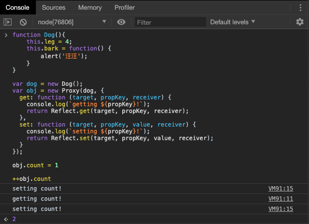
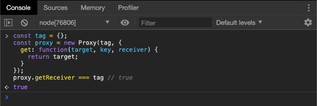

# Proxy

## 概述

Proxy 用于修改某些操作的默认行为，等同于在语言层面做出修改，所以属于一种“元编程”（meta programming），即对编程语言进行编程。

面向对象编程，实质上是一种与用户争夺“控制权”的编程，封装性是控制权之争，外界不可以任意对对象的属性进行更改。

```js
function Dog(){
    this.leg = 4;
    this.bark = function() {
        alert('汪汪');
    }
}

var dog = new Dog();
dog.wings = 2;
console.log(dog.wings); // 2
console.log(dog.tail) // undefined
```

上述代码中，我们可以任意给`dog`对象添加属性，也可以获取该对象不存在的属性。实际上，我们就没有把握该对象的控制权。

Proxy 可以理解成，在目标对象之前架设一层“拦截”，外界对该对象的访问，都必须先通过这层拦截，因此提供了一种机制，可以对外界的访问进行过滤和改写。Proxy 这个词的原意是代理，用在这里表示由它来“代理”某些操作，可以译为“代理器”。

> 当然我们也可以使用 `defineProperty` 设置对象的 `setter` 和 `getter`来解决这个问题。

```javascript
var obj = new Proxy(dog, {
  get: function (target, propKey, receiver) {
    console.log(`getting ${propKey}!`);
    return Reflect.get(target, propKey, receiver);
  },
  set: function (target, propKey, value, receiver) {
    console.log(`setting ${propKey}!`);
    return Reflect.set(target, propKey, value, receiver);
  }
});
```

上面代码对一个空对象架设了一层拦截，重定义了属性的读取（`get`）和设置（`set`）行为。这里暂时先不解释具体的语法，只看运行结果。对设置了拦截行为的对象`obj`，去读写它的属性，就会得到下面的结果。



我们对`dog`对象的属性操作，就被代理器接管了。Proxy 实际上重载（overload）了点运算符，即用自己的定义覆盖了语言的原始定义。

> 注意，要使得`Proxy`起作用，必须针对`Proxy`实例（上例是`obj`对象）进行操作，而不是针对目标对象（上例是`dog`对象）进行操作。

ES6 原生提供 Proxy 构造函数，用来生成 Proxy 实例。

```javascript
var proxy = new Proxy(target, handler);
```

Proxy 对象的所有用法，都是上面这种形式，不同的只是`handler`参数的写法。其中，`new Proxy()`表示生成一个`Proxy`实例，`target`参数表示所要拦截的目标对象，`handler`参数也是一个对象，用来定制拦截行为。

> 如果`handler`为空，则不会拦截。

Proxy 实例也可以作为其他对象的原型对象。

```javascript
var proxy = new Proxy({}, {
  get: function(target, propKey) {
    return 35;
  };
});

let obj = Object.create(proxy);
obj.time // 35
```

上面代码中，`proxy`对象是`obj`对象的原型，`obj`对象本身并没有`time`属性，所以根据原型链，会在`proxy`对象上读取该属性，导致被拦截。

同一个拦截器函数，可以设置拦截多个操作，下面是 Proxy 支持的拦截操作一览，一共 13 种。

- **get(target, propKey, receiver)**：拦截对象属性的读取，比如`proxy.foo`和`proxy['foo']`。
- **set(target, propKey, value, receiver)**：拦截对象属性的设置，比如`proxy.foo = v`或`proxy['foo'] = v`，返回一个布尔值。
- **has(target, propKey)**：拦截`propKey in proxy`的操作，返回一个布尔值。
- **deleteProperty(target, propKey)**：拦截`delete proxy[propKey]`的操作，返回一个布尔值。
- **ownKeys(target)**：拦截`Object.getOwnPropertyNames(proxy)`、`Object.getOwnPropertySymbols(proxy)`、`Object.keys(proxy)`、`for...in`循环，返回一个数组。该方法返回目标对象所有自身的属性的属性名，而`Object.keys()`的返回结果仅包括目标对象自身的可遍历属性。
- **getOwnPropertyDescriptor(target, propKey)**：拦截`Object.getOwnPropertyDescriptor(proxy, propKey)`，返回属性的描述对象。
- **defineProperty(target, propKey, propDesc)**：拦截`Object.defineProperty(proxy, propKey, propDesc）`、`Object.defineProperties(proxy, propDescs)`，返回一个布尔值。
- **preventExtensions(target)**：拦截`Object.preventExtensions(proxy)`，返回一个布尔值。
- **getPrototypeOf(target)**：拦截`Object.getPrototypeOf(proxy)`，返回一个对象。
- **isExtensible(target)**：拦截`Object.isExtensible(proxy)`，返回一个布尔值。
- **setPrototypeOf(target, proto)**：拦截`Object.setPrototypeOf(proxy, proto)`，返回一个布尔值。如果目标对象是函数，那么还有两种额外操作可以拦截。
- **apply(target, object, args)**：拦截 Proxy 实例作为函数调用的操作，比如`proxy(...args)`、`proxy.call(object, ...args)`、`proxy.apply(...)`。
- **construct(target, args)**：拦截 Proxy 实例作为构造函数调用的操作，比如`new proxy(...args)`。

## Proxy 的实例方法

### get()

`get`方法用于拦截某个属性的读取操作，可以接受三个参数，依次为要拦截的目标对象、属性名和 proxy 实例本身（严格地说，是操作行为所针对的对象），其中最后一个参数可选。


上面代码表示，如果访问目标对象不存在的属性，会抛出一个错误。如果没有这个拦截函数，访问不存在的属性，只会返回`undefined`。

上例和下例也说明了，`target`指向的是同一个对象，要拦截的对象。



`get`方法可以继承。

```javascript
let proto = new Proxy({}, {
  get(target, propertyKey, receiver) {
    console.log('GET ' + propertyKey);
    return target[propertyKey];
  }
});

let obj = Object.create(proto);
obj.foo // "GET foo"
```

上面代码中，拦截操作定义在`Prototype`对象上面，所以如果读取`obj`对象继承的属性时，拦截会生效。

下面是一个`get`方法的第三个参数的例子，它总是指向**原始的读操作**所在的那个对象，一般情况下就是 Proxy 实例。

```javascript
const proxy = new Proxy({}, {
  get: function(target, key, receiver) {
    return receiver;
  }
});
proxy.getReceiver === proxy // true
```

上面代码中，`proxy`对象的`getReceiver`属性是由`proxy`对象提供的，所以`receiver`指向`proxy`对象。


上面代码中，`d`对象本身没有`a`属性，所以读取`d.a`的时候，会去`d`的原型`proxy`对象找。这时，`receiver`就指向`d`，代表原始的读操作所在的那个对象。

总结成为一句话**谁调用就指向谁**。

请同学们认真阅读以下的代码，理解下面代码中 Proxy 如何实现函数的链式操作：

```javascript
var pipe = (function () {
  return function (value) {
    var funcStack = [];
    var oproxy = new Proxy({} , {
      get : function (pipeObject, fnName) {
        if (fnName === 'get') {
          return funcStack.reduce(function (val, fn) {
            return fn(val);
          },value);
        }
        funcStack.push(globle[fnName]);
        return oproxy;
      }
    });

    return oproxy;
  }
}());

var double = n => n * 2;
var pow    = n => n * n;
var reverseInt = n => n.toString().split("").reverse().join("") | 0;

pipe(3).double.pow.reverseInt.get; 
```

### set()

`set`方法用来拦截某个属性的赋值操作，可以接受四个参数，依次为目标对象、属性名、属性值和 Proxy 实例本身，其中最后一个参数可选。

假定`Person`对象有一个`age`属性，该属性应该是一个不大于 200 的整数，那么可以使用`Proxy`保证`age`的属性值符合要求。

```javascript
let validator = {
  set: function(obj, prop, value) {
    if (prop === 'age') {
      if (!Number.isInteger(value)) {
        throw new TypeError('The age is not an integer');
      }
      if (value > 200) {
        throw new RangeError('The age seems invalid');
      }
    }

    // 对于满足条件的 age 属性以及其他属性，直接保存
    obj[prop] = value;
  }
};

let person = new Proxy({}, validator);

person.age = 100;

person.age // 100
person.age = 'young' // 报错
person.age = 300 // 报错
```

上面代码中，由于设置了存值函数`set`，任何不符合要求的`age`属性赋值，都会抛出一个错误，这是数据验证的一种实现方法。利用`set`方法，还可以数据绑定，即每当对象发生变化时，会自动更新 DOM，这也是 Vue 实现数据绑定的方法。

私有属性可以通过闭包实现，同时，我们也可以通过`get`和`set`实现。


和`get`方法一样，`set`方法也是可以被继承的，同样，`set`的第四个参数`receiver`，指的是原始的操作行为所在的那个对象，一般情况下是`proxy`实例本身。


上面代码中，设置`myObj.foo`属性的值时，`myObj`并没有`foo`属性，因此引擎会到`myObj`的原型链去找`foo`属性。`myObj`的原型对象`proxy`是一个 Proxy 实例，设置它的`foo`属性会触发`set`方法。这时，第四个参数`receiver`就指向原始赋值行为所在的对象`myObj`。

### apply()

`apply`方法拦截函数的调用、`call`和`apply`操作。

`apply`方法可以接受三个参数，分别是目标对象、目标对象的上下文对象（`this`）和目标对象的参数数组。

下面是一个例子。

```javascript
var target = function () { return 'I am the target'; };
var handler = {
  apply: function () {
    return 'I am the proxy';
  }
};

var p = new Proxy(target, handler);

p()
// "I am the proxy"
```

上面代码中，变量`p`是 Proxy 的实例，当它作为函数调用时（`p()`），就会被`apply`方法拦截，返回一个字符串。

下面是另外一个例子。


上面代码中，每当执行`proxy`函数（直接调用或`call`和`apply`调用），就会被`apply`方法拦截。

### construct()

`construct`方法用于拦截`new`命令，下面是拦截对象的写法。

```javascript
var handler = {
  construct (target, args, newTarget) {
    return new target(...args);
  }
};
```

`construct`方法可以接受三个参数。

- `target`：目标对象
- `args`：构造函数的参数对象
- `newTarget`：创造实例对象时，`new`命令作用的构造函数（下面例子的`p`）

```javascript
var p = new Proxy(function () {}, {
  construct: function(target, args) {
    console.log('called: ' + args.join(', '));
    return { value: args[0] * 10 };
  }
});

(new p(1)).value
// "called: 1"
// 10
```

`construct`方法返回的必须是一个对象，否则会报错。

```javascript
var p = new Proxy(function() {}, {
  construct: function(target, argumentsList) {
    return 1;
  }
});

new p() // 报错
// Uncaught TypeError: 'construct' on proxy: trap returned non-object ('1')
```

### deleteProperty()

`deleteProperty`方法用于拦截`delete`操作，如果这个方法抛出错误或者返回`false`，当前属性就无法被`delete`命令删除。

```javascript
var handler = {
  deleteProperty (target, key) {
    invariant(key, 'delete');
    delete target[key];
    return true;
  }
};
function invariant (key, action) {
  if (key[0] === '_') {
    throw new Error(`Invalid attempt to ${action} private "${key}" property`);
  }
}

var target = { _prop: 'foo' };
var proxy = new Proxy(target, handler);
delete proxy._prop
// Error: Invalid attempt to delete private "_prop" property
```

上面代码中，`deleteProperty`方法拦截了`delete`操作符，删除第一个字符为下划线的属性会报错。

注意，目标对象自身的不可配置（configurable）的属性，不能被`deleteProperty`方法删除，否则报错。

### 剩余操作

剩余操作的代理可能较为低频，请同学们用到时自行查阅 [Proxy 处理器对象](https://developer.mozilla.org/zh-CN/docs/Web/JavaScript/Reference/Global_Objects/Proxy/handler)

## Proxy.revocable()

`Proxy.revocable`方法返回一个可取消的 Proxy 实例。

```javascript
let target = {};
let handler = {};

let {proxy, revoke} = Proxy.revocable(target, handler);

proxy.foo = 123;
proxy.foo // 123

revoke();
proxy.foo // TypeError: Revoked
```

`Proxy.revocable`方法返回一个对象，该对象的`proxy`属性是`Proxy`实例，`revoke`属性是一个函数，可以取消`Proxy`实例。上面代码中，当执行`revoke`函数之后，再访问`Proxy`实例，就会抛出一个错误。

`Proxy.revocable`的一个使用场景是，目标对象不允许直接访问，必须通过代理访问，一旦访问结束，就收回代理权，不允许再次访问。

## this 问题

虽然 Proxy 可以代理针对目标对象的访问，但它不是目标对象的透明代理，即不做任何拦截的情况下，也无法保证与目标对象的行为一致。主要原因就是在 Proxy 代理的情况下，目标对象内部的`this`关键字会指向 Proxy 代理。


上面代码中，一旦`proxy`代理`target.m`，后者内部的`this`就是指向`proxy`，而不是`target`，这种表现和 `handler`中的`get/set`的`receiver`参数比较类似，也是**谁调用就指向谁**。

此外，有些原生对象的内部属性，只有通过正确的`this`才能拿到，所以 Proxy 也无法代理这些原生对象的属性。

```javascript
const target = new Date();
const handler = {};
const proxy = new Proxy(target, handler);

proxy.getDate();
// TypeError: this is not a Date object.
```

上面代码中，`getDate`方法只能在`Date`对象实例上面拿到，如果`this`不是`Date`对象实例就会报错。这时，`this`绑定原始对象，就可以解决这个问题。


## 小结

本章我们重点学习了 ES6 中的 JS 内置对象 -- Proxy 代理器，重点掌握为什么要使用代理器和怎么使用代理器，掌握基础的对属性增删改操作的代理。

下一章，我们将讲解 ES6 中有关反射的内置对象 -- Reflect。