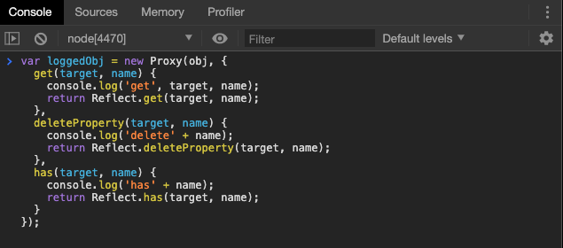
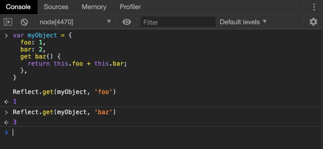
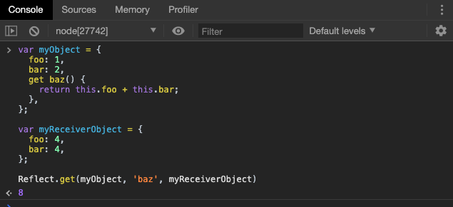
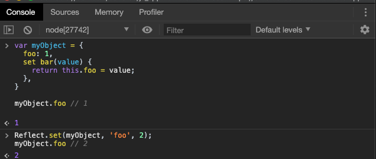
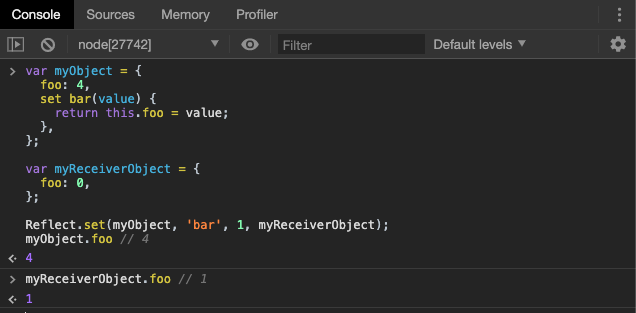

# Reflect

## 概述

`Reflect`对象与`Proxy`对象一样，也是 ES6 为了操作对象而提供的新 API。`Reflect`对象的设计目的有这样几个。

1. 将`Object`对象的一些明显属于语言内部的方法（比如`Object.defineProperty`），放到`Reflect`对象上。现阶段，某些方法同时在`Object`和`Reflect`对象上部署，未来的新方法将只部署在`Reflect`对象上。也就是说，从`Reflect`对象上可以拿到语言内部的方法，实现类似其它语言的“映射”接口。
2. 修改某些`Object`方法的返回结果，让其变得更合理。比如，`Object.defineProperty(obj, name, desc)`在无法定义属性时，会抛出一个错误，而`Reflect.defineProperty(obj, name, desc)`则会返回`false`。
3. 让`Object`操作都变成函数行为。某些`Object`操作是命令式，比如`name in obj`和`delete obj[name]`，而`Reflect.has(obj, name)`和`Reflect.deleteProperty(obj, name)`让它们变成了函数行为。
4. `Reflect`对象的方法与`Proxy`对象的方法一一对应，只要是`Proxy`对象的方法，就能在`Reflect`对象上找到对应的方法。这就让`Proxy`对象可以方便地调用对应的`Reflect`方法，完成默认行为，作为修改行为的基础。也就是说，不管`Proxy`怎么修改默认行为，你总可以在`Reflect`上获取默认行为。

其中，前三种目的其实就是为了使 JavaScript 这门语言更为规范。而第四种目的，能够更好的让我们得到**获取和修改对象的权限**。有利于面向对象封装性和开闭原则的实现。



上面代码中，每一个`Proxy`对象的拦截操作（`get`、`delete`、`has`），内部都调用对应的`Reflect`方法，因为上文的第四个目的，“**只要是`Proxy`对象的方法，就能在`Reflect`对象上找到对应的方法**”，通过`Reflect`，我们能够很轻易的在打印日志之后，继续对`target`对象执行`get`、`delete`、`has`操作。这也是我们对`Reflect`对象的了解更为容易。

## 静态方法

`Reflect`对象一共有 13 个静态方法。

- Reflect.apply(target, thisArg, args)
- Reflect.construct(target, args)
- Reflect.get(target, name, receiver)
- Reflect.set(target, name, value, receiver)
- Reflect.defineProperty(target, name, desc)
- Reflect.deleteProperty(target, name)
- Reflect.has(target, name)
- Reflect.ownKeys(target)
- Reflect.isExtensible(target)
- Reflect.preventExtensions(target)
- Reflect.getOwnPropertyDescriptor(target, name)
- Reflect.getPrototypeOf(target)
- Reflect.setPrototypeOf(target, prototype)

上面这些方法的作用，大部分与`Object`对象的同名方法的作用都是相同的，而且它与`Proxy`对象的方法是一一对应的。我们介绍几个在上一章中在代理器中提及的方法，剩下的同学们可以参考 MDN上的 [Reflect](https://developer.mozilla.org/zh-CN/docs/Web/JavaScript/Reference/Global_Objects/Reflect) 

### Reflect.get(target, name, receiver)

`Reflect.get`方法查找并返回`target`对象的`name`属性，如果没有该属性，则返回`undefined`。



第三个参数为 `receiver`，作`this`绑定时使用，一般情况下可以省略，表示自身`target`调用。不过我们可以手动改变获取属性时`getter`中的`this`指向。



用直白的话来解释就是：通过`Reflect`对象中的`get`方法，获取`myObject`中的`baz`属性值，并在获取的过程中，将`this`指向`myReceiverObject`。


### Reflect.set(target, name, value, receiver)

`Reflect.set`方法设置`target`对象的`name`属性等于`value`。



如果`name`属性设置了赋值函数，则赋值函数的`this`绑定`receiver`。



上面的表现在我们的预料之中。

但是需要注意的是：

注意，如果 `Proxy`对象和 `Reflect`对象联合使用，前者拦截赋值操作，后者完成赋值的默认行为，而且传入了`receiver`，那么`Reflect.set`会触发`Proxy.defineProperty`拦截。

因为在`Proxy`对象中，**handler.defineProperty()**方法会拦截目标对象的以下操作 :

- [`Object.defineProperty()`](https://developer.mozilla.org/zh-CN/docs/Web/JavaScript/Reference/Global_Objects/Object/defineProperty)
- [`Reflect.defineProperty()`](https://developer.mozilla.org/zh-CN/docs/Web/JavaScript/Reference/Global_Objects/Reflect/defineProperty)
- **`proxy.property='value'`**

```javascript
let p = {
  a: 'a'
};

let handler = {
  set(target, key, value, receiver) {
    console.log('set');
    Reflect.set(target, key, value, receiver)
  },
  defineProperty(target, key, attribute) {
    console.log(key);
    Reflect.defineProperty(target, key, attribute);
  }
};

let obj = new Proxy(p, handler);
obj.a = 'A';
// set
// defineProperty
```

上面代码中，`Proxy.set`拦截里面使用了`Reflect.set`，而且传入了`receiver`，导致触发`Proxy.defineProperty`拦截。这是因为`Proxy.set`的`receiver`参数总是指向当前的 `Proxy`实例（即上例的`obj`），而`Reflect.set`一旦传入`receiver`，就会将属性赋值到`receiver`上面（即`obj`），导致触发`defineProperty`拦截。如果`Reflect.set`没有传入`receiver`，那么就不会触发`defineProperty`拦截。

### Reflect.deleteProperty(obj, name)

`Reflect.deleteProperty`方法等同于`delete obj[name]`，用于删除对象的属性。

```javascript
const myObj = { foo: 'bar' };

// 旧写法
delete myObj.foo;

// 新写法
Reflect.deleteProperty(myObj, 'foo');
```

该方法返回一个布尔值。如果删除成功，或者被删除的属性不存在，返回`true`；删除失败，被删除的属性依然存在，返回`false`。

### Reflect.construct(target, args)

`Reflect.construct`方法等同于`new target(...args)`，这提供了一种不使用`new`，来调用构造函数的方法。

```javascript
function Greeting(name) {
  this.name = name;
}

// new 的写法
const instance = new Greeting('张三');

// Reflect.construct 的写法
const instance = Reflect.construct(Greeting, ['张三']);
```

### Reflect.apply(func, thisArg, args)

`Reflect.apply`方法等同于`Function.prototype.apply.call(func, thisArg, args)`，用于绑定`this`对象后执行给定函数。

> `Function.prototype.apply.call`可能看起来比较别扭，我们其实是使用`call`方法为`apply`提供参数和指向，`Function.prototype.apply.call(func, thisArg, args)`可以通俗的被解释为：`func.apply(thisArg,args)`，其实` thisArg, args`都是调用`apply`时的参数，具体是谁调用，`call`规定了是`func`调用。

一般来说，如果要绑定一个函数的`this`对象，可以这样写`fn.apply(obj, args)`，但是如果函数定义了自己的`apply`方法，就只能写成`Function.prototype.apply.call(fn, obj, args)`，采用`Reflect`对象可以简化这种操作。

```javascript
const ages = [11, 33, 12, 54, 18, 96];

// 旧写法
const youngest = Math.min.apply(Math, ages);
const oldest = Math.max.apply(Math, ages);
const type = Object.prototype.toString.call(youngest);

// 新写法
const youngest = Reflect.apply(Math.min, Math, ages);
const oldest = Reflect.apply(Math.max, Math, ages);
const type = Reflect.apply(Object.prototype.toString, youngest, []);
```

## 实例

观察者模式（Observer mode）指的是函数自动观察数据对象，一旦对象有变化，函数就会自动执行。

```javascript
const person = observable({
  name: '张三',
  age: 20
});

function print() {
  console.log(`${person.name}, ${person.age}`)
}

observe(print);
person.name = '李四';
// 输出
// 李四, 20
```

上面代码中，数据对象`person`是观察目标，函数`print`是观察者。一旦数据对象发生变化，`print`就会自动执行。

下面，使用 Proxy 写一个观察者模式的最简单实现，即实现`observable`和`observe`这两个函数。思路是`observable`函数返回一个原始对象的 Proxy 代理，拦截赋值操作，触发充当观察者的各个函数。

```javascript
function print() {
  console.log(`${person.name}, ${person.age}`)
}

const queuedObservers = new Set();

// 将观察者加入集合
const observe = fn => queuedObservers.add(fn);

// 设置代理器
const observable = obj => new Proxy(obj, {
  set(target, key, value, receiver) {
    // 正常设置 key 的值
    const result = Reflect.set(target, key, value, receiver);
    // 依次调用集合中的观察者
  	queuedObservers.forEach(observer => observer());
  	return result;
}});

observe(print)

const person = observable({
  name: '张三',
  age: 20
});

person.name = "lisi"


```

上面代码中，先定义了一个`Set`集合，所有观察者函数都放进这个集合。然后，`observable`函数返回原始对象的代理，拦截赋值操作。拦截函数`set`之中，会自动执行所有观察者。

## 小结

本章我们主要讲解了获得对象的内部方法的“反射”接口，重点掌握常见静态方法的使用方法和场景，配合代理器进行使用。

**预告**：下一章，我们将讲解 ES6 最甜的语法糖 -- Class