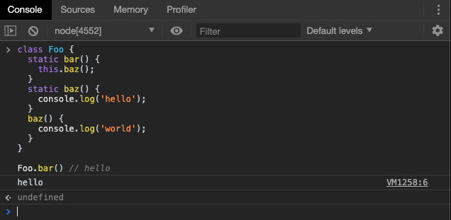

# Class 基本语法

## 简介

### 类的由来

先有人，还是先有人类？

如果从造物主的角度讲， 脑子中，先构想“人类的形象”，然后再造人。

这就是：先有类，再有对象。 如 java，php，c++。先把类构思好，才能`new`对象。

如果从地球生物演化的角度讲，是先有人，才有人类。

因为，原本没有人，只有猴子。

一个雷打下来， 某个猴子变异了，能站着走路，脑子也聪明了。这个猴子及其后代，和普通猴不一样，我们把他们叫人类。

传统的 JavaScript 面向对象，是基于个体的，面向原型的面向对象，而不是基于类这个“模版”的面向对象，这一点我们在面向对象基础中已经学过了。

我们可以通过字面量直接声明一个对象。

```js
var ori = {};  // 地球上最原始的蛋白质, 这就是一个对象
var c = {cell:1}; // 单细胞动物

var bird = {
    leg:2,
    song:function() {alert('我是一只小小鸟');}
}

console.log(ori,c,bird);

bird.song();
```

也可以通过构造函数，生成实例对象。

```javascript
function Point(x, y) {
  this.x = x;
  this.y = y;
}

Point.prototype.toString = function () {
  return '(' + this.x + ', ' + this.y + ')';
};

var p = new Point(1, 2);
```

但是随着 JavaScript 更为广泛的应用，它的运行时已经不仅仅局限于浏览器，而是得到了极大的拓展。上面这种写法跟传统的面向对象语言（比如 C++ 和 Java）差异很大，很容易让新学习这门语言的程序员感到困惑。

于是 ES6 提供了一个语法糖，引入了 Class（类）这个概念，作为对象的模板。通过`class`关键字，可以定义类。

新的`class`写法只是让对象原型的写法更加清晰、更像面向对象编程的语法而已。上面的代码用 ES6 的`class`改写，就是下面这样。

```javascript
class Point {
  constructor(x, y) {
    this.x = x;
    this.y = y;
  }

  toString() {
    return '(' + this.x + ', ' + this.y + ')';
  }
}
```

上面代码定义了一个“类”，可以看到里面有一个`constructor`方法，这就是构造方法，而`this`关键字则代表实例对象。也就是说，ES5 的构造函数`Point`，对应 ES6 的`Point`类的构造方法。

`Point`类除了构造方法，还定义了一个`toString`方法。注意，定义“类”的方法的时候，前面不需要加上`function`这个关键字，直接把函数定义放进去了就可以了。另外，方法之间不需要逗号分隔，加了会报错。

我们可以先回顾一下 JavaScript 的原型链。


再来测试下新的类的写法：

```javascript
class Point {
  // ...
}

typeof Point // "function"
Point === Point.prototype.constructor // true
```

上面代码表明，类的数据类型就是函数，类本身就指向构造函数。

使用的时候，也是直接对类使用`new`命令，跟构造函数的用法完全一致。

```javascript
class Bar {
  doStuff() {
    console.log('stuff');
  }
}

var b = new Bar();
b.doStuff() // "stuff"
```

构造函数的`prototype`属性，在 ES6 的“类”上面继续存在。事实上，类的所有方法都定义在类的`prototype`属性上面。

```javascript
class Point {
  constructor() {
    // ...
  }

  toString() {
    // ...
  }

  toValue() {
    // ...
  }
}

// 等同于

Point.prototype = {
  constructor() {},
  toString() {},
  toValue() {},
};
```

在类的实例上面调用方法，其实就是调用原型上的方法。

```javascript
class B {}
let b = new B();

b.constructor === B.prototype.constructor // true
```

上面代码中，`b`是`B`类的实例，它的`constructor`方法就是`B`类原型的`constructor`方法。

由于类的方法都定义在`prototype`对象上面，所以类的新方法可以添加在`prototype`对象上面。`Object.assign`方法可以很方便地一次向类添加多个方法。

```javascript
class Point {
  constructor(){
    // ...
  }
}

Object.assign(Point.prototype, {
  toString(){},
  toValue(){}
});
```


### constructor 方法

下面我们来详细讲解一下这个语法糖的吃法。

类似于其它面向对象的语言，ES6 的类也必须有构造方法，在实例化对象时自动调用，用于对实例进行初始化。

> 如果没有定义构造方法，那么一个空的`constructor`	会被自动添加。


不过不同于其它语言的构造函数，`constructor`是可以有返回值的，请同学们一定注意。


这就导致，`constructor`方法默认返回实例对象（即`this`），完全可以指定返回另外一个对象。


### 类的实例

生成类的实例的写法，与 ES5 完全一样，也是使用`new`命令。

> 如果忘记加上`new`，像函数那样调用`Class`，将会报错。

与 ES5 一样，实例的属性除非定义在`this`对象上，否则都是定义在原型上（即定义在`class`上）。

```javascript
//定义类
class Point {

  constructor(x, y) {
    this.x = x;
    this.y = y;
  }

  toString() {
    return '(' + this.x + ', ' + this.y + ')';
  }

}

var point = new Point(2, 3);

point.toString() // (2, 3)

point.hasOwnProperty('x') // true
point.hasOwnProperty('y') // true
point.hasOwnProperty('toString') // false
point.__proto__.hasOwnProperty('toString') // true
```

上面代码中，`x`和`y`都是实例对象`point`自身的属性（因为定义在`this`变量上），所以`hasOwnProperty`方法返回`true`，而`toString`是原型对象的属性（因为定义在`Point`类上），所以`hasOwnProperty`方法返回`false`。这些都与 ES5 的行为保持一致。

与 ES5 一样，类的所有实例共享一个原型对象。

```javascript
var p1 = new Point(2,3);
var p2 = new Point(3,2);

p1.__proto__ === p2.__proto__
```

### 取值函数（getter）和存值函数（setter）


上面代码中，`prop`属性有对应的存值函数和取值函数，因此赋值和读取行为都被自定义了。

> 这其实是封装性的一种实现。

存值函数和取值函数是设置在属性的 Descriptor 对象上的，我们在讲解`Object.getOwnPropertyDescriptor`时，已经验证过了。


### 属性表达式

类的属性名，可以采用表达式。

```javascript
let methodName = 'getArea';

class Square {
  constructor(length) {
    // ...
  }

  [methodName]() {
    // ...
  }
}
```

上面代码中，`Square`类的方法名`getArea`，是从表达式得到的。

这样，在某个方法之前加上星号（`*`），就表示该方法是一个 Generator 函数。

```javascript
class Foo {
  constructor(...args) {
    this.args = args;
  }
  * [Symbol.iterator]() {
    for (let arg of this.args) {
      yield arg;
    }
  }
}

for (let x of new Foo('hello', 'world')) {
  console.log(x);
}
```

### Class 表达式

因为类的本质是构造函数，所以它和函数一样，也可以使用表达式的形式定义，同样也可以定义匿名类。

> 函数的`name`属性，类同样也具有。

```javascript
const MyClass = class Me {
  getClassName() {
    return Me.name;
  }
};
```

上面代码使用表达式定义了一个类。需要注意的是，这个类的名字是`Me`，但是`Me`只在 Class 的内部可用，指代当前类。在 Class 外部，这个类只能用`MyClass`引用。

```javascript
let inst = new MyClass();
inst.getClassName() // Me
Me.name // ReferenceError: Me is not defined
```

上面代码表示，`Me`只在 Class 内部有定义。

如果类的内部没用到的话，可以省略`Me`，可以写成匿名类的形式。

```javascript
const MyClass = class { /* ... */ };
```

采用 Class 表达式，可以写出立即执行的 Class。

```javascript
let person = new class {
  constructor(name) {
    this.name = name;
  }

  sayName() {
    console.log(this.name);
  }
}('张三');

person.sayName(); // "张三"
```


##  公有属性

因为 ES6 中的 `class` 并没有实质性的变化，因此构造函数本身无法实现的功能，在`class`上同样无法实现，同样，由于 ES6 在各自运行时上并未完全实现，所以我们在学习时不必按照已经学过的 C++ ，Java 或者 Python 来进行学习。此处只作类比。

在 ES5 中，我们在构造函数中定义的变量无法被外界访问：


我们更愿意称之为“私有属性”。

但是，在 ES6 中，类中定义的变量却可以被任意实例访问：


这就表示，实例属性除了定义在`constructor()`方法里面的`this`上面，也可以定义在类的最顶层。

> 在 Node.js 12 版本中，不支持这种写法。上述代码的运行环境为 Chrome 79

我们更愿意称之为“公有属性”。

但是，这种写法导致了原有的 “私有属性” 的实现方法，在 ES6 的`class`写法中失效了。

## 私有属性和私有方法

ES6 现有关于私有属性和私有方法的提案，今后可能会实现。

在 ES5 中，我们可以通过闭包来实现私有属性。

```JS
// 用闭包来完成js面向对象之私有属性
// 让love不能外界访问

function Girl (name,bf) {
    var love;
    
    this.name = name;
    
    // 通过showlove做接口, 来读取私有属性love
    this.showlove = function() {
        return love;
    }

    // 移情别恋
    this.movelove = function() {
        love = '薛潘';
    }
}

var girl = new Girl('林黛玉','贾宝玉');
alert(girl.name + '喜欢' + girl.showlove());

girl.movelove();
alert(girl.name + '喜欢' + girl.showlove());
```

但是在 ES6 中，类中定义的属性被视作 “公有” 的。

**总结**：关于私有属性和公有属性，ES6 的 Class 现在并未提供一个完整的解决方案，这就导致了类的封装性的实现并不完善，我们无法做到像 C++，Java 那样，对类的属性和方法的权限进行有效的管理，权宜的解决方案是，在使用 `Class`的情况下，辅以代理器实现对属性和方法的封装。 

## 静态属性和静态方法

### 静态属性

静态属性指的是 Class 本身的属性，即`Class.propName`，而不是定义在实例对象（`this`）上的属性。

```javascript
class Foo {
}

Foo.prop = 1;
Foo.prop // 1
```

上面的写法为`Foo`类定义了一个静态属性`prop`。

目前，只有这种写法可行，因为 ES6 明确规定，Class 内部只有静态方法，没有静态属性。现在有一个[提案](https://github.com/tc39/proposal-class-fields)提供了类的静态属性，写法是在实例属性的前面，加上`static`关键字。

### 静态方法

类相当于实例的原型，所有在类中定义的方法，都会被实例继承。如果在一个方法前，加上`static`关键字，就表示该方法不会被实例继承，而是直接通过类来调用，这就称为“静态方法”。

```javascript
class Foo {
  static classMethod() {
    return 'hello';
  }
}

Foo.classMethod() // 'hello'

var foo = new Foo();
foo.classMethod()
// TypeError: foo.classMethod is not a function
```

上面代码中，`Foo`类的`classMethod`方法前有`static`关键字，表明该方法是一个静态方法，可以直接在`Foo`类上调用（`Foo.classMethod()`），而不是在`Foo`类的实例上调用。如果在实例上调用静态方法，会抛出一个错误，表示不存在该方法。

### 方法的“重载”

在 ES6 的 `Class` 中，函数的重复声明会发生覆盖，而不会发生重载。


但是，对于静态函数来说，和方法重名是被允许的。

如果静态方法包含`this`关键字，这个`this`指的是类，而不是实例。



上面代码中，静态方法`bar`调用了`this.baz`，这里的`this`指的是`Foo`类，而不是`Foo`的实例，等同于调用`Foo.baz`。另外，从这个例子还可以看出，静态方法可以与非静态方法重名。

## 禁止实例化

`new`是从构造函数生成实例对象的命令。ES6 为`new`命令引入了一个`new.target`属性，该属性一般用在构造函数之中，返回`new`命令作用于的那个构造函数。如果构造函数不是通过`new`命令或`Reflect.construct()`调用的，`new.target`会返回`undefined`，因此这个属性可以用来确定构造函数是怎么调用的。

```javascript
class Shape {
  constructor() {
    if (new.target === Shape) {
      throw new Error('本类不能实例化');
    }
  }
}

class Rectangle extends Shape {
  constructor(length, width) {
    super();
    // ...
  }
}

var x = new Shape();  // 报错
var y = new Rectangle(3, 4);  // 正确
```

子类中的 `super()`调用父类，`new.target`指向子类，因此我们能够正常的实例化`Rectangle`。


## 小结

本章中，我们学习了 ES6 提供的语法糖 `Class`，虽然它很甜，但是 JavaScript 并未发生本质的变化，反倒是变得有些 "不伦不类"，例如封装性的实现。因为当前很多代码都是使用 `Class` 声明类，因此我们有必要对它进行学习，只是同学们需要在学习的过程中，把握它的本质，与传统的面向对象语言区分开来。

下一章，我们将继续品尝这颗糖，学习一下 Class 的继承。