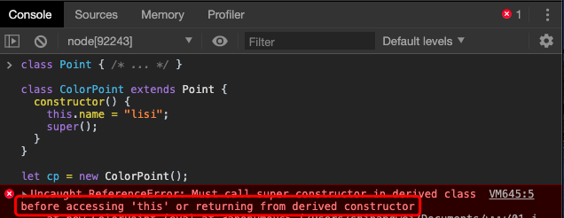

# Class 的继承

## 简介

Class 可以通过`extends`关键字实现继承，这比 ES5 的通过修改原型链实现继承，要清晰和方便很多。

```javascript
class Point { /* ... */ }

class ColorPoint extends Point {
  constructor() {
  }
}

let cp = new ColorPoint(); 
```

但是我们实际运行上述代码，却会报错。


报错信息为：必须调用父类构造函数。这就有一些奇怪了，我们在 ES5 使用原型继承时，并未有类似约束。

ES5 的继承，实质是先创造子类的实例对象`this`，然后再将父类的方法添加到`this`上面（`Parent.apply(this)`）。ES6 的继承机制完全不同，实质是先将父类实例对象的属性和方法，加到`this`上面（所以必须先调用`super`方法），然后再用子类的构造函数修改`this`。

因此，在继承父类时，必须将父类的`this`指向子类，因此，对于构造函数，我们都需要使用`super`方法进行父类继承。

> 如果子类没有定义`constructor`方法，这个方法会被默认添加。也就是说，不管有没有显式定义，任何一个子类都有`constructor`方法。


> 实质上，这是对构造函数的**重写**。

另一个需要注意的地方是，在子类的构造函数中，只有调用`super`之后，才可以使用`this`关键字，否则会报错。



下面是生成子类实例的代码。

```javascript
let cp = new ColorPoint();

cp instanceof ColorPoint // true
cp instanceof Point // true
```

上面代码中，实例对象`cp`同时是`ColorPoint`和`Point`两个类的实例，这与 ES5 的行为完全一致。

最后，父类的静态方法，也会被子类继承。


上面代码中，`hello()`是`A`类的静态方法，`B`继承`A`，也继承了`A`的静态方法。

## Object.getPrototypeOf()

`Object.getPrototypeOf`方法可以用来从子类上获取父类。

```javascript
Object.getPrototypeOf(ColorPoint) === Point
// true
```

因此，可以使用这个方法判断，一个类是否继承了另一个类，我们在讲解对象方法时已经用过了。

## super 关键字

`super`这个关键字，既可以当作函数使用，也可以当作对象使用。在这两种情况下，它的用法完全不同。

第一种情况，`super`作为函数调用时，代表父类的构造函数。ES6 要求，子类的构造函数必须执行一次`super`函数。`super()`只能用在子类的构造函数之中，用在其他地方就会报错。


第二种情况，`super`作为对象时，在普通方法中，指向父类的原型对象；在静态方法中，指向父类。

```javascript
class A {
  p() {
    return 2;
  }
}

class B extends A {
  constructor() {
    super();
    console.log(super.p()); // 2
  }
}

let b = new B();
```

上面代码中，子类`B`当中的`super.p()`，就是将`super`当作一个对象使用。这时，`super`在普通方法之中，指向`A.prototype`，所以`super.p()`就相当于`A.prototype.p()`。

因为类中的方法本质就是定义在原型上的，我们可以用`super`访问到，那么同样，如果属性定义在父类的原型对象上，`super`就可以取到。


ES6 规定，在子类普通方法中通过`super`调用父类的方法时，方法内部的`this`指向当前的子类实例。

```javascript
class A {
  constructor() {
    this.x = 1;
  }
  print() {
    console.log(this.x);
  }
}

class B extends A {
  constructor() {
    super();
    this.x = 2;
  }
  m() {
    super.print();
  }
}

let b = new B();
b.m() // 2
```

上面代码中，`super.print()`虽然调用的是`A.prototype.print()`，但是`A.prototype.print()`内部的`this`指向子类`B`的实例，导致输出的是`2`，而不是`1`。也就是说，实际上执行的是`super.print.call(this)`。

> 在静态方法中，`super`指向的是当前类。

## 类的 prototype 属性 和 `__proto__`属性

大多数浏览器的 ES5 实现之中，每一个对象都有`__proto__`属性，指向对应的构造函数的`prototype`属性。Class 作为构造函数的语法糖，同时有`prototype`属性和`__proto__`属性，因此同时存在两条继承链。

（1）子类的`__proto__`属性，表示构造函数的继承，总是指向父类。

（2）子类`prototype`属性的`__proto__`属性，表示方法的继承，总是指向父类的`prototype`属性。

类的继承是按照下面的模式实现的。

```javascript
class A {
}

class B {
}


Object.setPrototypeOf(B.prototype, A.prototype);
// 等同于
B.prototype.__proto__ = A.prototype; //完成方法的继承

Object.setPrototypeOf(B, A);
// 等同于
B.__proto__ = A;//完成静态属性的继承
```

正如上一章所讲，如果把类看作构造函数，那么类的方法是定义在构造函数的原型上的。所以要实现方法的继承，需要实现一条构造函数原型的继承链：

`B.prototype.__proto__ = A.prototype`

由于静态属性和静态方法是定义在类本身上的，因此要实现它们的继承，就需要实现一条函数实例的继承链。

`B.__proto__ = A`

了解上述原理，我们能够更好的了解类的本质，并且在一定条件下修改继承关系。

### 实例的 \__proto__ 属性

子类实例的`__proto__`属性的`__proto__`属性，指向父类实例的`__proto__`属性，这也是可以根据本小节内容推断出来的。

```javascript
var a = new A()
var b = new B()

b.__proto__ === B.prototype
b,__proto__.__proto__ === B.prototype.__proto__ === A.prototype === a.__proto__
b,__proto__.__proto__ = a.__proto__
```

上面代码中，`ColorPoint`继承了`Point`，导致前者原型的原型是后者的原型。

因此，通过子类实例的`__proto__.__proto__`属性，可以修改父类实例的行为。

```javascript
p2.__proto__.__proto__.printName = function () {
  console.log('Ha');
};

p1.printName() // "Ha"
```

上面代码在`ColorPoint`的实例`p2`上向`Point`类添加方法，结果影响到了`Point`的实例`p1`。

## 复制继承

ES5 当中，我们可以使用复制继承的方式，继承一个对象的属性和方法：

```js
function Cat(leg,tail) {
    this.leg = leg;
    this.tail = tail;

    this.climb = function() {
        alert('我会爬树');
    }
}

function Tiger(color) {
    this.color = color;
    
    this.extend = function (parent) {
        for(var key in parent) {
            //console.log(key);
            this[key] = parent[key];
        }
    }
}


var tiger = new Tiger('yellow');
//tiger.climb(); 出错
console.log(tiger);

tiger.extend(new Cat(4,1));
console.log(tiger);

tiger.climb();
```

在 ES6 中，我们有了 Class 的写法。

```javascript
function mix(...mixins) {
  class Mix {
    constructor() {
      for (let mixin of mixins) {
        copyProperties(this, new mixin()); // 拷贝实例属性
      }
    }
  }

  for (let mixin of mixins) {
    copyProperties(Mix, mixin); // 拷贝静态属性
    copyProperties(Mix.prototype, mixin.prototype); // 拷贝原型属性
  }

  return Mix;
}

function copyProperties(target, source) {
  for (let key of Reflect.ownKeys(source)) {
    if ( key !== 'constructor'
      && key !== 'prototype'
      && key !== 'name'
    ) {
      let desc = Object.getOwnPropertyDescriptor(source, key);
      Object.defineProperty(target, key, desc);
    }
  }
}
```

上面代码的`mix`函数，可以将多个对象合成为一个类。使用的时候，只要继承这个类即可。

```javascript
class DistributedEdit extends mix(Loggable, Serializable) {
  // ...
}
```

`mix`的调用自动传入两个类，拷贝静态属性，原型属性和实例属性，拷贝到`Mix`类上。


## 小结

本章我们学习了类的继承。由于 ES6 的类“类”语法实现并不是很完好，如果我们学习过其它语言，总有一种“画虎不成反类犬”的感觉，为了能够读懂和使用 ES6  中的类，还是请大家认真学习继承的基本语法和`super`的使用方式。

至此，我们 ES6 的基本语法已经学习完毕，还有一些内容需要在特定的场景中进行讲解，包括以下几个知识点：

+ Promise 对象 
+ async 函数 
+ Module 的语法和加载实现
+ 异步遍历

本套课程中我并未涉及到 ES6 中正则的扩展，有兴趣的同学可以自行查阅资料学习。