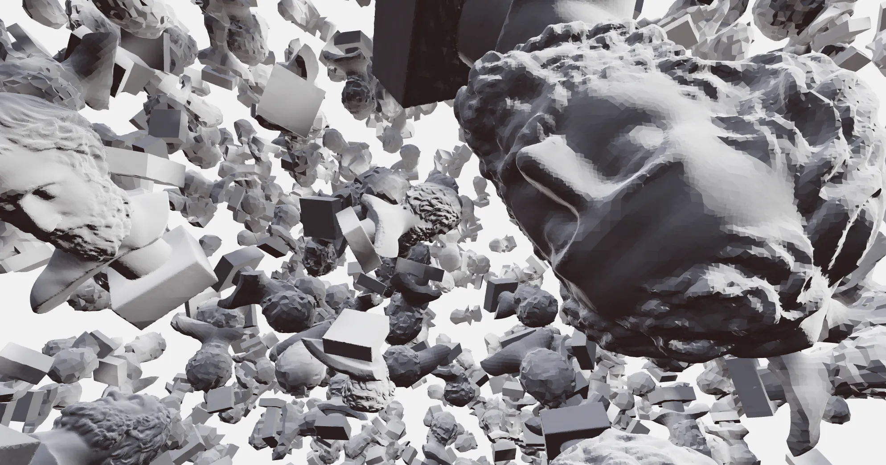

# 扩展性能

运行 WebGL 的成本可能相当昂贵，具体取决于您的设备的功能有多强大。为了缓解这种情况，特别是如果您想让您的应用程序可用于多种设备（包括较弱的选项），您应该考虑性能优化。本文将介绍其中的几个。

## 按需渲染

Three.js 应用程序通常在每秒执行 60 次的游戏循环中运行，React Three Fiber 也不例外。当场景中有不断移动的部件时，这非常好。这通常是最消耗电池电量并使风扇旋转的原因。
但是，如果允许场景中的移动部分静止，那么继续渲染将是一种浪费。在这种情况下，您可以选择按需渲染，仅在必要时才会渲染。这样可以节省电池并控制风扇噪音。
全屏打开下面的沙箱并查看开发工具，您会发现当没有任何事情发生时它完全空闲。仅当您移动模型时它才会渲染。

### 颜色分级

您需要做的就是将 canvasframeloop属性设置为demand。每当它检测到整个组件树的 prop 更改时，它就会渲染帧。

```jsx
<Canvas frameloop="demand">
```

### 触发手动帧

一个主要的警告是，如果树中的任何东西改变了props，那么 React 就无法意识到这一点，并且显示将会过时。例如，相机控件只是抓取相机并改变其值。这里可以使用React Three Fiber的invalidate功能来手动触发帧。

```jsx
function Controls() {
  const orbitControlsRef = useRef()
  const { invalidate, camera, gl } = useThree()
  useEffect(() => {
    orbitControlsRef.current.addEventListener('change', invalidate)
    return () => orbitControlsRef.current.removeEventListener('change', invalidate)
  }, [])
  return <orbitControls ref={orbitControlsRef} args={[camera, gl.domElement]} />
```

> Drei 的控件会自动为您完成此操作。
一般来说，当你需要渲染时，你可以调用 invalidate ：

```jsx
invalidate()
```

> 调用invalidate()不会立即渲染，它只是请求渲染一个新帧。多次调用invalidate不会多次渲染。将其视为告诉系统某些内容已更改的标志。

## 重复使用几何形状和材料

每个几何体和材质都意味着 GPU 的额外开销。如果您知道资源会重复，您应该尝试重复使用它们。

您可以在全球范围内执行此操作：

```jsx
const red = new THREE.MeshLambertMaterial({ color: "red" })
const sphere = new THREE.SphereGeometry(1, 28, 28)

function Scene() {
  return (
    <>
      <mesh geometry={sphere} material={red} />
      <mesh position={[1, 2, 3]} geometry={sphere} material={red} />
    </>
  )
}
```

如果您在全局空间中创建材质或颜色（在 React Three Fiber 的上下文之外），您应该在 Three.js 中Canvas启用ColorManagement 。这将允许自动进行某些转换（对于 sRGB 中的十六进制和 CSS 颜色），从而在所有情况下生成正确的颜色。

```jsx
import * as THREE from 'three'
// r150
THREE.ColorManagement.enabled = true
// r139-r149
THREE.ColorManagement.legacyMode = false
```

### 使用 useLoader 进行缓存

> 使用 useLoader 加载的每个资源都会自动缓存！
如果您在整个组件树中通过 useLoader 使用相同的 URL 访问资源，那么您将始终引用相同的资产，从而重复使用它。如果您通过GLTFJSX运行 GLTF 资产，这尤其有用，因为它链接几何图形和材质，从而创建可重用的模型。

### 重用 GLTF

```jsx
function Shoe(props) {
  const { nodes, materials } = useLoader(GLTFLoader, "/shoe.glb")
  return (
    <group {...props} dispose={null}>
      <mesh geometry={nodes.shoe.geometry} material={materials.canvas} />
    </group>
  )
}
<Shoe position={[1, 2, 3]} />
<Shoe position={[4, 5, 6]} />
```

## 实例化

每个网格都是一次绘制调用，您应该注意使用的网格数量：最多不超过 1000 个，最好是几百个或更少。您可以通过减少绘制调用来恢复性能，例如通过实例化重复对象。这样，您可以在一次绘制调用中拥有数十万个对象。
**实例**
设置实例并不难，如果需要帮助，请参阅Three.js 文档。

```jsx
function Instances({ count = 100000, temp = new THREE.Object3D() }) {
  const instancedMeshRef = useRef()
  useEffect(() => {
    // Set positions
    for (let i = 0; i < count; i++) {
      temp.position.set(Math.random(), Math.random(), Math.random())
      temp.updateMatrix()
      instancedMeshRef.current.setMatrixAt(i, temp.matrix)
    }
    // Update the instance
    instancedMeshRef.current.instanceMatrix.needsUpdate = true
  }, [])
  return (
    <instancedMesh ref={instancedMeshRef} args={[null, null, count]}>
      <boxGeometry />
      <meshPhongMaterial />
    </instancedMesh>
  )
}
```

## 详细程度

有时，距离相机越远，降低物体的质量可能是有益的。如果它几乎看不见，为什么要以全分辨率显示它呢？这可能是减少总顶点数的好策略，这意味着 GPU 的工作量会减少。
滚动查看效果：


重复使用几何图形和细节级别
Drei 中有一个名为的小组件`<Detailed />`，它可以在没有样板的情况下设置 LOD。您可以加载或准备几个分辨率阶段（任意数量），然后为它们提供与相机相同的距离，从最高质量到最低质量。

```jsx
import { Detailed, useGLTF } from '@react-three/drei'

function Model() {
  const [low, mid, high] = useGLTF(["/low.glb", "/mid.glb", "/high.glb"])
  return (
    <Detailed distances={[0, 10, 20]}>
      <mesh geometry={high} />
      <mesh geometry={mid} />
      <mesh geometry={low} />
    <Detailed/>
  )
}
```

## 嵌套加载

嵌套加载意味着首先加载较少的纹理和模型，然后加载较高分辨率的纹理和模型。

以下沙箱经历了三个加载阶段：

- 加载指示器
- 低质量
- 高质量

**具有悬念的渐进式加载状态**
实现它是多么容易，你可以嵌套悬念，甚至将其用作后备：

```jsx
function App() {
  return (
    <Suspense fallback={<span>loading...</span>}>
      <Canvas>
        <Suspense fallback={<Model url="/low-quality.glb" />}>
          <Model url="/high-quality.glb" />
        </Suspense>
      </Canvas>
    </Suspense>
  )
}

function Model({ url }) {
  const { scene } = useGLTF(url)
  return <primitive object={scene} />
}
```

## 性能监控

Drei 有一个新组件PerformanceMonitor，可让您监控并适应设备性能。该组件将收集一段时间内的平均 fps（每秒帧数）。如果经过几次迭代后平均值低于或高于阈值，它将触发 onIncline 和 onDecline 回调，让您做出响应。通常，您会降低场景的质量、分辨率、效果、要渲染的东西的数量，或者，如果您有足够的帧速率来填充，则增加它。

由于这通常会导致您定义帧率上限和下限的两个回调之间出现乒乓球现象，因此只要您保持在该范围内，就不会触发任何内容。理想情况下，您的应用程序应该通过逐渐改变质量来找到进入这一利润空间的方法。

调节分辨率的简单示例。它从 1.5 开始，如果系统低于界限，则变为 1，如果足够快，则变为 2。

```jsx
function App() {
  const [dpr, setDpr] = useState(1.5)
  return (
    <Canvas dpr={dpr}>
      <PerformanceMonitor onIncline={() => setDpr(2)} onDecline={() => setDpr(1)} />
    </Canvas>
  )
}
```

您还可以使用 onChange 回调在平均值朝任何方向变化时收到通知。这允许您进行渐进的改变。它为您提供一个介于 0 和 1 之间的系数，该系数随倾斜而增加，随下降而减少。默认情况下，该系数最初为 0.5。

```jsx
import round from 'lodash/round'

const [dpr, set] = useState(1)
return (
 <Canvas dpr={dpr}>
  <PerformanceMonitor onChange={({ factor }) => setDpr(round(0.5 + 1.5 * factor, 1))}>
    </PerformanceMonitor>
  </Canvas>
)
```

如果尽管有限制，您仍然遇到人字拖，您可以定义人字拖的限制。如果满足 onFallback 将被触发，这通常会为应用程序设置尽可能低的基线。调用回退后 PerformanceMonitor 将关闭。

```jsx
<PerformanceMonitor flipflops={3} onFallback={() => setDpr(1)}>
```

PerformanceMonitor 也可以有子级，如果您将应用程序包装在其中，您可以使用 usePerformanceMonitor，它允许嵌套树中的各个组件自行响应性能变化。

```jsx
<PerformanceMonitor>
  <Effects />
</PerformanceMonitor>

function Effects() {
  usePerformanceMonitor({ onIncline, onDecline, onFallback, onChange })
  // ...
}
```

## 运动回归

Sketchfab 等网站可确保场景始终流畅、以 60 fps 运行且响应灵敏，无论使用哪种设备或加载的模型有多昂贵。他们通过回归运动来做到这一点，其中效果、纹理、阴影会稍微降低质量，直到静止不动

下面的沙箱使用了昂贵的灯光和后期处理。为了使其运行相对平稳，它将缩放运动时的像素比，并跳过环境光遮挡等繁重的后处理效果。

### 性能扩展

当您检查状态模型时，您会注意到一个名为 的对象performance。

```jsx
performance: {
  current: 1,
  min: 0.1,
  max: 1,
  debounce: 200,
  regress: () => void,
},
```

- 当前：性能系数在最小值和最大值之间交替
- min：性能下限（应小于 1）
- max：性能上限（不大于1）
- debounce：反跳超时，直到再次达到上限 (1)
- regress()：暂时回归性能的函数

您可以像这样定义默认值：

```jsx
<Canvas performance={{ min: 0.5 }}>...</Canvas>
```

### 这就是让系统回归的方法

您唯一要做的就是打电话regress()。具体何时执行此操作取决于您，但可能是在鼠标移动或场景移动时，例如当控件触发其更改事件时。

假设您正在使用控件，那么以下代码会在控件处于活动状态时使系统回归：

```jsx
const regress = useThree((state) => state.performance.regress)
useEffect(() => {
  controls.current?.addEventListener('change', regress)
}, [])
```

### 您可以这样回应

仅仅调用regress()不会改变或影响任何事情！
您的应用程序必须通过监听性能来选择性能扩展current！该数字本身会告诉您该怎么做。1（最大）表示一切正常，默认值。小于 1（分钟）意味着需要回归，并且数字本身告诉您在缩小规模时应该走多远。

例如，您可以简单地乘以current像素比来降低分辨率。如果您已定义min: 0.5，则意味着在调用回归时，分辨率将减半至少 200 毫秒（延迟）。它也可以用于其他任何事情：在 时关闭灯光current < 1、使用较低分辨率的纹理、跳过后处理效果等。您当然也可以对这些更改进行动画/调整。

这是一个缩放像素比的小型原型组件：

```jsx
function AdaptivePixelRatio() {
  const current = useThree((state) => state.performance.current)
  const setPixelRatio = useThree((state) => state.setPixelRatio)
  useEffect(() => {
    setPixelRatio(window.devicePixelRatio * current)
  }, [current])
  return null
}
```

将此组件放入场景中，将其与上面调用的代码结合起来regress()，您就拥有了自适应分辨率：

```jsx
<AdaptivePixelRatio />
```

Drei 库中已经有为此目的预先制作的组件。

## 启用并发

React 18 引入了并发调度，特别是通过startTransition和进行时间切片useTransition。这将虚拟化组件图，然后允许您确定组件和操作的优先级。想一想虚拟列表如何避免缩放问题，因为它只渲染屏幕可以容纳的尽可能多的项目，它不受必须渲染的项目数量（无论是 10 还是 100.000.000）的影响。

React 18 的功能与此非常相似，它可能会以在普通应用程序中很难或不可能实现的方式推迟负载和繁重的任务。因此，即使在最苛刻的情况下，它也能保持稳定的帧速率。

以下基准测试显示了并发性的强大程度： https: //github.com/drcmda/scheduler-test

它通过创建数百个 THREE.TextGeometry 实例（确切地说是 510 个）来模拟重负载。与 Three.js 中的许多其他类一样，该类非常昂贵并且需要一段时间才能构建。如果同时创建所有 510 个实例，则会导致大约 1.5 秒的纯卡顿(Apple M1)，选项卡通常会冻结。它以一定的间隔运行，每 2 秒执行一次。

|- |分散式 |立即|
| --- | --- | --- |
|three.js| 〜20fps| 〜5fps|
| react | 〜60fps| 〜60fps|

有关如何使用此 API 的更多信息，请参阅使用 startTransition 进行昂贵的操作。
