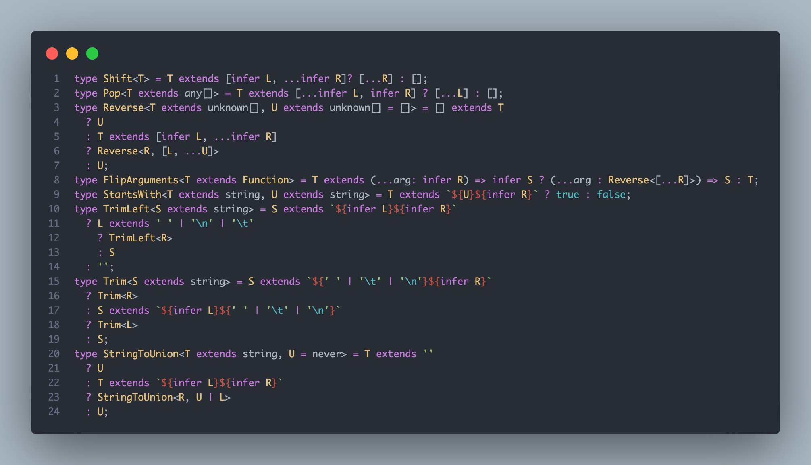

# infer

infer语法的限制如下：

>infer只能在条件类型的 extends 子句中使用
>infer得到的类型只能在true语句中使用, 即X中使用
>推断数组(或者元组)的类型

使用方法

```typescript
type InferArray<T> = T extends (infer U)[] ? U : never;
```

(infer U)和平时常写的string[]，number[]等等是不是很像？这里就是通过(infer U)来获取数组对应的类型。

```typescript
type I0 = InferArray<[number, string]>; // string | number
type I1 = InferArray<string[]>; // string
type I2 = InferArray<number[]>; // number
```

推断数组(或者元组)第一个元素的类型
使用方法

```typescript
type InferFirst<T extends unknown[]> = T extends [infer P, ...infer _] ? P : never
```

[infer P, ... infer _]中infer P获取的是第一个元素的类型，而...infer _获取的是数组其他剩余元素的数组类型;
特别说明下，我们例子汇总不需要使用其他元素的类型，所以用_。

```typescript
type I3 = InferFirst<[3, 2, 1]>; // 3
```

推断数组(或者元组)最后一个元素的类型
使用方法

```typescript
type InferLast<T extends unknown[]> = T extends [... infer _, infer Last] ? Last : never;
```

这个和推断数组第一个元素的类型类似，...infer _获取的是最后一个元素之前的所有元素类型，infer Last获取的是最后一个元素的类型。

```typescript
type I4 = InferLast<[3, 2, 1]>; // 1
```

推断函数类型的参数
使用方法

```typescript
type InferParameters<T extends Function> = T extends (...args: infer R) => any ? R : never;
```

...args 代表的是函数参数组成的元组, infer R代表的就是推断出来的这个函数参数组成的元组的类型。

```typescript
type I5 = InferParameters<((arg1: string, arg2: number) => void)>; // [string, number]
```

推断函数类型的返回值
使用方法

```typescript
type InferReturnType<T extends Function> = T extends (...args: any) => infer R ? R : never;
```

和前面的推断函数类型的参数类似，=> 后面的infer R代表的就是推断出来的函数的返回值类型。

```typescript
type I6 = InferReturnType<() => string>; // string
```

推断Promise成功值的类型
使用方法

```typescript
type InferPromise<T> =  T extends Promise<infer U> ? U : never;
```

```typescript
type I7 = InferPromise<Promise<string>>; // string
```

推断字符串字面量类型的第一个字符对应的字面量类型
使用方法

```typescript
type InferString<T extends string> = T extends `${infer First}${infer _}` ? First : [];
```

```typescript
type I8 = InferString<"Johnny">; // J
```

接下来我举一些综合性的例子，我不介绍这些例子实现的功能，大家来感受下infer的使用技巧，看看是否能一眼看出来实现的功能：



大家也进行手动的敲一敲 感受一下infer带来的乐趣