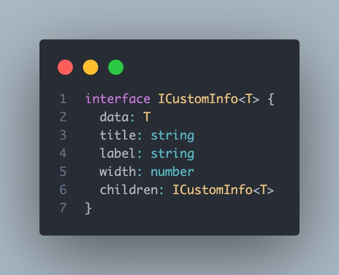
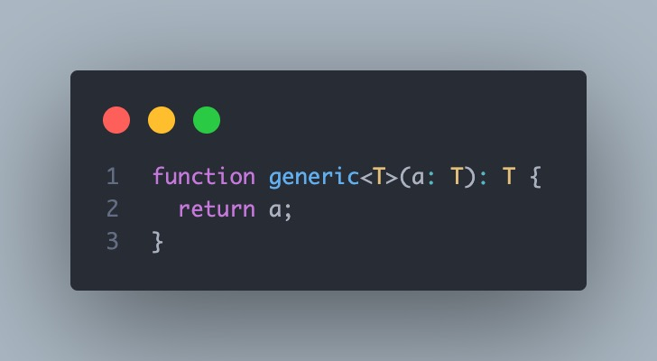
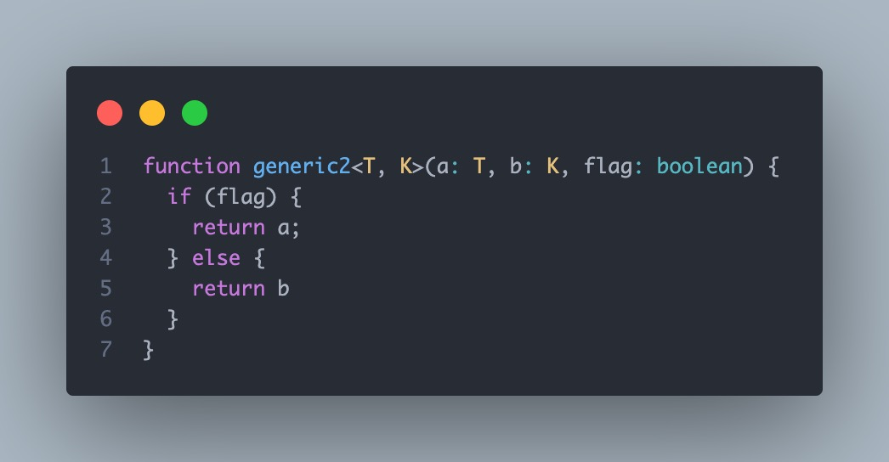
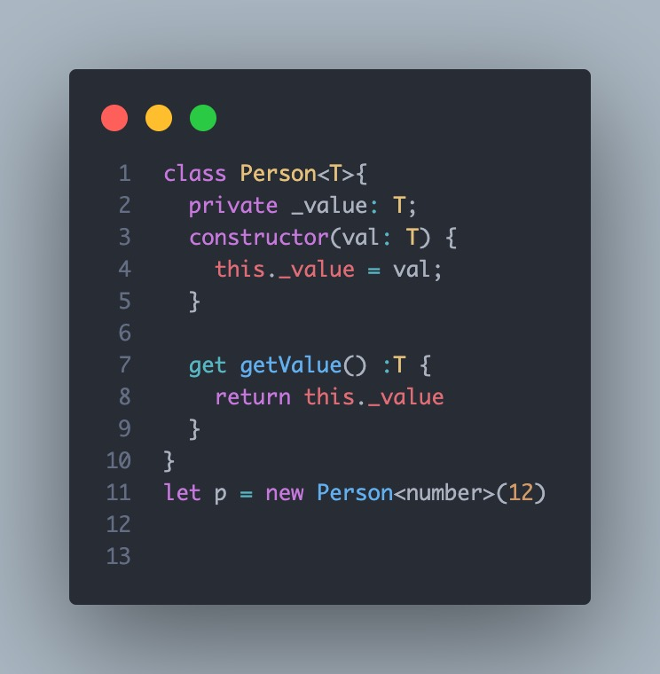

# 范型

> [小有成果之后，可以学习尝试一下类型体操](https://github.com/type-challenges/type-challenges)

## 泛型可以理解为宽泛的类型，通常用于类和函数
>
> 泛型和函数非常相似。都是先声明形参，然后使用参数做一些事：函数做的是计算值，泛型做的是计算类型。也就是说，函数是对“值”的编程，泛型是对“类型”的编程。
> TS设计泛型时，可能参考了函数的设计逻辑。因此我们在学习泛型时，要迁移我们熟悉的函数模型，便于我们理解和记忆。接下来我们一一拆解---
>
### 接口范性



当我定义了一个InListInfo接口 他接受一个范性T T可以自己叫啥都行 叫S A 都可以
当我对这个接口进行使用时 就像函数一样传入类型

```typescript
type dataInfoType = {
  name: string
  value: string
}
const data: InListInfo<dataInfoType>
```

这里就相当于定义一个变量 用于接收接口传回的指
实际上就相当于以下

```typescript
interface InListInfo<T> {
  data: {
    name: string
    value: string
  }
  title: string
  label: string
  width: number
  children: {
    data: {
      name: string
      value: string
    }
    title: string
    label: string
    width: number
    children: ....
  }
}
```
> 如果你能明白以上 那么下面的 函数范性 和类范性 我相信你会如鱼得水 
### 函数范性



#### 声明形参

函数是用 （a）这样小括号包含形参名的方式，而泛型仅仅是将小括号变成了尖括号---，是不是一个模子里刻出来的？大家注意，这里的T并不比这里的a高级，他们的本质是一样滴，都是形参。只是a接收值，T接收类型（其实声明的类型本质也是值）。

#### 使用参数

函数的参数a是用于计算值的，而泛型的参数T是用来约束值和函数返回值的。因此a会被用在表达式、语句中，而T会被用在类型约束上（a：T），或函数返回值上。
下面再让我们更进一步了解多参参数

### 函数多范性



比如上面的例子，函数形参多了b和flag，而泛型参数多了个K。

### 类范性



如上，T表示传递一个T类型，在new的时候才把具体类型传入。其中T是变量可改，但通常比较常见就是写T
之前说TypeScript类型的时有说到数组，其实数组本质就是一个泛型类

```typescript
let a = new Array<number>();
```

其实不管是用于类还是用于函数，核心思想都是：把类型当一种特殊的参数传入进去

需要注意的是泛型也可以“继承”，但表示的是限制范围


### 继承范性

```typescript
class Person<T extends Date>{
    private _value: T;
    constructor(val: T) {
        this._value = val;
    }
}
let p1 = new Person(new Date())

class MyDate extends Date{}
let p2 = new Person(new MyDate())
```

### 范性约束

> 我们可以定义一个接口来描述约束条件。 泛型可以通过 extends 一个接口来实现泛型约束，写法如：<泛型变量 extends 接口> 

```typescript
interface Person {
    name: string;
    age: number;
}
function student<T extends Person>(arg: T): T {
    return arg;
}
 
student({ name: 'liu' });//类型 "{ name: string; }" 中缺少属性 "age"，但类型 "Person" 中需要该属性
student({ name: "liu", age: '11' });//不能将类型“string”分配给类型“number”
student({ name: "liu", age: 11 });
```


### 泛型工具

> 这个在后面的文章中会进行详细的介绍 [UtilityTypes](/web/typescript/UtilityTypes/Partial.md)

