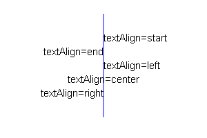
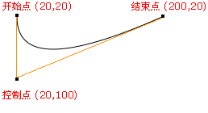

# Canvas

### 第一章 简介

#### 1.1 什么是canvas

+ 本质上canvas是HTML5提供的一种标签，对于支持canvas的浏览器，canvas即为一个矩形的画布(300*150)，可以用javascript上面绘画，控制每一个像素。
+ canvas标签使用javascript在网页上绘制图像，本身不具备绘图功能
+ canvas拥有多种绘制路径，矩形，圆形，字符以及添加图像的方法
+ HTML5之前的web页面只能用一些固定样式的标签：比如p，div，h1等，但有了canvas Web页面可以丰富多彩。

#### 1.2 canvas主要应用的领域

1. 游戏：canvas在基于Web的图像显示方面比Flash更加立体、更加精巧，canvas游戏在流畅度和跨平台方面更牛。      
    [25 超棒的 HTML5 Canvas 游戏](http://www.oschina.net/news/20143/top-25-best-html5-canvas-games-you-love-to-play)

2. **可视化数据**.数据图表话，比如:[百度的echart](http://echarts.baidu.com/)    

3. **banner广告**：Flash曾经辉煌的时代，智能手机还未曾出现。现在以及未来的智能机时代，HTML5技术能够在banner广告上发挥巨大作用，用Canvas实现动态的广告效果再合适不过。

4. 未来=> 模拟器：无论从视觉效果还是核心功能方面来说，模拟器产品可以完全由JavaScript来实现。

5. 未来=> 远程计算机控制：Canvas可以让开发者更好地实现基于Web的数据传输，构建一个完美的可视化控制界面。

6. 未来=> 图形编辑器：Photoshop图形编辑器将能够100%基于Web实现。

7. 其他可嵌入网站的内容(多用于活动页面、特效)：类似图表、音频、视频，还有许多元素能够更好地与Web融合，并且不需要任何插件。

8. **完整的canvas移动化应用**

canvas的标准：

+ 最新标准：http://www.w3.org/TR/2dcontext/
+ 稳定版本的标准：http://www.w3.org/TR/2013/CR-2dcontext-20130806/
+ API:http://www.w3school.com.cn/tags/html_ref_canvas.asp
+ 目前来说，标准还在完善中。先用早期的api足够完成所有的应用

### 第二章 canvas绘图基础

#### 2.1 Canvas标签

##### 标签属性

可以通过width和height控制标签的宽高。
但是需要注意的是如果我们使用css样式表而不是通过属性对canvas进行宽高控制，画布会被拉伸。

+ 注意：
  * 不要用CSS控制它的宽和高,会走出图片拉伸，
  * 重新设置canvas标签的宽高属性会让画布擦除所有的内容(重点!)。
  * 可以给canvas画布设置背景色

##### 标签兼容性

+ ie9以上才支持canvas, 其他chrome、ff、苹果浏览器等都支持
+ 只要浏览器兼容canvas，那么就会支持绝大部分api(个别最新api除外)
+ 移动端的兼容情况非常理想，基本上随便使用
+ 2d的支持的都非常好，3d（webgl）ie11才支持，其他都支持
+ 如果浏览器不兼容，最好进行友好提示         

```html
    <canvas id="cavsElem">
        你的浏览器不支持canvas，请升级浏览器.浏览器不支持，显示此行文本
    </canvas>
```

+ 浏览器不兼容，可以使用*flash*等手段进行**优雅降级**

#### 2.2 Canvas绘图上下文

+ Canvas自身无法绘制任何内容。Canvas的绘图是使用JavaScript操作的。
+ 上下文：是所有的绘制操作api的入口或者集合。
+ Context对象就是JavaScript操作Canvas的接口。
  使用`[CanvasElement].getContext('2d')`来获取2D绘图上下文。

```html
<body>
    <canvas></canvas>
</body>
<script type="text/javascript">
    var context = document.getElementsByTagName('canvas')[0].getContext('2d');
    console.log(context);
</script>
```

默认情况下画布的大小为300*150

通常情况下我们可以对上下文对象进行判断以做兼容。

```js
if (canvas.getContext){
  var ctx = canvas.getContext('2d');
  // drawing code here
} else {
  // canvas-unsupported code here
}
```

#### 2.3 基本的绘制路径

##### 2.3.1 canvas坐标系

canvas的坐标系，从左上角的0，0开始，x向右增大，y向下增大


##### 2.3.2 设置绘制起点

在绘制线段前必须设置的值，使用`ctx.moveTo(x,y)`设置。

moveTo相当于移动画笔到某个位置，如果不设置，线段无效。

##### 2.3.3 绘制直线

`ctx.lineTo(x,y)`方法添加一个新点，然后创建从该点到画布中最后指定点的线条

绘制一个`L`形的图像：

```html
<body>
    <canvas></canvas>
</body>
<script type="text/javascript">
    var ctx = document.getElementsByTagName('canvas')[0].getContext('2d');
    ctx.moveTo(20,20);
    ctx.lineTo(20,100);
    ctx.lineTo(70,100);
    ctx.stroke();
</script>
```

注意：`moveTo和lineTo`仅仅只是描绘了直线或图案的路径。真正的绘制线必须执行`stroke()`进行填充.

填充线的宽度和样式:

+ lineWidth 设置线宽度
+ strokeStyle设置线的颜色

**绘制表格**

在`600*600`的画布上绘制单元格为10*10,线宽为0.5的表格;

```html
<canvas></canvas>
<script>
var canvas = document.getElementsByTagName('canvas')[0]
var ctx = canvas.getContext('2d');

canvas.width = 600;
canvas.height = 600;
canvas.style.border = "1px solid #000";

var rectH = 10;
var rectW = 10;
ctx.lineWidth = .5;
for (var i = 0; i < canvas.width / rectH; i++) {
    // 第一步： 绘制横线
    ctx.moveTo(0, i * rectH);
    ctx.lineTo(canvas.width, i * rectH);
    //第二步：绘制竖线：
    ctx.moveTo(i * rectW, 0);
    ctx.lineTo(i * rectW, canvas.height);
}
ctx.stroke();
</script>
```

##### 2.3.4 路径开始和闭合

* 开始路径：ctx.beginPath();
* 闭合路径：ctx.closePath();

解释：如果复杂路径绘制，必须使用路径开始和结束。闭合路径会自动把最后的线头和开始的线头连在一起。

**beginPath** 

核心的作用是将不同绘制的形状进行隔离，
每次执行此方法，表示重新绘制一个路径,跟之前的绘制的墨迹可以进行分开样式设置和管理。

**closePath**

closePath的意思不是结束路径，而是关闭路径，它会试图从（MoveTo点之后）当前路径的终点连一条路径到起点，让整个路径闭合起来。但是，这并不意味着它之后的路径就是新路径了

所以上一个例子将`L`绘制为三角形,我们不需要继续`lineTo`操作,只需要`closePath`即可

**理解基于状态的绘图**

canvas中的绘制方法（如stroke,fill），都会以“上一次beginPath”之后的所有路径为基础进行绘制。

```html
<canvas></canvas>
<script>
var canvas = document.getElementsByTagName('canvas')[0]
var ctx = canvas.getContext('2d');

canvas.width = 600;
canvas.height = 600;
canvas.style.border = "1px solid #000";
ctx.strokeStyle = 'red';
ctx.lineWidth = 20;
//第一条线
ctx.beginPath(); 
                    //没有必要的。默认上来就一个状态
                    //状态里面： 当前状态里面的绘制样式。
ctx.moveTo(100, 100);
ctx.lineTo(300, 100);
ctx.stroke();
ctx.beginPath();    // 2开一个新路径，开启新状态的绘图
                    //开启了一个新的状态，新状态可以继承之前状态的样式，
                    //但是当前状态设置所有的样式，只能作用于当前的状态。
ctx.strokeStyle = 'green';
ctx.moveTo(100, 200);
ctx.lineTo(300, 200);
ctx.stroke();

ctx.beginPath();    // 3开一个新路径，开启新状态的绘图
                    //开启了一个新的状态，新状态可以继承之前状态的样式，
                    //但是当前状态设置所有的样式，只能作用于当前的状态。
                    //lineWidth:20
                    // strokeStyle: green
ctx.strokeStyle = 'purple';
ctx.moveTo(100, 300);
ctx.lineTo(300, 300);
ctx.stroke();
</script>
```

##### 2.3.5 填充

我们可以使用`fill()`方式来为闭合路径的内容进行填充.填充的颜色默认为黑色,可以通过`fillStyle`进行更改.

fill可以帮助我们在已有的路径中填充颜色,但是并未自动闭合.

```html
<body>
    <canvas></canvas>
</body>
<script type="text/javascript">
    var ctx = document.getElementsByTagName('canvas')[0].getContext('2d');
    ctx.moveTo(20,20);
    ctx.lineTo(20,100);
    ctx.lineTo(70,100);
    ctx.stroke();
    ctx.fillStyle = 'red';
    ctx.fill();
</script>
```

> 非零环绕原则:http://blog.csdn.net/itpinpai/article/details/50412260

##### 2.3.6 绘制矩形

canvas只支持一种原生的图形绘制：矩形。所有其他的图形的绘制都至少需要生成一条路径。矩形路径一定是封闭的，并且是按照逆时针方向来创建的。

我们可以使用`ctx.rect(x,y,width,height)`函数快速绘制一个矩形的路径,但是矩形并没有填充和描边.

同样canvas给我们提供了矩形相关的其他api

+ 描边矩形:`ctx.strokeRect(x,y,width,height)`
+ 填充矩形:`ctx.fillRect(x,y,width,height)`

矩形 的当前实现会清晰化路径，就好像 beginPath() 已经调用过了。这一令人吃惊的行为可能不会标准化,但是我们可以理解为矩形路径是封闭的。

```js
    ctx.moveTo(200,100)
    ctx.lineTo(400,100)
    ctx.lineWidth = 20;
    ctx.strokeStyle = 'red'
    ctx.stroke()

    ctx.rect(200,200,50,50)

    ctx.beginPath()
    ctx.moveTo(200,300)
    ctx.lineTo(400,300)
    ctx.strokeStyle = 'yellow'
    ctx.stroke()
```

##### 2.3.7 橡皮擦(清除矩形)

使用`ctx.clearRect(x,y,width,height)`可以清除某个矩形内的绘制内容;

##### 2.3.8 绘制圆形

+ 概述：arc() 方法创建弧/曲线（用于创建圆或部分圆）。
  * 语法：`ctx.arc(x,y,r,sAngle,eAngle,counterclockwise)`;
  * arc:  弧（度）弧形物；
  * counter 反击，还击；
  * 解释：
    - x,y：圆心坐标。 
    - r：半径大小。
    - sAngle:绘制开始的角度。 圆心到最右边点是0度，顺时针方向弧度增大。
    - eAngel:结束的角度，注意是弧度。π
    - counterclockwise：是否是逆时针。true是逆时针，false：顺时针
    - 弧度和角度的转换公式： `rad = deg*Math.PI/180`;  
    - 在Math提供的方法中**sin、cos等都使用的弧度** 

> 弧度 : http://baike.baidu.com/link?url=82VgDKwR3dKzKCRl1PCOCPT4E9a67M0WT0G_W9pY3CXKMuOcEE5HP_3fxMIiH9fbHuJojAvuvgaLOobl_qahBQ_EbBcj-FIzSptJOfkBFhm


**绘制扇形**

```html
<canvas></canvas>
<script>
var canvas = document.getElementsByTagName('canvas')[0]
var ctx = canvas.getContext('2d');

canvas.width = 600;
canvas.height = 600;
ctx.moveTo(300,300);
ctx.fillStyle = 'red';
ctx.arc(300, 300, 100,-90*Math.PI/180, -30 * Math.PI/ 180)
ctx.fill();//自动闭合
</script>
```

**绘制饼状图**

```html
<canvas></canvas>
<script>
var canvas = document.getElementsByTagName('canvas')[0]
var ctx = canvas.getContext('2d');

canvas.width = 600;
canvas.height = 600;
var data = [{
    "value": .2,
    "color": "red",
    "title": "应届生"
}, {
    "value": .3,
    "color": "blue",
    "title": "社会招生"
}, {
    "value": .4,
    "color": "green",
    "title": "老学员推荐"
}, {
    "value": .1,
    "color": "#ccc",
    "title": "公开课"
}];

var tempAngle = -90;

//设置角度的中间变量
var x0 = 400,
    y0 = 400;
var radius = 200;
// 从-90度开始绘制
for (var i = 0; i < data.length; i++) {
    ctx.beginPath(); //因为设置不同的颜色，所以每次绘制完起一个新状态
    ctx.moveTo(x0, y0);
    //当前扇形的角度
    var angle = data[i].value * 360;
    ctx.fillStyle = data[i].color;
    //开始从 tempAngle绘制
    var startAngle = tempAngle * Math.PI / 180;
    //从tempAngle绘制到 我们自己的angle区域
    var endAngle = (tempAngle + angle) * Math.PI / 180;
    //参数： x0，y0 圆心坐标，  radius：半径
    // startAngle：开始绘制的弧度
    // endAngle：结束绘制的弧度
    ctx.arc(x0, y0, radius, startAngle, endAngle);
    ctx.fill();
    tempAngle += angle; //下一次绘制的起始角度
}
</script>
```

**绘制饼状图动画**

```html
<body>
    <canvas width="600" height="600">
        您的浏览器不支持
    </canvas>
</body>
<script type="text/javascript">
        var canvas = document.getElementsByTagName('canvas')[0]
    var ctx  = canvas.getContext('2d');
    canvas.width = 600;
    canvas.height = 600;
    canvas.style.border = '1px solid blue'
    var data = [{
        "value": .2,
        "color": "red",
        "title": "应届生"
    }, {
        "value": .3,
        "color": "blue",
        "title": "社会招生"
    }, {
        "value": .4,
        "color": "green",
        "title": "老学员推荐"
    }, {
        "value": .1,
        "color": "#ccc",
        "title": "公开课"
    }];

    var x0 = 300,
            y0 =300,
            radias = 200,
            templateAngle = -90;
    var angle = 0;
    var clock = setInterval(run,10);
    function run(){
        angle += 1;
        if (angle>data[0].value*360-1) {
            clearInterval(clock)
            var templateAngle1 = templateAngle + angle;
            var angle1 = 0;
            var clock1 = setInterval(run1,10);
            function run1(){
                angle1 += 1;
                if (angle1>data[1].value*360-1) {
                    console.log(angle+angle1)
                    clearInterval(clock1);
                    //....
                }
                    ctx.beginPath();
                    ctx.moveTo(x0,y0)
                    ctx.fillStyle = data[1].color;
                    var startAngle = templateAngle1;
                    var endAngle = startAngle + angle1;
                    ctx.arc(x0, y0, radias, startAngle*Math.PI/180, endAngle*Math.PI/180);
                    ctx.fill();
            }
        }
        ctx.beginPath();
        ctx.moveTo(x0,y0)
        ctx.fillStyle = data[0].color;
        var startAngle = templateAngle;
        var endAngle = startAngle + angle;
        ctx.arc(x0, y0, radias, startAngle*Math.PI/180, endAngle*Math.PI/180);
        ctx.fill();
    }

</script>
```

**绘制环形图**

```html
<body>
    <canvas id="canvas">
        您的浏览器不支持 canvas.
    </canvas>
</body>
<script>
    function $(id){
        return document.getElementById(id);
    }
    function initial(){
        // 第一步: 先获取 canvas 对象
        var canvas = $('canvas');
        canvas.style.border = '1px solid #09c';
        canvas.width = 1200; // 设置宽
        canvas.height = 600; // 设置高
        var ctx = canvas.getContext('2d');// 获取上下文, 传 2d 渲染

        // 一个静态圆,底色
        ctx.beginPath();
        ctx.arc(300,300,200,0*Math.PI/180,360*Math.PI/180,false);
        ctx.fillStyle = '#eee';
        ctx.fill();

        // 写一个动态的圆形
        var clock = setInterval(run,10);
        var set = 0.98;
        var deg = 0;
        function run(){
            deg+=1;
            if(deg >= 360){
                clearInterval(clock);
            }
            ctx.beginPath();
            ctx.moveTo(300,300);
            ctx.arc(300,300,200,0*Math.PI/180,deg*set*Math.PI/180,false);
            ctx.fillStyle = '#09c';
            ctx.fill();
            // console.log(deg);

            // 一个静态圆
            ctx.beginPath();
            ctx.arc(300,300,170,0*Math.PI/180,360*Math.PI/180,false);
            ctx.fillStyle = '#fff';
            ctx.fill();

            // 显示百分比
            ctx.beginPath();
            ctx.font = '80px 微软雅黑';
            ctx.fillStyle = 'purple';
            ctx.textAlign = 'center';
            ctx.textBaseline = 'middle';
            var bfb = parseInt(deg*set/360*100);
            // console.log(bfb);
            ctx.fillText(bfb+'%',300,300);
        }
    }
    window.addEventListener('load',initial,false);
</script>
```

**折线图**

```html
<body>
    <canvas id="canvas">
        您的浏览器不支持 canvas.
    </canvas>
</body>
<script>
    function $(id){
        return document.getElementById(id);
    }
    function initial(){
        // 第一步: 先获取 canvas 对象
        var canvas = $('canvas');
        canvas.style.border = '1px solid #09c';
        canvas.width = 1200; // 设置宽
        canvas.height = 600; // 设置高
        var ctx = canvas.getContext('2d');// 获取上下文, 传 2d 渲染

        function xy(){
            // y轴
            ctx.beginPath();
            ctx.moveTo(100,500);
            ctx.lineTo(100,100);
            ctx.stroke();

            // x轴
            ctx.beginPath();
            ctx.moveTo(100,500);
            ctx.lineTo(700,500);
            ctx.stroke();
        }

        // 画一条折线, 让它动起来
        var clock = setInterval(run,40);
        var mx = 0;
        var my = 0;
        function run(){
            ctx.clearRect(0,0,canvas.width,canvas.height); // 清除画布
            xy();
            mx+=20;
            my-=30;
            if(mx >= 200){
                clearInterval(clock);
                var clock2 = setInterval(run2,40);
                var mx2 = 0;
                var my2 = 0;
                function run2(){
                    ctx.clearRect(0,0,canvas.width,canvas.height); // 清除画布
                    xy();
                    ctx.beginPath();
                    ctx.moveTo(100,500);
                    ctx.lineTo(300,200);
                    ctx.stroke();
                    mx2+=20;
                    my2+=30;
                    if(mx2 >= 100){
                        clearInterval(clock2);
                    }
                    ctx.beginPath();
                    ctx.moveTo(300,200);
                    ctx.lineTo(300+mx2,200+my2);
                    ctx.stroke();
                }

            }
            ctx.beginPath();
            ctx.moveTo(100,500);
            ctx.lineTo(100+mx,500+my);
            ctx.stroke();
            console.log(mx);
        }
    }
    window.addEventListener('load',initial,false);
</script>
```

**绘图板**

```html
<body>
    <canvas id="canvas">
        您的浏览器不支持 canvas.
    </canvas>
</body>
<script>
    function $(id){
        return document.getElementById(id);
    }
    function initial(){
        // 第一步: 先获取 canvas 对象
        var canvas = $('canvas');
        canvas.style.border = '1px solid #09c';
        canvas.width = 600; // 设置宽
        canvas.height = 600; // 设置高
        var ctx = canvas.getContext('2d');// 获取上下文, 传 2d 渲染
        canvas.addEventListener('mousedown',canvas_mousedown,false);
        function canvas_mousedown(){
            // 鼠标移动事件
            canvas.onmousemove = function (e){
                // console.log(1);
                var location = getCanvasCoordinate(canvas,e.clientX,e.clientY);
                // console.log(location);
                var x = location.x;
                var y = location.y;
                ctx.beginPath();
                ctx.arc(x,y,10,0*Math.PI/180,360*Math.PI/180);
                ctx.fillStyle = '#09c';
                ctx.fill();
            }
        }

        // 鼠标抬起事件
        canvas.onmouseup = function(){
            canvas.onmousemove = function(){}
        }
        function getCanvasCoordinate(cvs,x,y){
            var box = cvs.getBoundingClientRect();
            var cvsX = parseInt(x - box.left);
            var cvsY = parseInt(y - box.top);
            return {x:cvsX,y:cvsY};
        }
    }
    window.addEventListener('load',initial,false);
</script>
```

##### 饼状图文字坐标计算


```
sin50 = h/(r+20);
y = y0 + Math.sin(50*Math.PI/180) * (r+20)
x = x0 + Math.sin(50*Math.PI/180) * (r+20)
```

##### 2.3.9 绘制文字

+ font            设置或返回文本内容的当前字体属性
  * font 属性使用的语法与 CSS font 属性相同。

```js
ctx.font = "18px '微软雅黑'";
```

+ textAlign       设置或返回文本内容的当前对齐方式
  * start :    默认。文本在指定的位置开始。
  * end   :    文本在指定的位置结束。
  * center:    文本的中心被放置在指定的位置。
  * left  :    文本左对齐。
  * right :    文本右对齐。      

```js
ctx.textAlign = 'left';         
```



+ textBaseline      设置或返回在绘制文本时使用的当前文本基线   
  * alphabetic ：   默认。文本基线是普通的字母基线。
  * top        ：   文本基线是 em 方框的顶端。
  * hanging    ：   文本基线是悬挂基线。
  * middle     ：   文本基线是 em 方框的正中。
  * ideographic：   文本基线是em基线。表意基线.
  * bottom     ：   文本基线是 em 方框的底端。


对齐方式和行框于行内框有关;
em方框是渲染时包裹字体的块,与em的设置有关.

```js
ctx.textBaseline = 'top';
```

> http://www.cnblogs.com/dolphinX/p/3236686.html


绘制文字的方法

* ctx.fillText()      在画布上绘制“被填充的”文本
* ctx.strokeText()    在画布上绘制文本（无填充）
* ctx.measureText()   返回包含指定文本宽度的对象

```html
<canvas></canvas>
<script>
var canvas = document.getElementsByTagName('canvas')[0]
var ctx = canvas.getContext('2d');

canvas.width = 600;
canvas.height = 600;
ctx.moveTo( 300, 300 );
ctx.fillStyle = "purple";               //设置填充颜色为紫色
ctx.font = '20px "微软雅黑"';           //设置字体
ctx.textBaseline = "bottom";            //设置字体底线对齐绘制基线
ctx.textAlign = "left";                 //设置字体对齐的方式
//ctx.strokeText( "left", 450, 400 );
ctx.fillText( "Top-g", 100, 300 );
</script>       
```

**文字对齐**

```html
<canvas></canvas>
<script>
var canvas = document.getElementsByTagName('canvas')[0]
var ctx = canvas.getContext('2d');
canvas.width = 900;
canvas.height = 600;
canvas.style.border = "1px solid #000";

ctx.beginPath();
ctx.moveTo(0, 301);
ctx.lineTo(900, 301);
ctx.strokeStyle = "teal";
ctx.stroke();

ctx.moveTo(450, 0);
ctx.lineTo(450, 600);
ctx.stroke();
//绘制字体
ctx.font = '20px "微软雅黑"';
ctx.fillStyle = "red";
ctx.textBaseline = "top";
ctx.fillText("Top-g", 100, 300);

ctx.textBaseline = "middle";
ctx.fillText("middle-g", 200, 300);

ctx.textBaseline = "bottom";
ctx.fillText("bottom-g", 490, 300);

ctx.textBaseline = "Alphabetic";
ctx.fillText("Alphabetic-g", 700, 300);
//绘制字体 设置对齐方式
ctx.fillStyle = "purple";
ctx.textAlign = "left";
ctx.strokeText("left", 450, 400);

ctx.textAlign = "right";
ctx.strokeText("right", 450, 440);

ctx.textAlign = "start";
ctx.strokeText("start", 450, 480);

ctx.textAlign = "end";
ctx.strokeText("end", 450, 520);

ctx.textAlign = "center";
ctx.strokeText("center", 450, 560);
</script>
```

**饼状图绘制文字**

```html
<canvas></canvas>
<script>
var canvas = document.getElementsByTagName('canvas')[0]
var ctx = canvas.getContext('2d');

canvas.width = 600;
canvas.height = 600;
var data = [{
    "value": .2,
    "color": "red",
    "title": "应届生"
}, {
    "value": .3,
    "color": "blue",
    "title": "社会招生"
}, {
    "value": .4,
    "color": "green",
    "title": "老学员推荐"
}, {
    "value": .1,
    "color": "#ccc",
    "title": "公开课"
}];

var tempAngle = -90;

//设置角度的中间变量
var x0 = 400,
    y0 = 400;
var radius = 200;
// 从-90度开始绘制
for (var i = 0; i < data.length; i++) {
    ctx.beginPath();
    ctx.moveTo(x0, y0);
    var angle = data[i].value * 360;
    ctx.fillStyle = data[i].color;
    var startAngle = tempAngle * Math.PI / 180;
    var endAngle = (tempAngle + angle) * Math.PI / 180;
    ctx.arc(x0, y0, radius, startAngle, endAngle);
    var txt = data[i].value * 100 + '%';

    var x, y;
    // 计算出文字的要放的角度
    var txtAngle = tempAngle + 1 / 2 * angle;

    //计算文字的 坐标
    x = x0 + Math.cos(txtAngle * Math.PI / 180) * (radius + 20);
    y = y0 + Math.sin(txtAngle * Math.PI / 180) * (radius + 20);

    //如果文字在圆形的左侧，那么让文字 对齐方式为 文字结尾对齐当前坐标。
    if (txtAngle > 90 && txtAngle < 270) {
        ctx.textAlign = 'end';
    }

    //把文字绘制到 扇形区域的 旁边
    ctx.fillText(txt, x, y);
    ctx.fill();
    tempAngle += angle; //下一次绘制的起始角度
}
</script>
```

##### 2.3.10 绘制图像

**基本绘制图片的方式**

    context.drawImage(img,x,y);
    参数说明： x,y 绘制图片左上角的坐标， img是绘制图片的dom对象。

```html
<canvas></canvas>
<br>

<script>
var canvas = document.getElementsByTagName('canvas')[0]
var ctx = canvas.getContext('2d');

canvas.width = 600;
canvas.height = 600;
var img = document.getElementsByTagName('img')[0];
img.onload = function(){
    // for(i=0;i<=3;i++){
    //     ctx.drawImage(this, 100+i*20,20+i*20);
    // }
    ctx.drawImage(this, 100,20);
}
</script>
```

**在画布上绘制图像，并规定图像的宽度和高度**

    context.drawImage(img,x,y,width,height);   
    参数说明：width 绘制图片的宽度，  height：绘制图片的高度
    如果指定宽高，最好成比例，不然图片会被拉伸
        等比写法：  toH = Height * toW   /  Width; 
                 设置高 = 原高度 * 设置宽/ 原宽度;

```html
<canvas></canvas>
<br>

<script>
var canvas = document.getElementsByTagName('canvas')[0]
var ctx = canvas.getContext('2d');

canvas.width = 600;
canvas.height = 600;
var img = document.getElementsByTagName('img')[0];
img.onload = function(){
    ctx.drawImage(this, 100,20);
}
var h = 100 * img.height / img.width;
ctx.drawImage(img, 400, 20, 100,100);   //拉伸
ctx.drawImage(img, 500, 20, 100,h);
</script>
```

**用JavaScript创建img对象**

    第一种方式： 
       var img = document.getElementById("imgId");
    第二种方式：
        var img = new Image();//这个就是 img标签的dom对象
        img.src = "imgs/arc.gif";
        img.alt = "文本信息";
        img.onload = function() {
            //图片加载完成后，执行此方法
        }

```html
<canvas></canvas>
<script>
var canvas = document.getElementsByTagName('canvas')[0]
var ctx = canvas.getContext('2d');

canvas.width = 600;
canvas.height = 600;
var img = new Image();
img.src = 'a.jpg';
img.onload = function(){
    ctx.drawImage(this, 100,20);
}
</script>
```

**图片裁剪，并在画布上定位被剪切的部分**

    context.drawImage(img,sx,sy,swidth,sheight,x,y,width,height);
    参数说明：
        sx,sy 裁剪的左上角坐标，
        swidth：裁剪图片的高度。 sheight:裁剪的高度 
        注意：参数的个数只能是3,5,9
        其他同上

```html
<canvas></canvas>
<script>
var canvas = document.getElementsByTagName('canvas')[0]
var ctx = canvas.getContext('2d');

canvas.width = 600;
canvas.height = 600;
var img = new Image();
img.src = "b.jpg";
img.onload = function() {
    ctx.drawImage(img, 0, 0, img.width, img.height);
    ctx.drawImage(img, 0, 0, 68, 73, 0, img.height + 10, 68, 73);
};
</script>
```

**动画效果**

```html
<canvas></canvas>
<button dir="2" id="btn_up">上</button>
<button dir="6" id="btn_down">下</button>
<button dir="0" id="btn_left">左</button>
<button dir="4" id="btn_right">右</button>
<script>
var canvas = document.getElementsByTagName('canvas')[0]
var ctx = canvas.getContext('2d');
canvas.style.border = '1px solid black'
canvas.width = 600;
canvas.height = 600;
var img = new Image();
img.src = "1.png";
var deltaTime = 200; //设置帧的间隔时间 ，毫秒
var spriteSize = 256; //设置 动画精灵的大小。
var direction = 0; //
var i = 0;
img.onload = function() {
    setInterval(function() {
        ctx.clearRect(100, 100, 256, 256);
        //canvas.width = 600; //重新设置宽高,则画布清空
        ctx.drawImage(img, i * spriteSize, direction * spriteSize, 256, 256, 100, 100, 256, 256);
        i++;
        i %= 8;
    }, deltaTime);
};

var btnList = document.getElementsByTagName("button");
for (var j = 0; j < btnList.length; j++) {
    btnList[j].onclick = function() {
        var dir = this.getAttribute("dir");
        direction = dir;
    };
}
</script>
```

### 第三章 Canvas进阶

#### 3.1 Canvas颜色样式和阴影

##### 3.1.1 设置填充和描边的颜色

+ fillStyle  : 设置或返回用于填充绘画的颜色
+ strokeStyle: 设置或返回用于笔触的颜色

以上两个值都可以接受颜色名,16进制数据，rgb值，甚至rgba.
一般先进行设置样式然后进行绘制。

```js
ctx.strokeStyle = "red";      
ctx.strokeStyle = "#ccc";      
ctx.strokeStyle = "rgb(255,0,0)";      
ctx.strokeStyle = "rgba(255,0,0,6)";    
```

##### 3.1.2 设置阴影

+ 类比于CSS3的阴影。
+ shadowColor  ：   设置或返回用于阴影的颜色
+ shadowBlur   ： 设置或返回用于阴影的模糊级别,大于1的正整数，数值越高，模糊程度越大
+ shadowOffsetX：   设置或返回阴影距形状的水平距离
+ shadowOffsetY：   设置或返回阴影距形状的垂直距离

> 设置png图片的阴影，图片透明部分不会被投影

```js
    ctx.fillStyle = "rgba(255,0,0, .9)"
    ctx.shadowColor = "teal";
    ctx.shadowBlur = 10;
    ctx.shadowOffsetX = 10;
    ctx.shadowOffsetY = 10;
    ctx.fillRect(100, 100, 100, 100);
```

```html
<canvas></canvas>
<script>
var canvas = document.getElementsByTagName('canvas')[0]
var ctx = canvas.getContext('2d');
canvas.style.border = '1px solid black'
canvas.width = 600;
canvas.height = 600;
ctx.fillStyle = "rgba(255,0,0, .9)"
ctx.shadowColor = "teal";
ctx.shadowBlur = 10;
ctx.shadowOffsetX = 10;
ctx.shadowOffsetY = 10;
ctx.fillRect(100, 100, 100, 100);

var img = new Image();
img.src = "1.png";

img.onload = function() {
    ctx.drawImage(img, 200, 200,300,300);
};
</script>
```

#### 3.2 复杂样式（了解）

##### 3.2.1 创建线性渐变的样式（了解）

+ 一般不用，都是用图片代替，canvas绘制图片效率更高。
+ 线性渐变可以用于 矩形、圆形、文字等颜色样式
+ 语法：ctx.createLinearGradient(x0,y0,x1,y1);
  参数：x0,y0起始坐标，x1,y1结束坐标

```js
    var grd=ctx.createLinearGradient(0,0,170,0);
    grd.addColorStop(0,"black");  //添加一个渐变颜色，第一个参数介于 0.0 与 1.0 之间的值，表示渐变中开始与结束之间的位置。
    grd.addColorStop(1,"white");  //添加一个渐变颜色
    ctx.fillStyle =grd;           //关键点，把渐变设置到 填充的样式
```

```html
<canvas></canvas>
<script>
var canvas = document.getElementsByTagName('canvas')[0]
var ctx = canvas.getContext('2d');
canvas.style.border = '1px solid black'
canvas.width = 600;
canvas.height = 600;
var grd = ctx.createLinearGradient(100, 0, 300, 0);

grd.addColorStop(0, "teal");
grd.addColorStop(.5, "blue");
grd.addColorStop(.7, "red"); //添加渐变的节点。
grd.addColorStop(1, "#ccc");

ctx.fillStyle = grd; //关键点，把渐变设置到 填充的样式
ctx.arc(300, 300, 300, 0, 2 * Math.PI);
ctx.fill();
</script>
```

##### 3.2.2 设置圆形渐变（径向渐变)

+ 创建放射状/圆形渐变对象。可以填充文本、形状等
+ context.createRadialGradient(x0,y0,r0,x1,y1,r1);
+ 参数详解：
  * x0:  渐变的开始圆的 x 坐标
  * y0:  渐变的开始圆的 y 坐标
  * r0:  开始圆的半径
  * x1:  渐变的结束圆的 x 坐标
  * y1:  渐变的结束圆的 y 坐标
  * r1:  结束圆的半径

```js
var rlg = ctx.createRadialGradient(300,300,10,300,300,200);
rlg.addColorStop(0, 'teal');    //添加一个渐变颜色
rlg.addColorStop(.4, 'navy');
rlg.addColorStop(1, 'purple');
ctx.fillStyle = rlg;//设置 填充样式为延续渐变的样式
ctx.fillRect(100, 100, 500, 500);
```

```html
<canvas></canvas>
<script>
var canvas = document.getElementsByTagName('canvas')[0]
var ctx = canvas.getContext('2d');
canvas.style.border = '1px solid black'
canvas.width = 600;
canvas.height = 600;
var grd = ctx.createRadialGradient(300, 300,0,300,300,300);

grd.addColorStop(0, "orange");
grd.addColorStop(.3, "black");
grd.addColorStop(.7, "#ccc"); //添加渐变的节点。
grd.addColorStop(1, "red");

ctx.fillStyle = grd; //关键点，把渐变设置到 填充的样式
ctx.arc(300, 300, 300, 0, 2 * Math.PI);
ctx.fill();
</script>
```

##### 3.2.3 绘制背景图

+ ctx.createPattern(img,repeat) 方法在指定的方向内重复指定的元素了解
+ 参数：设置平铺背景的图片，背景平铺的方式。
  * image    ：   规定要使用的图片、画布或视频元素。
  * repeat   ：   默认。该模式在水平和垂直方向重复。
  * repeat-x ：   该模式只在水平方向重复。
  * repeat-y ：   该模式只在垂直方向重复。
  * no-repeat：   该模式只显示一次（不重复）。

```js
    var ctx=c.getContext("2d");
    var img=document.getElementById("lamp");
    var pat=ctx.createPattern(img,"repeat");
    ctx.rect(0,0,150,100);
    ctx.fillStyle=pat;//  把背景图设置给填充的样式
    ctx.fill();
```

```html
<canvas></canvas>
<script>
var canvas = document.getElementsByTagName('canvas')[0]
var ctx = canvas.getContext('2d');
canvas.style.border = '1px solid black'
canvas.width = 500;
canvas.height = 600;
canvas.style.border = "1px solid #000";
var img = new Image();
img.src = "a.jpg";
img.onload = function() {
    var pat=ctx.createPattern(img,"repeat");
    ctx.rect(0,0,900,600);
    ctx.fillStyle=pat;
    ctx.fill();
};
</script>
```

#### 3.3 变换

##### 3.3.1 缩放

+ scale() 方法缩放当前绘图，更大或更小
+ 语法：context.scale(scalewidth,scaleheight)
  * scalewidth  :  缩放当前绘图的宽度 (1=100%, 0.5=50%, 2=200%, 依次类推)
  * scaleheight :  缩放当前绘图的高度 (1=100%, 0.5=50%, 2=200%, etc.)
+ 注意：缩放的是整个画布，缩放后，继续绘制的图形会被放大或缩小。

```html
<canvas></canvas>
<script>
var canvas = document.getElementsByTagName('canvas')[0]
var ctx = canvas.getContext('2d');
canvas.style.border = '1px solid black'
canvas.width = 600;
canvas.height = 600;
canvas.style.border = "1px solid #000";
ctx.strokeStyle = "red";
ctx.strokeRect(100, 100, 100, 100);
ctx.strokeText("1", 100, 100);

ctx.scale(2, 2);    //放到2倍
ctx.strokeStyle = "green";
ctx.strokeRect(100, 100, 100, 100);
ctx.strokeText("2", 100, 100);

ctx.scale(.5, .5);  //缩放到1/2 回到原来状态
ctx.strokeStyle = "blue";
ctx.strokeRect(150, 150, 100, 100);
ctx.strokeText("3", 150, 150);
ctx.stroke();
</script>
```

##### 3.3.2 位移画布

+ ctx.translate(x,y) 方法重新映射画布上的 (0,0) 位置
+ 参数说明：
  * x：   添加到水平坐标（x）上的值
  * y：   添加到垂直坐标（y）上的值
+ 发生位移后，相当于把画布的0,0坐标 更换到新的x,y的位置，所有绘制的新元素都被影响。
+ 位移画布一般配合缩放和旋转等。

```html
<canvas></canvas>
<script>
var canvas = document.getElementsByTagName('canvas')[0]
var ctx = canvas.getContext('2d');
canvas.style.border = '1px solid black'
canvas.width = 600;
canvas.height = 600;
ctx.translate(50, 50);      //发生了位移。
ctx.strokeRect(0,0, 100,100);   //最后绘制的矩形也发生了位移。
ctx.stroke();
</script>
```

##### 3.3.3 旋转

+ context.rotate(angle); 方法旋转当前的绘图
+ 注意参数是弧度（PI）

```html
<canvas></canvas>
<script>
var canvas = document.getElementsByTagName('canvas')[0]
var ctx = canvas.getContext('2d');
canvas.style.border = '1px solid black'
canvas.width = 600;
canvas.height = 600;
ctx.strokeRect(200, 200, 100, 100);
ctx.rotate(30 * Math.PI / 180);
ctx.strokeRect(200, 200, 100, 100);
ctx.stroke();
</script>
```

**时钟**

```html
<body>
    <canvas id="canvas">
        您的浏览器不支持 canvas.
    </canvas>
</body>
<script>
    function $(id){
        return document.getElementById(id);
    }
    function initial(){
        // 第一步: 先获取 canvas 对象
        var canvas = $('canvas');
        canvas.style.border = '1px solid #09c';
        canvas.width = 1200; // 设置宽
        canvas.height = 600; // 设置高
        var ctx = canvas.getContext('2d');// 获取上下文, 传 2d 渲染
        run();
        setInterval(run,1000);
        function run(){
            ctx.clearRect(0,0,canvas.width,canvas.height); // 清除画布所有内容
            // 获取当前时间
            var date = new Date();
            var sec = date.getSeconds(); // 获取到秒
            var min = date.getMinutes(); // 获取分
            var hou24 = date.getHours()+min/60; // 获取小时(24)
            var hou = hou24 > 12 ? hou24 - 12 : hou24; // 三元运算符(改成 12 制小时)
            // console.log(hou);

            // 画时刻度
            ctx.save();
            ctx.translate(300,300);
            for(var i=0; i<12; i++){
                ctx.beginPath();
                ctx.rotate(30*Math.PI/180);
                ctx.moveTo(0,-220);
                ctx.lineWidth = 7;
                ctx.strokeStyle = '#09c';
                ctx.lineTo(0,-250);
                ctx.stroke();
            }
            ctx.restore();

            // 画分刻度
            ctx.save();
            ctx.translate(300,300);
            for(var i=0; i<60; i++){
                ctx.beginPath();
                ctx.rotate(6*Math.PI/180);
                ctx.moveTo(0,-230);
                ctx.lineWidth = 4;
                ctx.strokeStyle = '#09c';
                ctx.lineTo(0,-250);
                ctx.stroke();
            }
            ctx.restore();

            // 画时针
            ctx.save();
            ctx.translate(300,300);
            ctx.beginPath();
            ctx.rotate(hou*30*Math.PI/180);
            ctx.moveTo(0,0);
            ctx.lineTo(0,-130);
            ctx.strokeStyle = '#09c';
            ctx.lineWidth = 12;
            ctx.stroke();
            ctx.restore();

            // 画分针
            ctx.save();
            ctx.translate(300,300);
            ctx.beginPath();
            ctx.rotate(min*6*Math.PI/180+sec*0.1*Math.PI/180);
            ctx.moveTo(0,0);
            ctx.lineTo(0,-180);
            ctx.strokeStyle = 'purple';
            ctx.lineWidth = 8;
            ctx.stroke();
            ctx.restore();

            // 画秒针
            ctx.save();
            ctx.translate(300,300);
            ctx.rotate(sec*6*Math.PI/180);
            ctx.beginPath();
            ctx.moveTo(0,0);
            ctx.lineTo(0,-230);
            ctx.strokeStyle = 'red';
            ctx.lineWidth = 4;
            ctx.stroke();
            ctx.restore();

            // 画表盘
            ctx.beginPath();
            ctx.arc(300,300,250,0*Math.PI/180,360*Math.PI/180,false);
            ctx.strokeStyle = '#09c';
            ctx.lineWidth = 10;
            ctx.stroke();

            // 画一个圆心
            ctx.beginPath();
            ctx.arc(300,300,10,0,2*Math.PI,false);
            ctx.strokeStyle = 'cyan';
            ctx.lineWidth = 10;
            ctx.fillStyle = 'orange';
            ctx.fill();
            ctx.stroke();
        }
    }
    window.addEventListener('load',initial,false);
</script>
```

##### 3.3.4 绘制状态保存和还原

+ ctx.save()  保存当前环境的状态
  * 可以把当前绘制环境进行保存到缓存中。
+ ctx.restore()   返回之前保存过的路径状态和属性
  * 获取最近缓存的ctx
+ 一般配合位移画布使用。
+ 最后保存的最先还原,restore总是还原离他最近的save点。

**注意**
save只是用来保存画布的状态而不是保存画布的绘制内容。画布状态包括绘笔的颜色,粗细,绘制区域等等.

#### 3.4 画布限定区域绘制

+ `ctx.clip()`; 方法从原始画布中剪切任意形状和尺寸
+ 一旦剪切了某个区域，则所有之后的绘图都会被限制在被剪切的区域内（不能访问画布上的其他区域）
+ 一般配合绘制环境的保存和还原。

```html
<canvas></canvas>
<script>
var canvas = document.getElementsByTagName('canvas')[0]
var ctx = canvas.getContext('2d');
canvas.style.border = '1px solid black'
canvas.width = 600;
canvas.height = 600;
canvas.style.border = "1px solid #000";
ctx.rect(100, 100, 200, 200);
ctx.clip();
ctx.fillRect(150, 150, 300, 300); 
ctx.stroke();
</script>
```

clip不只是对画出的图形生效，也可以用来保证路径外的图形不被清除：

```js
ctx.fillRect(10,10,100,100);
ctx.beginPath();
ctx.arc(30,30,20,0,Math.PI*2);
ctx.clip();
ctx.clearRect(10,10,100,100);
```

clip会以上一个beginPath()后面所绘的所有路径进行一个切割

```js
ctx.fillRect(150, 150, 300, 300); 

ctx.beginPath()
ctx.rect(100, 100, 200, 200);
ctx.clip();
ctx.clearRect(0,0,600,600)

ctx.beginPath()
ctx.fillRect(250, 250, 300, 300); 
ctx.beginPath()
ctx.rect(100, 100, 200, 200);
ctx.clip();
ctx.clearRect(0,0,600,600)
```

我们可以用save和restore还原切割区域;

```js
ctx.fillRect(150, 150, 300, 300); 

ctx.save()
ctx.beginPath()
ctx.rect(100, 100, 200, 200);
ctx.clip();
ctx.clearRect(0,0,600,600)
ctx.restore()

ctx.beginPath()
ctx.fillRect(250, 250, 300, 300); 
ctx.beginPath()
ctx.rect(100, 100, 200, 200);
ctx.clip();
ctx.clearRect(0,0,600,600)
```

**橡皮擦/刮刮卡**

```html
<body>
    <canvas id="canvas">
        您的浏览器不支持 canvas.
    </canvas>
</body>
<script>
    function $(id){
        return document.getElementById(id);
    }
    function initial(){
        var canvas = $('canvas');
        canvas.style.border = '1px solid #09c';
        canvas.width = 600; // 设置宽
        canvas.height = 600; // 设置高
        var ctx = canvas.getContext('2d');// 获取上下文, 传 2d 渲染
        ctx.fillRect(100,100,400,300); // 设置一个填充矩形清除
        canvas.addEventListener('mousemove',canvas_mousemove,false);
        function canvas_mousemove(e){
            var location = getCanvasCoordinate(canvas,e.clientX,e.clientY);
            var x = location.x;
            var y = location.y;

            ctx.save(); // 保存当前环境
            ctx.beginPath();
            ctx.arc(x,y,50,0*Math.PI/180,360*Math.PI/180,false);
            ctx.clip();

            ctx.clearRect(0,0,canvas.width,canvas.height);
            ctx.restore(); // 重新读取保存的环境
        }
        function getCanvasCoordinate(cvs,x,y){
            var box = cvs.getBoundingClientRect();
            var cvsX = parseInt(x - box.left);
            var cvsY = parseInt(y - box.top);
            return {x:cvsX,y:cvsY};
        }
    }
    window.addEventListener('load',initial,false);
</script>
```

**探照灯**

```html
<body>
    <canvas id="canvas">
        您的浏览器不支持 canvas.
    </canvas>
</body>
<script>
    function $(id){
        return document.getElementById(id);
    }
    function initial(){
        // 第一步: 先获取 canvas 对象
        var canvas = $('canvas');
        canvas.style.border = '1px solid #09c';
        canvas.width = 600; // 设置宽
        canvas.height = 600; // 设置高
        canvas.style.background = 'black';
        var ctx = canvas.getContext('2d');// 获取上下文, 传 2d 渲染

        canvas.addEventListener('mousemove',canvas_mousemove,false);
        function canvas_mousemove(e){
            // 清空画布所有内容
            ctx.clearRect(0,0,canvas.width,canvas.height);

            var location = getCanvasCoordinate(canvas,e.clientX,e.clientY);
            var x = location.x;
            var y = location.y;

            ctx.save(); // 保存当前环境

            ctx.beginPath();
            ctx.arc(x,y,100,0*Math.PI/180,360*Math.PI/180,false);
            ctx.clip();

            // 绘制字体
            ctx.font = '80px 微软雅黑';
            ctx.fillStyle = '#f9c';
            ctx.textAlign = 'center';
            ctx.textBaseline = 'middle';
            ctx.fillText('打死你个龟孙!',canvas.width/2,canvas.height/2);

            ctx.restore(); // 重新读取保存的环境
        }
        function getCanvasCoordinate(cvs,x,y){
            var box = cvs.getBoundingClientRect();
            var cvsX = parseInt(x - box.left);
            var cvsY = parseInt(y - box.top);
            return {x:cvsX,y:cvsY};
        }
    }
    window.addEventListener('load',initial,false);
</script>
```

#### 3.5 画布保存base64编码内容

+ 把canvas绘制的内容输出成base64内容。 
+ 语法：canvas.toDataURL(type, encoderOptions);
+ 例如：canvas.toDataURL("image/jpg",1);
+ 参数说明：
  * type，设置输出的类型，比如 image/png   image/jpg等
  * encoderOptions： 0-1之间的数字，用于标识输出图片的质量，1表示无损压缩，类型为： image/jpeg 或者image/webp才起作用。

```html
<canvas></canvas>

<script>
var canvas = document.getElementsByTagName('canvas')[0]
var ctx = canvas.getContext('2d');
canvas.style.border = '1px solid black'
canvas.width = 600;
canvas.height = 600;
canvas.style.border = "1px solid #000";
ctx.strokeRect(20, 20, 100, 200);
ctx.fillRect(300, 100, 200, 10);
var img = document.getElementById('img')
img.src = canvas.toDataURL("image/jpg",0.1);
</script>
```

#### 3.6 画布渲染画布

+ context.drawImage(img,x,y);
+ img参数也可以是画布，也就是把一个画布整体的渲染到另外一个画布上。

我们可以将 多次绘制的内容保存到一个画布上，然后将这个画布作为图片，一次性插入页面中（documentFragment）

```html
<canvas></canvas>
<canvas></canvas>
<script>
var canvas = document.getElementsByTagName('canvas');
var ctx1 = canvas[0].getContext('2d');
canvas[0].style.border = '1px solid black'
canvas[0].width = 300;
canvas[0].height = 300;
canvas[0].style.border = "1px solid #000";
var ctx2 = canvas[1].getContext('2d');
canvas[1].style.border = '1px solid black'
canvas[1].width = 300;
canvas[1].height = 300;
canvas[1].style.border = "1px solid #000";

ctx1.strokeRect(20 * Math.random(), 20 * Math.random(), 40 * Math.random(), 40 * Math.random());
ctx1.strokeRect(20 * Math.random(), 20 * Math.random(), 40 * Math.random(), 40 * Math.random());
ctx1.strokeRect(20 * Math.random(), 20 * Math.random(), 40 * Math.random(), 40 * Math.random());
ctx1.strokeRect(20 * Math.random(), 20 * Math.random(), 40 * Math.random(), 40 * Math.random());
ctx1.fill();

ctx2.drawImage(canvas[0], 20, 20);
</script>
```

#### 3.7 绘制切线的弧

+ 在画布上创建介于当前起点和两个点形成的夹角的切线之间的弧
+ 语法： `context.arcTo(x1,y1,x2,y2,r)`; //类比：css3中的圆角。
+ 参数：
  * x1:  弧的端点1的 x 坐标
  * y1:  弧的端点1的 y 坐标
  * x2:  弧的端点2(终点)的 x 坐标
  * y2:  弧的端点2(终点)的 y 坐标
  * r :  弧的半径   


```html
<canvas></canvas>
<script>
var canvas = document.getElementsByTagName('canvas')[0]
var ctx = canvas.getContext('2d');
canvas.style.border = '1px solid black'
canvas.width = 600;
canvas.height = 600;

ctx.moveTo(100, 100);
ctx.lineTo(200, 100);
ctx.arcTo(240, 100, 240, 110, 40);
ctx.lineTo(240, 300);
ctx.stroke();
</script>
```

##### 绘制线段的结束线帽

`lineCap`

+ round
+ square
+ butt

#### 3.8 贝塞尔曲线

##### 3.8.1 绘制一条二次方曲线。

+ 语法： `context.quadraticCurveTo(cpx,cpy,x,y)`;
+ 参数：
  * cpx：   贝塞尔控制点的 x 坐标
  * cpy：   贝塞尔控制点的 y 坐标
  * x  ：   结束点的 x 坐标
  * y  ：   结束点的 y 坐标      




```html
<canvas></canvas>
<script>
var canvas = document.getElementsByTagName('canvas')[0]
var ctx = canvas.getContext('2d');
canvas.style.border = '1px solid black'
canvas.width = 600;
canvas.height = 600;

ctx.beginPath();
ctx.moveTo(30, 30);
//绘制二次贝塞尔曲线
//参数： 控制点x1，控制点y1  ,结束点x2 ，结束点y2
ctx.quadraticCurveTo(200, 200, 300, 30);
ctx.stroke();
</script>
```

##### 3.8.2 绘制贝塞尔曲线

+ 语法：`context.bezierCurveTo(cp1x,cp1y,cp2x,cp2y,x,y)`;
+ 提示：三次贝塞尔曲线需要三个点。前两个点是用于三次贝塞尔计算中的控制点，第三个点是曲线的结束点。曲线的开始点是当前路径中最后一个点。如果路径不存在，那么请使用 beginPath() 和 moveTo() 方法来定义开始点。
+ 参数说明：
  * cp1x：    第一个贝塞尔控制点的 x 坐标
  * cp1y：    第一个贝塞尔控制点的 y 坐标
  * cp2x：    第二个贝塞尔控制点的 x 坐标
  * cp2y：    第二个贝塞尔控制点的 y 坐标
  * x:        结束点的 x 坐标
  * y:        结束点的 y 坐标  


```html
<canvas></canvas>
<script>
var canvas = document.getElementsByTagName('canvas')[0]
var ctx = canvas.getContext('2d');
canvas.style.border = '1px solid black'
canvas.width = 600;
canvas.height = 600;
//绘制复杂的贝塞尔曲线
ctx.beginPath();
ctx.moveTo(100, 300);
//参数说明：
// cp1x： 第一个贝塞尔控制点的 x 坐标
// cp1y： 第一个贝塞尔控制点的 y 坐标
// cp2x： 第二个贝塞尔控制点的 x 坐标
// cp2y： 第二个贝塞尔控制点的 y 坐标
// x: 结束点的 x 坐标
// y: 结束点的 y 坐标
ctx.bezierCurveTo(200, 200, 400, 400, 500, 200);
ctx.stroke();
</script>
```

### 第四章 Konva

我们想要绘制一个矩形，可能需要对矩形旋转，缩放等操作。

1. 矩形的 x、y坐标
2. 矩形的宽高
3. 矩形的边框的线条样式、线条宽度
4. 矩形填充的样式
5. 矩形的旋转角度
6. 矩形的缩小放大

原生的Canvas我们只能一步一步的书写，每次绘制新的矩形都需要我们重新操作。当然我们也可以自己封装一个函数复用，但是已经有现有的框架帮助我们完成了这个操作。

Konva官网：http://konvajs.github.io/

> API https://konvajs.github.io/docs/

* 小巧、使用方便、适合移动端和pc端
* 支持丰富的事件处理操作
* 支持类似JQuery的操作方式
* 开源，可以随意更改
* 社区更新比较活跃，github托管源码
* 性能也不错

#### 4.1 Konva的整体理念

+ 舞台的概念的引入。整个视图看做是一个舞台 stage
+ 舞台中可以绘制很多个层 layer
+ layer下面可以有很多的group
+ group下面可以有 矩形、图片、其他形状等
+ 参看：快速上手文档---查看翻译文档

```
                  Stage
                    |
             +------+------+
             |             |
           Layer         Layer
             |             |
       +-----+-----+     Shape
       |           |
     Group       Group
       |           |
       +       +---+---+
       |       |       |
    Shape   Group    Shape
               |
               +
               |
             Shape
```

#### 4.2 绘制线段

```html
<div id="container"></div>
<body>
<script src="https://cdn.rawgit.com/konvajs/konva/1.5.0/konva.min.js"></script>
<script>
var stage = new Konva.Stage({
    container: 'container',
    width: window.innerWidth,
    height: window.innerHeight
});
var layer = new Konva.Layer();
stage.add(layer);
var greenLine = new Konva.Line({
    //绘制线的点， x1,y1,x2,y2,.....
    points: [50, 50, 30, 100, 200, 300, 300, 20],
    stroke: "green",
    lineCap: 'round',
    strokeWidth: 10,
    //绘制虚线点： 每50像素一段实线，20像素的空白
    dash: [50, 20]
});
layer.add(greenLine);
layer.draw();
</script>
```

#### 4.3 绘制一个矩形

```html
<div id="container"></div>
<body>
    <script src="https://cdn.rawgit.com/konvajs/konva/1.5.0/konva.min.js"></script>
    <script>
    var stage = new Konva.Stage({
        container: 'container', //需要存放舞台的Dom容器
        width: window.innerWidth, //设置全屏
        height: window.innerHeight
    });
    //创建层
    var layer = new Konva.Layer(); //创建一个层
    stage.add(layer); //把层添加到舞台
    //创建矩形
    var rect = new Konva.Rect({ //创建一个矩形
        x: 100, //矩形的x坐标，相对其父容器的坐标
        y: 100,
        width: 100, //矩形的宽度
        height: 100, //矩形高度
        fill: 'gold', //矩形填充的颜色
        stroke: 'navy', //矩形描边的颜色
        strokeWidth: 4, //填充宽度
        scale: 2, //矩形的缩放 1：原来大小
        rotation: 30, //旋转的角度，是deg不是弧度。
        cornerRadius: 10, //圆角的大小（像素） 
        id: 'rect1', //id属性，类似dom的id属性
        name: 'rect',
        draggable: true //是否可以进行拖拽
    });
    layer.add(rect); //把矩形添加到层
    layer.draw(); //绘制层到舞台上
    </script>
```

#### 4.4 绘制扇形和圆形

```html
<div id="container"></div>
<body>
<script src="https://cdn.rawgit.com/konvajs/konva/1.5.0/konva.min.js"></script>
<script>
var stage = new Konva.Stage({
    container: 'container',
    width: window.innerWidth,
    height: window.innerHeight
});
var layer = new Konva.Layer();
stage.add(layer);

var wedge = new Konva.Wedge({
    x: stage.getWidth() / 2,
    y: stage.getHeight() / 2,
    angle: 60,
    rotation: -90, //起始角度
    radius: 100,
    fill: "#ccc",
    stroke: 'red',
    strokeWidth: 3
});
var circle = new Konva.Circle({
    fill: "green",
    radius: 50, //半径
    x: 300, //圆心
    y: 300
});
layer.add(circle);
layer.add(wedge);
layer.draw();
</script>
```

#### 4.5 动画效果

Konva的动画效果可以使用`Tween()`或者`Animation()`设置。

**tween**

+ tween是控制Konva对象进行动画的核心对象。
+ tween可以控制所有数字类型的属性进行动画处理，比如：x, y, rotation,
  width, height, radius, strokeWidth, opacity, scaleX等

```html
<div id="container"></div>
<body>
<script src="https://cdn.rawgit.com/konvajs/konva/1.5.0/konva.min.js"></script>
<script>
var stage = new Konva.Stage({
    container: 'container',
    width: window.innerWidth,
    height: window.innerHeight
});
var layer = new Konva.Layer();
stage.add(layer);
var rect = new Konva.Rect({
    x: 10,
    y: 10,
    width: 100,
    height: 100,
    fill: 'red'
});
layer.add(rect);
layer.draw();
var tween = new Konva.Tween({
    node: rect, //要进行动画的Konva对象
    x: 300, //要进行动画的属性
    opacity: .5,
    duration: 1, //持续时间
    easing: Konva.Easings.EaseIn, //动画的动画效果
    yoyo: true, //是否进行循环播放的设置
    onFinish: function() {
        //动画执行结束后，执行此方法
    }
});
tween.play(); //启动动画
</script>
```

+ tween的控制方法
  
  * tween.play(),     //播放动画
  * tween.pause(),    //暂停动画
  * tween.reverse(),  //动画逆播放
  * tween.reset(),    //重置动画
  * tween.finish(),   //立即结束动画

+ tween的缓动控制选项
  
  * Konva.Easings.Linear            //线性
  * Konva.Easings.EaseIn            //缓动，先慢后快
  * Konva.Easings.EaseOut //先快后慢
  * Konva.Easings.EaseInOut //两头慢，中间快
  * Konva.Easings.BackEaseIn //往回来一点，然后往前冲，汽车启动类似...
  * Konva.Easings.BackEaseOut
  * Konva.Easings.BackEaseInOut 
  * Konva.Easings.ElasticEaseIn  //橡皮筋 
  * Konva.Easings.ElasticEaseOut 
  * Konva.Easings.ElasticEaseInOut 
  * Konva.Easings.BounceEaseIn   //弹跳；弹起，反跳；弹回  
  * Konva.Easings.BounceEaseOut 
  * Konva.Easings.BounceEaseInOut 
  * Konva.Easings.StrongEaseIn //强力
  * Konva.Easings.StrongEaseOut 
  * Konva.Easings.StrongEaseInOut 

+ to就是对tween的封装，比较简单好用。

```js
var rect = new Konva.Rect({
    x: 10,
    y: 10,
    width: 100,
    height: 100,
    fill: 'red'
});
layer.add(rect);
layer.draw();
//动画系统
rect.to({
    x: 100,
    y: 100,
    opactity: .1,
    duration: 3,
    onFinish: function() {
    }
});
```

+ 重复动画

```js
var rect = new Konva.Rect({
    x: 300,
    y: 300,
    width: 100,
    height: 50,
    fill: 'green',
    strokeWidth: 3,
    stroke : 'black',
    offset: {
      x: 50,//偏移x： 让x向负方向移动
      y: 25// 偏移y： 让y向负方向移动
    },
    draggable: true
});

layer.add(rect);
layer.draw();
rect.to({
    duration:3,
    rotation: 360,
    easing: Konva.Easings.ElasticEaseInOutIn,
    yoyo: true
});
```

或者

```js
var tween = new Konva.Tween({
    node: rect,
    duration: 2,
    rotation: 360,
    easing: Konva.Easings.ElasticEaseInOutIn,
    onFinish: function() {
        this.reset();
        this.play();
    }
});
```

**Animate动画**

+ Animation动画，实际上就是浏览器通知开发者进行绘制，并提供当前的时间

```js
var rect = new Konva.Rect({
    x: 10,
    y: 10,
    width: 100,
    height: 100,
    fill: 'red'
});
layer.add(rect);
var animate = new Konva.Animation(function(frame){
    var time = frame.time,      //动画执行的时间
        timeDiff = frame.timeDiff,  //上次动画执行到现在的时间
        frameRate = frame.frameRate;    //每秒中执行的帧数
        console.log(frameRate);
    rect.setX(rect.x()+60/frameRate);
    rect.scaleX(rect.scaleX() + 1/10/frameRate);
    rect.scaleY(rect.scaleY() + 1/10/frameRate);
    layer.draw();
    if(rect.x() > 610){
        this.stop();
    }
});
animate.start()
```

#### 4.6 选择器和事件

```js
//创建舞台
var stage = new Konva.Stage({
    container: 'container',
    width: window.innerWidth,//全屏
    height: window.innerHeight
});
var layer = new Konva.Layer();
stage.add(layer);
var cenX = stage.width() / 2;
var cenY = stage.height() / 2;
var circleRadius = 30;
var colors = ["orange", "lightgreen", "lightblue"];
var circles = [];//圆形 Konva对象数组

//创建3个小球Konva对象
for(var i=0; i<3; i++){
    circles.push(new Konva.Circle({
        x: cenX + ( i-1 ) * circleRadius * 2,
        y: cenY,
        fill: colors[i],
        radius: circleRadius
    }));
}

circles.forEach(function(val){
    layer.add(val);//把小球添加到层里面
});
layer.draw();

showLoading();

var isStop = false;

function showLoading() {
    if(isStop) {
        return;
    }
    circles[0].setZIndex(2);
    circles[2].setZIndex(0);
    circles[0].to({
        duration: .8,
        x: cenX + 2 * circleRadius,
        y: cenY,
        opacity: .6,
        scaleY: 1.2,
        scaleX: 1.2,
        onFinish : function(){
            circles[0].setZIndex(0);
            circles[0].to({
                duration: .8,
                x: cenX - 2 * circleRadius,
                y: cenY,
                opacity: 1,
                scaleY: 1,
                scaleX: 1,
            });
        }
    });
    circles[2].to({
        duration: .8,
        x: cenX - 2 * circleRadius,
        y: cenY,
        opacity: .6,
        scaleY: .8,
        scaleX: .8,
        onFinish : function(){
            circles[2].setZIndex(2);
            circles[2].to({
                duration: .8,
                x: cenX + 2 * circleRadius,
                y: cenY,
                opacity: 1,
                scaleY: 1,
                scaleX: 1,
                onFinish: showLoading
            });
        }
    });
}

circles[0].on("click dbclick tap tourchend",function(){
    isStop = true;
    // stage.remove(layer);
    // layer.getChildren().forEach(function(val){
    //  val.destroy();
    // });
    layer.destroy();
});
```
