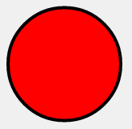
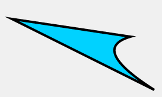

# 快速开始

## 简介 *Intro*

### Konva是什么? *What’s Konva?*

> Konva is an HTML5 Canvas JavaScript framework that extends the 2d context by enabling canvas interactivity for desktop and mobile applications.
> 
> Konva enables high performance animations, transitions, node nesting, layering, filtering, caching, event handling for desktop and mobile applications, and much more.
> 
> You can draw things onto the stage, add event listeners to them, move them, scale them, and rotate them independently from other shapes to support high performance animations, even if your application uses thousands of shapes.
> 

Konva是一个用于扩展HTML5 Canvas的功能JavaScript框架，它可以用来构建交互性的桌面或移动端应用。

Konva可以在桌面或者移动端甚至更多平台上实现高性能动画、变换、节点组织、分层、滤镜、缓存、事件机制。

你可以在舞台上绘制物件，为它们添加事件监听器，对它们独立地进行移动、缩放、旋转，以支持高性能的动画，哪怕你的应用中使用了数千个形状。

>This project began as a GitHub fork of KineticJS.

这个项目是GitHub上Kinetic项目的一个分支。

### 安装Konva *Install Konva*


> If you are using package managers:

如果你使用包管理器的话：

```shell
 npm install konva
 # or
 bower install konva
```

## 概述 *Overview*

### Konva是什么? *What’s Konva?*

>Konva is an HTML5 Canvas JavaScript framework that extends the 2d context by enabling canvas interactivity for desktop and mobile applications.

>Konva enables high performance animations, transitions, node nesting, layering, 
filtering,caching, event handling for desktop and mobile applications, and much more.

Konva是一个用于扩展HTML5 Canvas的功能JavaScript框架，它可以用来构建交互性的桌面或移动端应用。

Konva可以在桌面或者移动端甚至更多平台上实现高性能动画、变换、节点组织、分层、滤镜、缓存、事件机制。

### 它是怎样工作的? *How does it work?*

> Every thing starts from Konva.Stage than[1] contains several user’s layers (Konva.Layer).
> 
> Each layer has two &lt;canvas&gt; renderers: a scene renderer and a hit graph renderer.

> The scene renderer is what you can see
> 
> 
> 
> 
> 
> 
>  and the hit graph renderer is a special hidden canvas that’s used for high performance event detection.


>Each layer can contain shapes, groups of shapes, or groups of other groups.
The stage, layers, groups, and shapes are virtual nodes, similar to DOM nodes in an HTML page.

> [1]这里应该是"that"

一切都是从一个包含了一系列用户的图层(Konva.Layer)的舞台对象(Konva.Stage)开始的。

每个图层都有两个&lt;canvas&gt;渲染器：一个场景渲染器以及一个hit graph渲染器。 

场景渲染器是你所看到的东西。

hit graph渲染器则是一个特殊的隐藏画布，它被用来实现高性能的点击检测机制。【译注：估计是利用了hitTest。】

每个图层都可以包含许多形状，形状分组，以及分组的分组。所有的舞台、图层、分组和形状都是节点，就像是HTML页面中的DOM节点一样。

>Here’s an example Node hierarchy:

这里有一个节点的层次结构的示例：

```
               Stage
                 |
          +------+------+
          |             |
        Layer         Layer
          |             |
    +-----+-----+     Shape
    |           |
  Group       Group
    |           |
    +       +---+---+
    |       |       |
 Shape   Group    Shape
            |
            +
            |
          Shape
```

>All nodes can be styled and transformed. Although Konva has prebuilt shapes available,
such as rectangles, circles, images, sprites, text, lines, polygons, regular polygons, paths, stars, etc.,
you can also create custom shapes by instantiating the Shape class and creating a draw function.

所有节点都可以被样式化、变换，尽管Konva以及内建了很多形状。比如：三角形，原型，图片，精灵，文本，线条，多边形，正多边形，路径，星型等。

你也可以通过实例化Shape类、并创建一个draw函数来创建自定义的形状。

>Once you have a stage set up with layers and shapes, you can bind event listeners, transform nodes, run animations, apply filters, and much more.

每当你准备好一个具有图层和形状的舞台，你就可以绑定事件监听器、节点变换、运行动画、应用滤镜以及做更多事情。

>Minimal code example:

简单示例：

```js
 // first we need to create a stage *首先我们需要创建一个舞台
 var stage = new Konva.Stage({
   container: 'container',   // id of container <div> *包裹舞台的DIV元素的ID
   width: 500,
   height: 500
 });
 
 // then create layer *然后创建一个图层
 var layer = new Konva.Layer();
 
 // create our shape *创建我们的形状
 var circle = new Konva.Circle({
   x: stage.getWidth() / 2,
   y: stage.getHeight() / 2,
   radius: 70,
   fill: 'red',
   stroke: 'black',
   strokeWidth: 4
 });

 // add the shape to the layer *将形状添加到图层上
 layer.add(circle);
 
 // add the layer to the stage *将图层添加到舞台上
 stage.add(layer);
```

结果：



### 基本形状 *Basic shapes*

> Konva.js supports shapes: Rect, Ellipse, Line，Image, Text, TextPath, Star, Label, SVG Path, RegularPolygon.

Konva.js 支持这些形状：矩形，椭圆，线，图像，文字，文字路径，星型，标签，SVG路径，正多边形

> Also you can create custom shape:

你也可以创建自定义的形状：


```js
 var triangle = new Konva.Shape({
       sceneFunc: function(context) {
         context.beginPath();
         context.moveTo(20, 50);
         context.lineTo(220, 80);
         context.quadraticCurveTo(150, 100, 260, 170);
         context.closePath();
 
         // special Konva.js method
         context.fillStrokeShape(this);
       },
       fill: '#00D2FF',
       stroke: 'black',
       strokeWidth: 4
 });
```



### 样式 *Styles*

>Each shape supports the following style properties:

每个形状都支持以下的样式属性：

- Fill. Solid color, gradients or images 
	* 填充：纯色，渐变或者图像纹理
- Stroke (color, width) 
	* 描边：颜色，宽度
- Shadow (color, offset, opacity, blur) 
	* 阴影：颜色，偏移，透明度，模糊度
- Opacity 
	* 透明度

示例：

```javascript
 var pentagon = new Konva.RegularPolygon({
     x: stage.getWidth() / 2,
     y: stage.getHeight() / 2,
     sides: 5,
     radius: 70,
     fill: 'red',
     stroke: 'black',
     strokeWidth: 4,
     shadowOffsetX : 20,
     shadowOffsetY : 25,
     shadowBlur : 40,
     opacity : 0.5
 });
```

### 事件 *Events*

>With Konva you can easily listen to user input events (click, dblclick, mouseover, tap, dbltap, touchstart etc),attributes change events (scaleXChange, fillChange) and drag&drop events (dragstart, dragmove, dragend).

使用Konva，你可以方便地监听用户输入事件（点击，双击，鼠标滑过，触击，连续触击，触摸开始等），属性变更事件（横向缩放变更，填充变更等），和拖拽释放事件（拖拽开始，拖拽移动，托转结束）。

示例：

```js
 circle.on('mouseout touchend', function() {
     console.log('user input');
 });
 
 circle.on('xChange', function() {
     console.log('position change');
 });
 
 circle.on('dragend', function() {
     console.log('drag stopped');
 });
```

See [working example](http://konvajs.github.io/docs/events/Binding_Events.html).

### 拖拽和释放 *DRAG AND DROP*

>Konva has builtin drag support. For the current moment there is no drop events (drop, dragenter, dragleave, dragover)
but it is very easy to implement them via framework.

Konva没有内建的拖拽支持，现在并没有任何拖拽事件（drop,dragenter,dragleave,dragover)
但是,[利用框架，可以轻易地实现这个机制](http://konvajs.github.io/docs/drag_and_drop/Drop_Events.html)。

>To enable drag&drop just set property draggable = true.

启用拖拽只需要设置draggable属性为true。

```javascript
shape.draggable('true');
```

>Then you can subscribe to drag&drop events and setup moving limits.

然后你就可以支持拖拽事件，并[设置移动区域的限制](http://konvajs.github.io/docs/drag_and_drop/Complex_Drag_and_Drop.html)。

### 滤镜 *Filters*

>Konva has several filters: blur, invert, noise etc. For all available filters see Filters API.

Konva有多重滤镜：模糊，反色，杂色等，[Filters API](http://konvajs.github.io/api/Konva.Filters.html)收录了所有的滤镜。

### 动画 *Animation*

>You can create animations in two ways:

你可以使用两种方式创建动画：


使用`Konva.Animation`的示例:

```js
 var anim = new Konva.Animation(function(frame) {
     var time = frame.time, // *时间
         timeDiff = frame.timeDiff, // *间隔时间
         frameRate = frame.frameRate; // *帧率
     // update stuff *用于更新动画状态的代码写在下面
 }, layer);
 anim.start();
 ```

使用`Konva.Tween`的示例:

```javascript
 var tween = new Konva.Tween({
         node: rect,
         duration: 1,
         x: 140,
         rotation: Math.PI * 2,
         opacity: 1,
         strokeWidth: 6
 });
 tween.play();
 
 // or new shorter method: *或者更简短的新方法：
 circle.to({
     duration : 1,
     fill : 'green'
 });
```

【译注：

这里其实是创建动画的两种最常见的方式。

Animation是指每隔一段时间调用一次我们写好的回调，他们会把当前时间、两帧之间的时间差、帧率以传参的方式交给我们，我们则根据这些数据，手动写代码更新画面的状态。

Tween则是描述间隔时间、属性变化之后，让框架自行更新数据。

前者更加灵活，后者更加方便。

】

### 选择器 *Selectors*

>It is very useful to use searching in elements when you are building large application.
>
>Konva helps you to find an element with selectors. You can use find() method (returns collection) or findOne() method (return first element of collection).

在你创建大型应用时，元素搜索是很有用的。

Konva提供的选择器可以帮你寻找元素。你可以使用`find()`函数（返回一个集合）或者`findOne()`函数(返回集合中的第一个元素)

```js
 var circle = new Konva.Circle({
         radius: 10,
         fill: 'red',
         id : 'face',
         name : 'red circle'
 });
 layer.add(circle);
 
 // then try to search
 
 // find by type
 layer.find('Circle'); // all circles
 
 // find by id
 layer.findOne('#face');
 
 // find by name (like css class)
 layer.find('.red')
```

### 序列化和反序列化 *Serialisation and Deserialization*

>All created objects you can save as JSON. You may save it to server or local storage.

你创建的所有对象都可以用JSON的姓氏存储，你可以将它保存在服务器或者HTML5浏览器本地存储里。

```javascript
 var json = stage.toJSON();
 Also you can restore objects from JSON:
 
 var json = '{"attrs":{"width":578,"height":200},"className":"Stage","children":[{"attrs":{},"className":"Layer","children":[{"attrs":{"x":100,"y":100,"sides":6,"radius":70,"fill":"red","stroke":"black","strokeWidth":4},"className":"RegularPolygon"}]}]}';
 
 var stage = Konva.Node.create(json, 'container');
 Performance
 ```

### 性能 *Performance*

>Konva has a lot of tools to improve speed of your app. Most important methods:

Konva有很多工具，可以改善你的应用的性能。其中最关键的方法有：

>Caching allows you to draw an element into buffer canvas. Then draw element from the canvas. It may improve performance a lot for complex nodes such as text or shapes with shadow and strokes.

缓存允许你在缓冲画布上绘制一个元素，然后从那个canvas上绘制元素。在有很多组合节点时，这将会提高你的性能，比如说文本或者具有很多阴影和描边的形状。

```js
shape.cache();
```

[Demo](http://konvajs.github.io/docs/performance/Shape_Caching.html)

【译注：Canvas的矢量绘制性能很差，而位图绘制则稍好。所以将复杂的图形先保存到图片或者另外的画布中，然后做完位图绘制到主画布上，是很常见的优化手法】

>Layering. As framework supports several &lt;canvas&gt; elements you can put objects at your discretion.

分层。这个框架支持多个&lt;canvas&gt;元素，你可以依据自己的判断来放置自己的对象。

>For example your application consists from complex background and several moving shapes. You can use one layer for background and another one for shapes.
While updating shapes you don’t need to update background canvas. Demo

举个例子，你的应用包含一个复杂的背景很多个移动的形状。你可以为背景准备一个图层，再为其他形状准备另外一个图层。当更新形状的状态时，你就不需要更新背景画布的状态了。

[Demo](http://konvajs.github.io/docs/performance/Layer_Management.html)


>You can find all available performance tips here:
http://konvajs.github.io/docs/performance/All_Performance_Tips.html

你可以在这里看到所有可用的性能建议：
<http://konvajs.github.io/docs/performance/All_Performance_Tips.html>